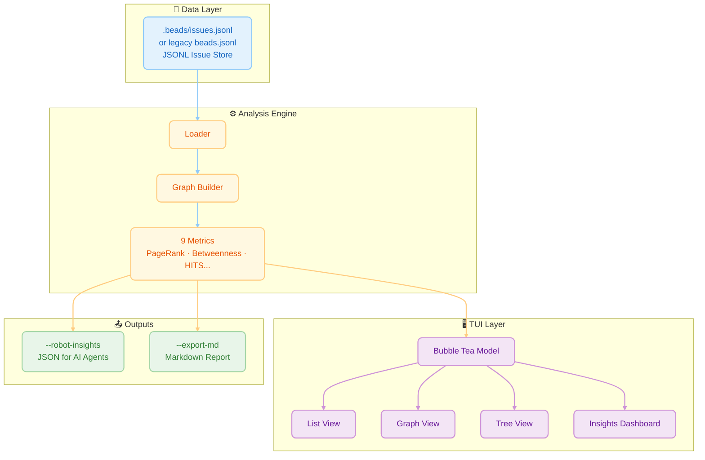
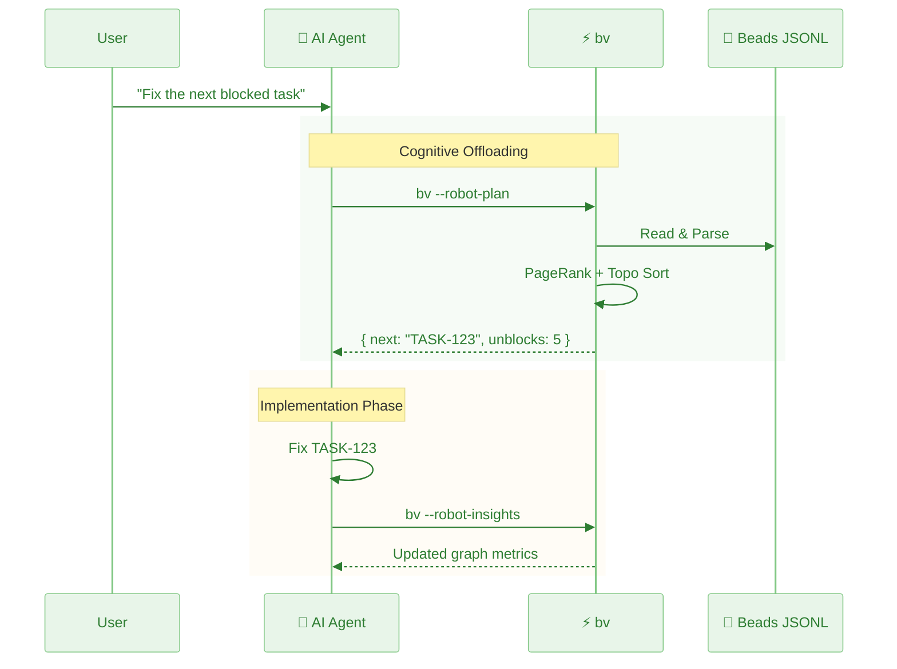
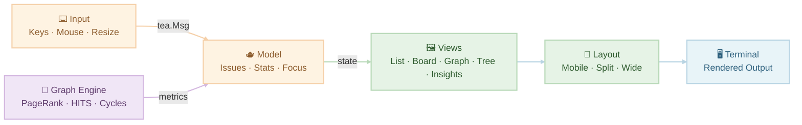
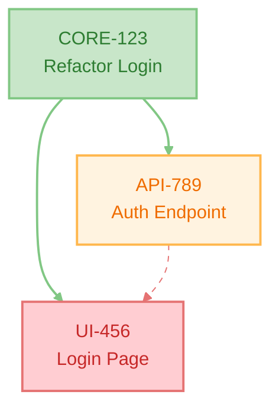
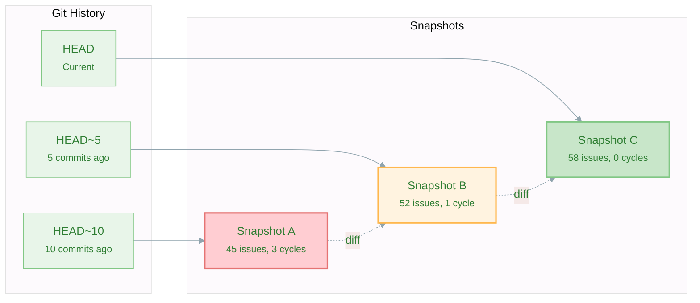
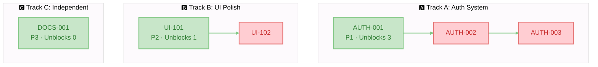
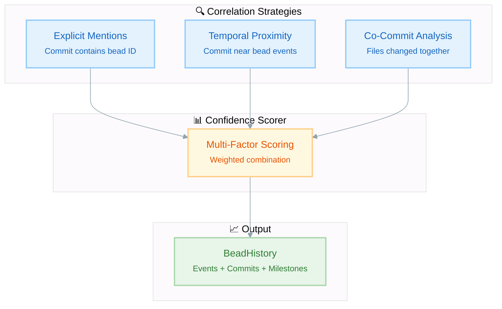
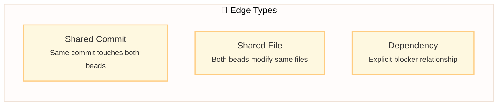
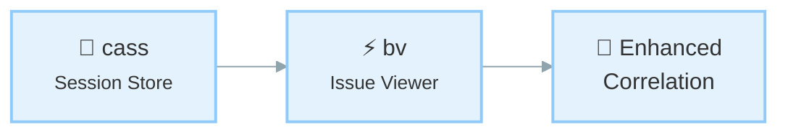

# Beads Viewer (bv)


[](https://codecov.io/gh/Dicklesworthstone/beads_viewer)

> **The elegant, keyboard-driven terminal interface for the [Beads](https://github.com/steveyegge/beads) issue tracker.**

<div align="center" style="margin: 1.2em 0;">
  <table>
    <tr>
      <td align="center" style="padding: 8px;">
        
        <div><sub>Main split view: fast list + rich details</sub></div>
      </td>
      <td align="center" style="padding: 8px;">
        
        <div><sub>Kanban board (`b`) for flow at a glance</sub></div>
      </td>
    </tr>
    <tr>
      <td align="center" style="padding: 8px;">
        
        <div><sub>Insights panel: PageRank, critical path, cycles</sub></div>
      </td>
      <td align="center" style="padding: 8px;">
        
        <div><sub>Graph view (`g`): navigate the dependency DAG</sub></div>
      </td>
    </tr>
  </table>
</div>

## Installation

### Recommended: Homebrew (macOS/Linux)

```bash
brew install dicklesworthstone/tap/bv
```

This method provides:
- Automatic updates via `brew upgrade`
- Dependency management
- Easy uninstall via `brew uninstall`

### Windows: Scoop

```powershell
scoop bucket add dicklesworthstone https://github.com/Dicklesworthstone/scoop-bucket
scoop install dicklesworthstone/bv
```

Homebrew and Scoop select the version in their published manifests. To pin
v0.25.0, use a verified release archive below. See the [distribution checks](docs/RELEASING.md#native-installation-and-package-stores) for version and checksum details.

### Alternative: Direct Download

Pick the archive for your platform from the [latest release page](https://github.com/Dicklesworthstone/beads_viewer/releases/latest). Archives are named `bv_<version>_<os>_<arch>.tar.gz` (`.zip` on Windows), for example `bv_0.25.0_linux_amd64.tar.gz`, `bv_0.25.0_darwin_arm64.tar.gz`, `bv_0.25.0_windows_amd64.zip`, so a downloaded file always says which release it came from. Every release also ships `checksums.txt`; verify before extracting:

```bash
sha256sum -c --ignore-missing checksums.txt
```

Releases up to v0.22.0 used unversioned names (`bv_linux_amd64.tar.gz`); `bv --update` and `install.sh` accept both forms.

### Alternative: Install Script

**Linux/macOS:**
Prefer Homebrew, Scoop, or a checksum-verified release archive above. If you do pipe the script, pin it to a commit you have read instead of the moving `main` branch:

```bash
# Pinned to a reviewed commit; read it first: https://github.com/Dicklesworthstone/beads_viewer/blob/a43b8e85a39664381566abdfd85dc8fcbfdcb773/install.sh
curl -fsSL "https://raw.githubusercontent.com/Dicklesworthstone/beads_viewer/a43b8e85a39664381566abdfd85dc8fcbfdcb773/install.sh" | bash
```

> **Warning:** `curl ... | bash` runs whatever the URL serves at that moment. The pinned form above cannot change under you; the `main` form can. `install.sh` downloads the release archive for your platform, verifies it against the release `checksums.txt`, and refuses to install on a mismatch.

**Windows (PowerShell):**
```powershell
# Pinned to a reviewed commit; read it first: https://github.com/Dicklesworthstone/beads_viewer/blob/a43b8e85a39664381566abdfd85dc8fcbfdcb773/install.ps1
irm "https://raw.githubusercontent.com/Dicklesworthstone/beads_viewer/a43b8e85a39664381566abdfd85dc8fcbfdcb773/install.ps1" | iex
```
> **Note:** The pinned installer above downloads the Windows release zip, verifies it against the release `checksums.txt` with `Get-FileHash`, and refuses anything that does not verify; no Go toolchain is needed. Pass `-Version v0.25.0` to pin a release or `-InstallDir` to choose the folder (default `%LOCALAPPDATA%\Programs\bv`). Scoop installs the archive selected by its manifest. For best display, use Windows Terminal with a [Nerd Font](https://www.nerdfonts.com/).

For a source build, use `install.ps1` from this checkout (requires Git and Go 1.26+):

```powershell
.\install.ps1 -FromSource -Version v0.25.0
```

This source path builds a verified checkout of the requested tag with that tag's vendored dependencies, checks the executable's version and Git revision before installation, and retains diagnostics on failure. The pinned installer above uses the same verified source-build path. Selecting an older release tag does not include later, unreleased fixes from this checkout.

Vendoring covers the Go module dependencies, not the compiler. When your Go differs from the `toolchain` directive in that tag's `go.mod`, Go downloads the pinned toolchain before compiling, so the source build needs network access even though the dependencies are vendored, and on a slow machine that download alone can take several minutes. The installer's progress line reports the Go it was launched with, not the toolchain it ends up building with; `go version -m` on the installed executable reports the one actually used.

---

## Generating the JSONL File (`br` and `bd`)

`bv` reads Beads JSONL exports from `.beads/`. Current `br` and Dolt-backed `bd` workspaces use `.beads/issues.jsonl`; older legacy workspaces may use `.beads/beads.jsonl`. `bv` auto-discovers the supported file names.

**Rust (`br`) users** — run `br sync --flush-only` after Beads mutations so `.beads/issues.jsonl` is current.

**Go (`bd`) users** — run:

```bash
bd export -o .beads/issues.jsonl
```

Once the file exists, `bv` works identically regardless of which tool produced it.

---

## 🤖 Agent Quickstart (Robot Mode)

⚠️ **Never run bare `bv` in an agent context** — it launches the interactive TUI. Always use `--robot-*`.

```bash
# 1) Start with triage (single-call mega-command)
bv --robot-triage

# 2) Minimal mode: just the top pick + claim command
bv --robot-next

# 3) TOON output: smaller only for wide tabular payloads (--robot-graph); larger
#    for nested ones such as --robot-triage. Check with --stats before adopting.
bv --robot-graph --format toon
bv --robot-triage --format toon --stats
export BV_OUTPUT_FORMAT=toon

# 4) Full robot help
bv --robot-help
```

**Output conventions**
- stdout = JSON/TOON data only
- stderr = diagnostics
- exit 0 = success

TOON uses an external `toon_rust` encoder. Discovery honors `TOON_TRU_BIN` or `TOON_BIN`, then looks for `tru` or `toon` on PATH and the library's known fallback paths; candidates are validated as `toon_rust`. If none is available, `bv` warns on stderr and emits JSON. A successful fallback is not evidence that TOON encoding ran. Keep the format set to JSON when copying the jq examples below.

## 💡 TL;DR

`bv` is a high-performance **Terminal User Interface (TUI)** for browsing and managing tasks in projects that use the **Beads** issue tracking system. 

**Why you'd care:**
*   **Local browsing:** Browse thousands of issues without a network round trip. Response time depends on the graph, selected view, and host.
*   **Focus:** Stay in your terminal and use Vim-style keys (`j`/`k`) to navigate.
*   **Intelligence:** It visualizes your project as a **dependency graph**, automatically highlighting bottlenecks, cycles, and critical paths that traditional list-based trackers miss.
*   **AI-Ready:** It provides structured, pre-computed insights for AI coding agents, acting as a "brain" for your project's task management.

---

## 📖 The Core Experience

At its heart, `bv` is about **viewing your work nicely**.

### ⚡ Fast, Fluid Browsing
Browse your issue backlog in the terminal using standard Vim keys (`j`/`k`). Startup and navigation time depend on the workload; measured limits are described under Performance.
*   **Split-View Dashboard:** On wider screens, see your list on the left and full details on the right.
*   **Markdown Rendering:** Issue descriptions, comments, and notes are beautifully rendered with syntax highlighting, headers, and lists.
*   **Keyboard Filtering:** Press `o` for Open, `c` for Closed, or `r` for Ready (unblocked) tasks.
*   **Live Reload:** Watches the active Beads JSONL or SQLite source and refreshes lists, details, and insights automatically. SQLite updates are detected even while committed changes remain in its write-ahead log (WAL).

### 🔎 Rich Context
Don't just read the title. `bv` gives you the full picture:
*   **Comments & History:** Scroll through the full conversation history of any task.
*   **Metadata:** Instantly see Assignees, Labels, Priority badges, and creation dates.
*   **Search:** Fuzzy list filtering (`/`) matches the title, ID, status, issue type, assignee, labels and repo prefix, whether or not the current terminal width displays them. CLI keyword search (`--search`) also indexes descriptions and can combine text scores with graph metrics.
*   **Dependency Details:** The detail pane shows dependencies up to three edges from the selected issue. Each issue's dependencies appear once along a shortest path; other occurrences say `(reference: shown elsewhere)`. Every relationship within that limit retains its type and target metadata. Cycle-closing edges carry a separate `(cycle)` marker.

### 🎯 Focused Workflows
*   **Kanban Board:** Press `b` to switch to a columnar view (Open, In Progress, Blocked, Closed) to visualize flow.
*   **Visual Graph:** Press `g` to explore the dependency tree visually.
*   **Insights:** Press `i` to see graph metrics and bottlenecks.
*   **History View:** Press `h` to see the timeline of changes, correlating git commits with bead modifications. On wider terminals, enjoy a responsive three-pane layout showing commits, affected beads, and details.
*   **Ultra-Wide Mode:** On large monitors, the list expands to show extra columns like sparklines and label tags.

### 🛠️ Quick Actions
*   **Export:** Press `x` to export all issues to a timestamped Markdown file with Mermaid diagrams (`E` opens the tree view).
*   **Graph Export (CLI):** `bv --robot-graph` outputs the dependency graph as JSON, DOT (Graphviz), or Mermaid format. Use `--graph-format=dot` for rendering with Graphviz, or `--graph-root=ID --graph-depth=3` to extract focused subgraphs.
*   **Copy:** Press `C` to copy the selected issue as formatted Markdown to your clipboard.
*   **Edit:** Press `O` to open the loaded source in a GUI editor, or edit the focused issue's frontmatter in a terminal editor while the TUI is suspended.
*   **Time-Travel:** Press `t` to compare against any git revision, or `T` for quick HEAD~5 comparison. Combined with History view (`h`), you can navigate to any commit and see exactly what changed.

### 🔌 Automation Hooks
Configure pre- and post-export hooks in `.bv/hooks.yaml` to run validations, notifications, or uploads. Report exports (`--export` / `--export-md`) and Pages exports run configured hooks; pass `--no-hooks` to skip them for one export. Defaults: pre-export hooks fail fast on errors (`on_error: fail`), post-export hooks log and continue (`on_error: continue`). A post-export hook declared `on_error: fail` makes the export exit 1 even though the bundle has already been written. Empty commands are ignored with a warning for safety. Hook env includes `BV_EXPORT_PATH`, `BV_EXPORT_FORMAT`, `BV_ISSUE_COUNT`, `BV_TIMESTAMP`, plus any custom `env` entries.

**Security:** hooks are shell commands defined by the project you are exporting, so treat `.bv/hooks.yaml` in an unfamiliar repository as untrusted code and review it before exporting (or pass `--no-hooks`). To limit blast radius, bv strips credential-bearing environment variables (names containing `TOKEN`, `SECRET`, `PASSWORD`, `CREDENTIAL`, `API_KEY`, `ACCESS_KEY`, `PRIVATE_KEY`, etc., plus `SSH_AUTH_SOCK`) from hook subprocesses. A hook that legitimately needs one must re-grant it explicitly, e.g. `env: { GITHUB_TOKEN: "${GITHUB_TOKEN}" }`.

---

## 🤖 Ready-made Blurb to Drop Into Your AGENTS.md or CLAUDE.md Files

The text below is exactly what `bv --agents-add` (and the TUI's AGENTS.md prompt) installs (`pkg/agents/blurb.go`, `AgentBlurb`); a docs parity test keeps this copy identical to it.

````markdown
<!-- bv-agent-instructions-v7 -->

---

## Beads Workflow Integration

This project uses a Beads tracker—either the Go `bd` CLI or the Rust `br` CLI—for issue tracking, plus [beads_viewer](https://github.com/Dicklesworthstone/beads_viewer) (`bv`) for graph-aware triage. Issues are stored in `.beads/`. `bv` auto-discovers supported JSONL exports, including `.beads/issues.jsonl` and legacy `.beads/beads.jsonl`.

**Choose the tracker CLI from this repository's instructions and configuration.** Use `bd` commands in a Go Beads workspace and `br` commands in a beads_rust workspace. Do not run both trackers against the same workspace or infer the tracker solely from the JSONL filename.

### Using bv as an AI sidecar

bv is a graph-aware triage engine for Beads projects. Instead of parsing .beads/issues.jsonl / .beads/beads.jsonl directly or hallucinating graph traversal, use robot flags for deterministic, dependency-aware outputs with precomputed metrics (PageRank, betweenness, critical path, cycles, HITS, eigenvector, k-core).

**Scope boundary:** bv handles *what to work on* (triage, priority, planning). The selected tracker CLI (`bd` or `br`) handles creating, claiming, modifying, and closing beads.

**CRITICAL: Use ONLY --robot-* flags. Bare bv launches an interactive TUI that blocks your session.**

#### The Workflow: Start With Triage

**`bv --robot-triage` is your single entry point.** Its `triage` object contains:
- `quick_ref`: at-a-glance counts + top 3 picks
- `recommendations`: ranked actionable items with scores, reasons, unblock info
- `quick_wins`: low-effort high-impact items
- `blockers_to_clear`: items that unblock the most downstream work
- `project_health`: status/type/priority distributions, graph metrics
- `commands`: copy-paste shell commands for next steps

```bash
bv --robot-triage        # THE MEGA-COMMAND: start here
bv --robot-next          # Minimal: just the single top pick + claim command

# TOON output (--format toon): a compact tabular encoding. Measured on this
# repository it is 7% smaller than JSON for --robot-graph but 9-15% LARGER for
# nested payloads (--robot-triage, --robot-plan, --robot-insights,
# --robot-label-health); use --stats to see both sizes before adopting it.
# TOON encoding shells out to the tru binary. With no encoder installed,
# --format toon prints a fallback warning, emits JSON with output_format "json",
# and --stats prints no sizes at all.
bv --robot-graph --format toon
bv --robot-triage --format toon --stats
```

Recommendations can include blocked or assigned work; `triage.quick_ref.top_picks` reflects snapshot readiness. A suggested action records its original local ID, working directory, and tracker route. Use that route rather than a namespaced display ID or an unrelated current directory. Inspect current tracker state before execution: analysis does not reserve work or guarantee that a later claim succeeds.

#### Other bv Commands

| Command | Returns |
|---------|---------|
| `--robot-plan` | Parallel execution tracks with unblocks lists |
| `--robot-priority` | Priority misalignment detection with confidence |
| `--robot-insights` | Full metrics: PageRank, betweenness, HITS, eigenvector, critical path, cycles, k-core |
| `--robot-alerts` | Stale issues, blocking cascades, priority mismatches |
| `--robot-suggest` | Hygiene: duplicates, missing deps, label suggestions, cycle breaks |
| `--robot-diff --diff-since <ref>` | Changes since ref: new/closed/modified issues |
| `--robot-graph [--graph-format=json\|dot\|mermaid]` | Dependency graph export |

Robot analysis commands default to JSON; `--format toon` selects TOON, and `--robot-help` defaults to text. In JSON mode, `--graph-format=dot` or `mermaid` puts diagram text in the `graph` field (`bv --robot-graph --graph-format=dot | jq -r .graph`).

#### Scoping & Filtering

```bash
bv --robot-plan --label backend              # Scope to label's subgraph
bv --robot-insights --as-of HEAD~30          # Historical point-in-time
bv --recipe actionable --robot-plan          # Pre-filter: ready to work (no blockers)
bv --recipe high-impact --robot-triage       # Pre-filter: top PageRank scores
```

### Tracker Commands for Issue Management

Use exactly one command family, matching the tracker configured for the repository.

#### Rust beads_rust (`br`)

Use `br` 0.6.0 or newer when executing saved claim commands. It rechecks
deferred status and future `defer_until` values when the claim runs, so a
recommendation captured before a deferral cannot bypass it. This requirement
applies to executing tracker claims.

```bash
br ready --json                       # Show issues ready to work (no blockers)
br list --status=open --json          # All open issues
br show <id> --json                   # Full issue details with dependencies
br create --title="..." --type=task --priority=2 --json
br update <id> --claim --json         # Claim for the current actor and start work
br close <id> --reason="Completed" --json
br close <id1> <id2> --reason="Completed" --json
br sync --flush-only                  # Export DB to JSONL after Beads mutations
```

#### Go Beads (`bd`)

```bash
bd ready --json                       # Show issues ready to work
bd show <id> --json                   # Full issue details
bd create "..." -t task -p 2 --json
bd update <id> --claim --json         # Atomically claim work
bd close <id> --json
bd dep add <issue> <depends-on>
bd export -o .beads/issues.jsonl        # Refresh the compatibility export read by bv
```

### Workflow Pattern

1. **Triage**: Run `bv --robot-triage` to find the highest-impact actionable work
2. **Verify**: Check the selected tracker's `show`/`ready` output before claiming
3. **Claim**: Use `br update <id> --claim --json` or `bd update <id> --claim --json`
4. **Work**: Implement the task
5. **Complete**: Use the selected tracker's `close` command
6. **Refresh for bv**: Run `br sync --flush-only` or the `bd export` command above so the JSONL export is current

### Key Concepts

- **Dependencies**: Issues can block other issues. `br ready --json` and `bd ready --json` show unblocked work.
- **Priority**: P0=critical, P1=high, P2=medium, P3=low, P4=backlog (use numbers 0-4, not words)
- **Types**: task, bug, feature, epic, chore, docs, question
- **Blocking**: Use `br dep add <issue> <depends-on>` or `bd dep add <issue> <depends-on>` to add dependencies

### Git Policy

Tracker commands do not grant permission to commit or push application code. Follow this repository's own git and tracker instructions before staging, committing, syncing, or pushing. If the repository says "commit only when asked," that rule overrides any generic workflow advice.

<!-- end-bv-agent-instructions -->
````

**Version Tracking:**

The blurb uses HTML comment markers for version tracking:
```
<!-- bv-agent-instructions-v7 -->
... content ...
<!-- end-bv-agent-instructions -->
```

When a new version of the blurb is released, `bv` can detect the outdated version and offer to update it.

---

## 📐 Architecture & Design

`bv` treats your project as a **directed dependency graph**, including cycles when present. Its graph metrics help identify blockers and structural importance.



### Key Metrics & Algorithms
`bv` computes **9 graph-theoretic metrics** to surface hidden project dynamics:

| # | Metric | What It Measures | Key Insight |
|---|--------|------------------|-------------|
| 1 | **PageRank** | Recursive dependency importance | Foundational blockers |
| 2 | **Betweenness** | Shortest-path traffic | Bottlenecks & bridges |
| 3 | **HITS** | Hub/Authority duality | Epics vs. utilities |
| 4 | **Critical Path** | Longest dependent chain in task counts | Prerequisites supporting long chains |
| 5 | **Eigenvector** | Influence via neighbors | Strategic dependencies |
| 6 | **Degree** | Direct connection counts | Immediate blockers/blocked |
| 7 | **Density** | Directed edges / possible edges: `E / (N × (N−1))` for `N > 1` | Project coupling health |
| 8 | **Cycles** | Circular dependencies | Structural errors |
| 9 | **Topo Sort** | Prerequisites-first order for acyclic graphs | Structural order; readiness still requires lifecycle and dependency checks |

### 1. PageRank (Dependency Authority)
**The Math:** Originally designed to rank web pages by "importance" based on incoming links, PageRank models a "random surfer" walking the graph. In our dependency graph (u → v implies u depends on v), we treat dependencies as "votes" of importance.
$$
PR(v) = \frac{1-d}{N} + d \sum_{u \in M(v)} \frac{PR(u)}{L(u)}
$$

**The Intuition:** If many tasks depend on Task A, or if a single very important Task B depends on Task A, then Task A implicitly becomes "heavy." A random walker following dependency links will frequently get stuck at Task A.

**Pragmatic Meaning:** **Foundational Blocks.** High PageRank tasks are the bedrock of your project. They are rarely "features" in the user-facing sense; they are often schemas, core libraries, or architectural decisions. Breaking them breaks the graph.

### 2. Betweenness Centrality (Bottlenecks)
**The Math:** Defined as the fraction of all shortest paths in the network that pass through a given node $v$.
$$C_B(v) = \sum_{s \neq v \neq t} \frac{\sigma_{st}(v)}{\sigma_{st}}$$

**The Intuition:** Imagine information (or progress) flowing from every task to every other task along the most efficient route. "Bridge nodes" that connect otherwise isolated clusters (e.g., the Frontend cluster and the Backend cluster) will see a massive amount of traffic.

**Pragmatic Meaning:** **Gatekeepers & Bottlenecks.** A task with high Betweenness is a choke point. It might be an API contract that both the mobile app and the server team are waiting on. If this task is delayed, it doesn't just block one thread; it prevents entire sub-teams from synchronizing.

### 3. HITS (Hubs & Authorities)
**The Math:** An iterative algorithm that defines two scores for every node:
*   **Authority:** The sum of Hub scores of nodes pointing to it.
*   **Hub:** The sum of Authority scores of nodes it points to.

**The Intuition:** This models a "mutually reinforcing" relationship. Good libraries (Authorities) are used by many applications. Good applications (Hubs) use many good libraries.

**Pragmatic Meaning:** **Epics vs. Infrastructure.**
*   **High Hub Score:** These are your **Epics** or **Product Features**. They aggregate many dependencies to deliver value.
*   **High Authority Score:** These are your **Utilities**. They provide value to many consumers.

### 4. Critical Path (Longest Path in DAG)
**The Math:** In a DAG, `bv` measures unweighted chain depth in tasks. Edges point from a dependent to its prerequisite, so the score is:
$$Impact(u) = 1 + \max(\{Impact(v) \mid v \to u\} \cup \{0\})$$
The implementation evaluates this in topological order. This node-count metric does not use task durations or establish a minimum project completion time.

**The Intuition:** If you hold the graph by its "leaf" nodes (tasks with no dependencies) and let it dangle, the tasks at the very top that support the longest chains are carrying the most weight.

**Pragmatic Meaning:** **Keystones.** High scores identify prerequisites supporting long dependent chains. Inspect the separate `Slack` metric for structural scheduling flexibility; neither metric proves that a delay translates one-for-one into delivery time. Cyclic graphs can leave critical-path metrics unavailable, as reported by `.status.Critical`.

### 5. Eigenvector Centrality (Influential Neighbors)
**The Math:** Eigenvector centrality measures a node's influence by considering not just its connections, but the importance of those connections. A node with few but highly influential neighbors can score higher than a node with many unimportant neighbors.
$$x_i = \frac{1}{\lambda} \sum_{j \in N(i)} x_j$$

Where $\lambda$ is the largest eigenvalue of the adjacency matrix and $N(i)$ are neighbors of node $i$.

**The Intuition:** It's not just *how many* connections you have, but *who* you're connected to. Being depended on by a critical task makes you more important than being depended on by many trivial tasks.

**Pragmatic Meaning:** **Strategic Dependencies.** High Eigenvector tasks are connected to the "power players" in your graph. They may not have many direct dependents, but their dependents are themselves critical.

### 6. Degree Centrality (Direct Connections)
**The Math:** The simplest centrality measure—just count the edges.
$$C_D^{in}(v) = |\{u : u \to v\}|$$

$$C_D^{out}(v) = |\{u : v \to u\}|$$

**The Intuition:**
*   **In-Degree:** How many tasks depend on me? (I am a blocker)
*   **Out-Degree:** How many tasks do I depend on? (I am blocked)

**Pragmatic Meaning:** **Immediate Impact.**
*   **High In-Degree:** This task is a direct blocker for many others. Completing it can make its dependents ready when their remaining prerequisites and eligibility conditions are satisfied.
*   **High Out-Degree:** This task has many prerequisites. It's likely to be blocked and should be scheduled later in the execution plan.

### 7. Graph Density (Interconnectedness)
**The Math:** Density measures how "connected" the graph is relative to its maximum possible connections.
$$D = \frac{|E|}{|V|(|V|-1)}$$

Where $|E|$ is the edge count and $|V|$ is the node count. For a directed graph, the maximum edges is $|V|(|V|-1)$.

**The Intuition:** A density of 0.0 means no dependencies exist (isolated tasks). A density approaching 1.0 means everything depends on everything (pathological complexity).

**Pragmatic Meaning:** **Project Health Indicator.**
*   **Low Density (< 0.05):** Healthy. Tasks are relatively independent and can be parallelized.
*   **Medium Density (0.05 - 0.15):** Normal. Reasonable interconnection reflecting real-world dependencies.
*   **High Density (> 0.15):** Warning. Overly coupled project. Consider breaking into smaller modules.

### 8. Cycle Detection (Circular Dependencies)
**The Math:** A cycle in a directed graph is a path v₁ → v₂ → ⋯ → vₖ → v₁ where the start and end nodes are identical. `bv` uses Tarjan's strongly connected components algorithm and extracts one representative cycle from each cyclic component. It analyzes blocking edges among non-closed, non-tombstoned issues, applies a storage cap, and reports truncation in `.status.Cycles.reason`. It does not enumerate every elementary cycle; breaking one reported cycle can leave others in the same component.

**The Intuition:** If A depends on B, and B depends on A, neither can ever be completed. This is a logical impossibility that must be resolved.

**Pragmatic Meaning:** **Structural Errors.** Cycles are **bugs in your project plan**, not just warnings. They indicate:
*   Misclassified dependencies (A doesn't really block B, or vice versa)
*   Missing intermediate tasks (A and B both depend on an unstated C)
*   Scope confusion (A and B should be merged into a single task)

### 9. Topological Sort (Execution Order)
**The Math:** A topological ordering of a DAG is a linear sequence of all vertices such that for every edge u → v, vertex u appears before v in the sequence. Only acyclic graphs have valid topological orderings.

**The Intuition:** Edge direction matters. In bv's stored graph, A → B means A depends on B. A raw topological ordering of those edges puts A before B; bv reverses that ordering so its published order puts prerequisites first. The cross-label Flow Matrix presents the opposite edge direction, from blocker to dependent.

**Pragmatic Meaning:** **Work Queue.** `--robot-plan` checks dependency eligibility and groups actionable work into tracks. Raw topological order alone does not establish readiness: lifecycle status, unresolved blockers and deferral also matter.

---

## 🤖 The Robot Protocol (AI Interface)

`bv` bridges the gap between raw data and AI agents. Agents struggle with graph algorithms; `bv` solves this by acting as a deterministic "sidecar" that offloads the cognitive burden of graph traversal.



### The "Cognitive Offloading" Strategy
The primary design goal of the Robot Protocol is **Cognitive Offloading**.
Large Language Models (LLMs) are probabilistic engines; they are excellent at semantic reasoning (coding, writing) but notoriously unreliable at algorithmic graph traversal (finding cycles, computing shortest paths). The two-phase analyzer returns degree/topo/density first and computes the remaining metrics asynchronously with size-aware timeouts. Graph-stat caches are keyed by issue data and analysis configuration; readiness and ranking also depend on the selected scope and reference clock. Check each metric's status before interpreting its values.

If you feed an Agent raw Beads JSONL data, you are forcing the Agent to:
1.  Parse thousands of lines of JSON.
2.  Reconstruct the dependency graph in its context window.
3.  "Hallucinate" a path traversal or cycle check.

`bv` solves this by providing a deterministic graph engine sidecar.

### Why `bv` vs. Raw Beads?
Using `beads` directly gives an agent *data*. Using `bv --robot-insights` gives an agent *intelligence*.

| Capability | Raw Beads (JSONL) | `bv` Robot Mode |
| :--- | :--- | :--- |
| **Query** | "List all issues." | "List the top 5 bottlenecks blocking the release." |
| **Context Cost** | Full issue records grow with issue count. | Compact summaries and capped metric maps; source diagnostics and graph output can still grow with the project. |
| **Graph Logic** | Agent must infer/compute. | Pre-computed (PageRank/Brandes). |
| **Safety** | Agent might miss a cycle. | Cycles explicitly flagged. |

### Agent Usage Patterns
Agents typically use `bv` in three phases:

1.  **Triage & Orientation:**
    Before starting a session, the agent runs `bv --robot-insights`. It receives a lightweight JSON summary of the project's structural health. It immediately knows:
    *   "I should not work on Task C yet because it depends on Task B, which is a Bottleneck."
    *   "The graph has a cycle (A->B->A); I must fix this structural error before adding new features."

2.  **Impact Analysis:**
    When asked to "refactor the login module," the agent checks the **PageRank** and **Impact Scores** of the relevant beads. If the scores are high, the agent knows this is a high-risk change with many downstream dependents, prompting it to run more comprehensive tests.

3.  **Execution Planning:**
    The agent uses `--robot-plan` to select currently actionable work and group it into dependency-connected tracks. Items are ordered by priority, then ID within each track; the plan does not assign agents or establish freedom from file conflicts.

**JSON Output Excerpt (`--robot-insights`):**
Field names are case-sensitive. This excerpt uses illustrative values and omits the source envelope and other metrics; `bv --robot-schema` describes the complete contract.
```json
{
  "Bottlenecks": [
    { "ID": "CORE-123", "Value": 0.45 }
  ],
  "Keystones": [
    { "ID": "API-001", "Value": 12.0 }
  ],
  "Influencers": [
    { "ID": "AUTH-007", "Value": 0.82 }
  ],
  "Hubs": [
    { "ID": "EPIC-100", "Value": 0.67 }
  ],
  "Authorities": [
    { "ID": "UTIL-050", "Value": 0.91 }
  ],
  "Cycles": [
    ["TASK-A", "TASK-B", "TASK-A"]
  ],
  "ClusterDensity": 0.045,
  "full_stats": {
    "pagerank": { "CORE-123": 0.15 },
    "betweenness": { "CORE-123": 0.45 },
    "eigenvector": { "AUTH-007": 0.82 },
    "critical_path_score": { "API-001": 12.0 }
  },
  "status": {
    "PageRank": { "state": "computed" },
    "Cycles": { "state": "computed" }
  }
}
```

| Field | Metric | What It Contains |
|-------|--------|------------------|
| `Bottlenecks` | Betweenness | Top nodes bridging graph clusters (`ID`/`Value` records) |
| `Keystones` | Critical Path | Top nodes on longest dependency chains |
| `Influencers` | Eigenvector | Top nodes connected to important neighbors |
| `Hubs` | HITS Hub | Top dependency aggregators (Epics) |
| `Authorities` | HITS Authority | Top prerequisite providers (Utilities) |
| `Cycles` | Cycle Detection | Stored representative cycles; inspect `status.Cycles` for skips, timeouts and truncation |
| `ClusterDensity` | Density | Overall graph interconnectedness |
| `full_stats` | Metric maps | Per-issue values, capped by `BV_INSIGHTS_MAP_LIMIT` (default 200) |

---

## 🎨 TUI Engineering & Craftsmanship

`bv` is built with the **Bubble Tea** framework. Its adaptive layout responds to terminal resize events, and its custom graph renderer supports ASCII and Unicode. A 60fps frame budget is a design target; actual interaction latency depends on the graph, view, terminal, and host.



### 1. Adaptive Layout Engine
`bv` doesn't just dump text; it calculates geometry on every render cycle.
*   **Dynamic Resizing:** `Update()` handles terminal-size messages and resizes the views.
*   **Terminal Breakpoint:** At 100 columns or fewer, the list uses a single pane. Above 100 columns, the default split allocates 40% of the available content width to the list and 60% to details, after panel overhead. The pane ratio is adjustable.
*   **Optional Row Columns:** The default list delegate uses the actual list-row width, not terminal width: above 100 cells it can show an assignee, above 120 a graph-score sparkline, and above 140 label tags. A 140-column terminal with the default split does not have room for these columns.
*   **Padding Awareness:** The layout engine explicitly accounts for borders (2 chars) and padding (2 chars) to prevent "off-by-one" wrapping errors that plague many TUIs.

### 2. Viewport Virtualization
`bv` limits list rendering to visible rows, including when browsing 10,000 issues:
*   **Windowing:** We only render the slice of rows currently visible in the terminal window.
*   **Pre-Computation:** Expensive graph metrics are computed asynchronously at startup and when source snapshots change. Navigation reuses the completed results.
*   **Detail Caching:** The Markdown renderer is reused. It can retain the last exact render within a 512 KiB input/output budget; selecting a different issue renders its actual details. Virtualizing the list does not eliminate the cost of rendering long details or analyzing a large graph.

### 3. Visual Graph Engine (`pkg/ui/graph.go`)
We built a custom 2D ASCII/Unicode rendering engine from scratch to visualize the dependency graph.
*   **Line Canvas:** The renderer assembles styled strings into a line-based canvas and clips it to the viewport.
*   **Dependency Neighborhood:** The selected issue appears between its blockers above and its dependents below, joined by Unicode connectors. Impact scores order the node selector; this is not a whole-graph topological layout.
*   **Panning:** Horizontal and vertical scrolling reveal portions of the selected neighborhood outside the viewport.

### 4. Thematic Consistency
We use **[Lipgloss](https://github.com/charmbracelet/lipgloss)** to enforce a strict design system.
*   **Semantic Colors:** Colors are defined semantically (`Theme.Blocked`, `Theme.Open`) rather than hardcoded hex values. This allows `bv` to switch between "Dracula" (Dark) and "Light" modes seamlessly.
*   **Status Indicators:** We use Nerd Font glyphs (`🐛`, `✨`, `🔥`) paired with color coding to convey status instantly without reading text.

---

## 📈 Visual Data Encoding: Sparklines & Heatmaps

In dense information environments like the terminal, text is expensive. `bv` employs high-density data visualization techniques (`pkg/ui/visuals.go`) inspired by Edward Tufte to convey complex metrics in minimal space.

### 1. Unicode Sparklines
When viewing the list in Ultra-Wide mode, `bv` renders a "Graph Score" column using Unicode block characters (` `, `▂`, `▃`, `▄`, `▅`, `▆`, `▇`, `█`).
*   **The Math:** `RenderSparkline(val, width)` normalizes a float value (0.0 - 1.0) against the available character width. It calculates the precise block height for each character cell to create a continuous bar chart effect.
*   **The Utility:** This allows you to scan a list of 50 issues and instantly spot the "spikes" in complexity or centrality without reading a single number.

### 2. Semantic Heatmaps
`GetHeatmapColor` in `pkg/ui/visuals.go` maps scores to four discrete themed bands:
*   `≤ 0.2`: **Low** (`Theme.Secondary`)
*   `> 0.2` through `0.5`: **Mid** (`Theme.InProgress`)
*   `> 0.5` through `0.8`: **High** (`Theme.Feature`)
*   `> 0.8`: **Peak** (`Theme.Primary`)
These colors style the list's graph-score sparklines; they indicate score bands, not an independent urgency classification.

---

## 🔍 Search Architecture

The TUI's `/` filter performs local fuzzy matching over a composite string for each list item. This differs from `--search`, which uses hashed keyword vectors over ID, title, description and labels, with optional graph-based ranking.

### The "Flattened Vector" Index
`IssueItem.FilterValue()` constructs a string in this order: title, ID, status, issue type, assignee (if set), labels, and repository prefix (if set). Description text and priority are not included in this default list filter.

### Fuzzy Subsequence Matching
When you press `/`, the search engine performs a **fuzzy subsequence match** against this composite vector.
*   **Example:** `"fix log"` matches `"Fix login race condition"` in that order.
*   **Example:** `"bug steve"` can match issue type `bug` followed by assignee `steve`.
*   **Example:** `"open v1.0"` can match status followed by a label. This is subsequence matching, not a typed status/label query; use the dedicated filters for exact field selection.

### Performance Characteristics
*   **Local work:** The list's filter command builds target strings and fuzzy-match results in memory; it makes no database or network request.
*   **Allocations:** `FilterValue()` builds strings during filtering, and the matcher allocates its result data. This path is not allocation-free.
*   **Ranking:** The default filter sorts by fuzzy-match score. Stable ties retain input order; unequal scores can change the original priority or recipe order.

---

## 🧜 Mermaid Integration: Diagrams in the Terminal?

A common question is: *"How do you render complex diagrams in a text-only terminal?"*

`bv` approaches this problem in two ways:

### 1. The Native Graph Visualizer (`g`)
For the interactive TUI, we built a specialized **ASCII/Unicode Graph Engine** (`pkg/ui/graph.go`) that replicates the core value of a Mermaid flowchart without requiring graphical protocol support (like Sixel).
*   **Selected-node neighborhood:** Boxes show the selected issue, its blockers, and its dependents. The node list sorts by project critical-path depth when available, then by ID. A `◆` marks nodes on one deterministic longest dependency chain within the displayed scope; cyclic displayed graphs have no computed critical chain. The metrics panel retains the project analysis values.
*   **Expandable dependency paths:** Press `Space` to reveal upstream and downstream edges beyond the immediate neighborhood. Paths retain their prerequisite-to-dependent direction, stop at filtered-out records, and handle cycles without recursive loops. Press `Space` again to collapse; expansion is remembered per selected node.
*   **Scrollable canvas:** `H`/`L` pan horizontally and `J`/`K` scroll vertically through graph content and metrics. The viewport clips terminal cells without splitting Unicode graphemes or ANSI styles. Lowercase `h`/`j`/`k`/`l` select nodes; `Enter` opens details. The footer shows the current scroll position.

### 2. The Export Engine (`--export-md`)
For external reporting, `bv` includes a robust **Mermaid Generator** (`pkg/export/markdown.go`).
*   **Sanitization:** It automatically escapes unsafe characters in issue titles to prevent syntax errors in the Mermaid parser.
*   **Collision-Proof IDs:** When sanitization would collide (e.g., symbol-only IDs), nodes get a stable hash suffix so edges never merge or disappear.
*   **Class-Based Styling:** Nodes are assigned CSS classes (`classDef open`, `classDef blocked`) based on their status, so the resulting diagram visually matches the TUI's color scheme when rendered on GitHub or GitLab.
*   **Semantic Edges:** Blockers are rendered with thick arrows (`==>`), while loose relations use dashed lines (`-.->`), encoding the *severity* of the link into the visual syntax.



---

## 📸 Graph Export (`--robot-graph`)

Export the dependency graph in multiple formats for visualization, documentation, or integration with other tools:

```bash
bv --robot-graph                              # JSON (default)
bv --robot-graph --graph-format=dot           # JSON envelope; DOT text in .graph
bv --robot-graph --graph-format=mermaid       # JSON envelope; Mermaid text in .graph

# In default JSON mode, robot-graph wraps DOT or Mermaid text in an envelope.
# Extract its graph field:
bv --robot-graph --graph-format=dot | jq -r .graph > graph.dot
bv --robot-graph --graph-format=mermaid | jq -r .graph > graph.mmd

# Focused subgraph extraction
bv --robot-graph --graph-root=bv-123          # Subgraph from specific root
bv --robot-graph --graph-root=bv-123 --graph-depth=3  # Limited depth
```

### Output Formats

| Format | Use Case | Rendering |
|--------|----------|-----------|
| `json` | Programmatic processing, custom visualization | Parse with jq or code |
| `dot` | High-quality static images | `bv --robot-graph --graph-format=dot \| jq -r .graph \| dot -Tpng -o graph.png` |
| `mermaid` | Embed in Markdown, GitHub rendering | `jq -r .graph` the envelope, then paste into docs |

### Subgraph Extraction

For large projects, extract focused views around specific issues:

- **`--graph-root=ID`**: Start from a specific issue and include all its dependencies and dependents
- **`--graph-depth=N`**: Limit traversal to N levels (0 = unlimited)

### JSON Output Excerpt

Top-level `nodes` and `edges` are counts. Node and edge records live under `adjacency`; other envelope fields are omitted here, and the node records below are abbreviated too — each real record also carries `labels` and `pagerank`. Edges run from the issue to its referenced dependency and retain the recorded dependency type. Empty output can omit `adjacency`.

```json
{
  "format": "json",
  "data_hash": "abc123",
  "nodes": 2,
  "edges": 1,
  "adjacency": {
    "nodes": [
      { "id": "bv-123", "title": "Fix auth", "status": "open", "priority": 1 },
      { "id": "bv-124", "title": "Test auth", "status": "open", "priority": 2 }
    ],
    "edges": [
      { "from": "bv-124", "to": "bv-123", "type": "blocks" }
    ]
  }
}
```

```bash
bv --robot-graph | jq '{nodes, edges, ids: [.adjacency.nodes[]?.id]}'
bv --robot-graph | jq '.adjacency.edges[]? | {from, to, type}'
```

---

## 🌌 Interactive Graph Visualization (`--export-graph`)

For deep exploration of complex dependency structures, `bv` generates **single-file HTML visualizations** powered by a force-directed graph engine. Pan, zoom, filter, and drill into individual beads without a server. Scripts and styles are embedded, fonts use the system stack, and the standalone graph makes no external requests.

```bash
# Generate interactive HTML graph
bv --export-graph graph.html                    # Export to specific file
bv --export-graph                               # Auto-generate timestamped filename
bv --export-graph --graph-title "Q4 Sprint"     # Custom title
bv --export-graph graph.svg --graph-preset roomy  # Static SVG/PNG snapshot; presets: compact (default), roomy
bv --recipe actionable --export-graph ready.html # Export only work ready to start
```

HTML, SVG and PNG exports apply `--recipe`, including custom recipe files and
sorted `max_items` limits, together with `--label` and `--repo`. Readiness still
checks prerequisites in the full loaded source. An empty selection reports an
error without creating a graph file.

### Why Interactive Graph Visualization?

Traditional list-based views show tasks in isolation. The interactive graph reveals the **hidden structure** of your project:

- **Dependency Chains**: See at a glance which tasks are blocking others, and trace critical paths through your backlog
- **Bottleneck Detection**: Nodes sized by PageRank/betweenness instantly reveal which items have outsized impact
- **Cluster Discovery**: Force-directed layout naturally groups related work, exposing team boundaries or feature clusters
- **Context Switching**: Hover over any node to see full details—description, design notes, acceptance criteria—without leaving the visualization

### What's Included in the Export

Each export is a **single HTML file** (typically 1-2 MB depending on project size; the vendored graph library and all bead data are inlined):

| Component | Description |
|-----------|-------------|
| **Full Bead Data** | Title, description, design, acceptance criteria, notes, labels, timestamps |
| **Graph Metrics** | PageRank, betweenness, critical path score, slack, hub/authority scores |
| **Triage Analysis** | Complete triage recommendations with scores and reasons |
| **Git Correlation** | Commit history linked to each bead (when available) |
| **Dependency Map** | Full blocked-by/blocks relationships with visual edges |

### Interface Overview

The visualization provides a rich, keyboard-driven interface:

```
┌─────────────────────────────────────────────────────────────────────────────┐
│  📊 Project Graph | [Search...] | Layout ▾ | Filters ▾ | 🔥 📋 ⭐ ☀️ ❓    │
├──────────────────────┬──────────────────────────────────────────────────────┤
│                      │                                                      │
│   Bead Details       │              Force-Directed Graph                    │
│   ═══════════════    │                                                      │
│   ID: bv-xyz         │         ●───────●                                    │
│   Title: Feature X   │        /│\      │                                    │
│                      │       ● ● ●     ●───●                                │
│   Description:       │         │           │                                │
│   [markdown...]      │         ●───────────●                                │
│                      │                                                      │
│   Graph Metrics:     │              ┌──────────────────┐                    │
│   PageRank: 2.34%    │              │ Low ▰▰▰▰ High   │  <- Heatmap Legend │
│   Betweenness: 0.12  │              └──────────────────┘                    │
│   Critical Path: 4.0 │         ┌─────────────┐                              │
│                      │         │ Mini-map    │                              │
│   Blocked By: [...]  │         └─────────────┘                              │
│   Blocks: [...]      │                                                      │
└──────────────────────┴──────────────────────────────────────────────────────┘
```

### Visual Encoding

Nodes encode multiple dimensions of information simultaneously:

| Visual Property | Meaning |
|-----------------|---------|
| **Color** | Status: 🟢 Open, 🟠 In Progress, 🔴 Blocked, ⚫ Closed |
| **Size** | Configurable metric (PageRank, betweenness, critical path, in-degree) |
| **Shape** | Type: ● Feature, ▲ Bug, ■ Task, ◆ Epic |
| **Glow** | Golden halo on hover shows connected subgraph (2-hop neighbors) |
| **Edge Color** | Pink edges indicate critical path connections |

### Keyboard Shortcuts

The visualization is fully keyboard-driven:

| Key | Action | Key | Action |
|-----|--------|-----|--------|
| `?` | Help overlay | `D` | Dock/detach detail panel |
| `F` | Fit all in view | `L` | Toggle light/dark mode |
| `R` | Reset to defaults | `H` | Toggle heatmap coloring |
| `Space` | Fullscreen | `T` | Top nodes panel |
| `Esc` | Clear/cancel | `G` | Triage panel |
| `1-4` | Layout modes | `Y` | Recently viewed |
| `P` | Path finder mode | | |

### Features

**Filtering & Search**
- **Full-text search**: Dropdown search over ID, title, description, design, notes, acceptance criteria, labels and assignee, with live preview (2-character minimum, top 8 results). The graph filter itself dims nodes by ID and title only.
- **Status filter**: Open, In Progress, Blocked, Closed
- **Type filter**: Feature, Bug, Task, Epic
- **Priority filter**: P0 (Critical) through P4 (Backlog)
- **Label filter**: Dynamically populated from your data

**Navigation**
- **Path Finder**: Press `P`, then click two nodes to find and highlight the shortest path between them
- **Recently Viewed**: Press `Y` to see your navigation history and jump back to previous nodes
- **Mini-map**: Overview in the corner shows your current viewport position

**Panels**
- **Docked Detail Panel**: Left sidebar shows full bead information on hover (default)
- **Floating Mode**: Press `D` to detach the panel for floating tooltip-style display
- **Triage Panel**: Shows top recommendations with scores and reasoning
- **Top Nodes**: Lists highest PageRank nodes for quick navigation

**Customization**
- **Layout Modes**: Force-directed (default), DAG top-down, DAG left-right, Radial
- **Size Metric**: Choose what determines node size (PageRank, betweenness, critical path, in-degree)
- **Light/Dark Mode**: Full theme support with proper contrast
- **Preferences Saved**: Theme and layout choices persist via localStorage

### Use Cases

| Scenario | How the Graph Helps |
|----------|---------------------|
| **Sprint Planning** | Identify which items unblock the most downstream work |
| **Stakeholder Updates** | Share a single HTML file—no setup required to view |
| **Architecture Review** | Spot unexpected dependencies between features |
| **Onboarding** | New team members can explore the codebase's work structure |
| **Retrospectives** | Visualize completed work and remaining blockers |

### Example Workflow

```bash
# 1. Generate the visualization
bv --export-graph sprint_review.html --graph-title "Sprint 42 Review"

# 2. Open in browser
open sprint_review.html    # macOS
xdg-open sprint_review.html  # Linux
start sprint_review.html   # Windows

# 3. Share with team
# One HTML file: just send it or host anywhere
```

### Technical Notes

- **No Server Required**: Everything runs client-side in the browser
- **Offline Capable**: Works offline once opened and makes no network requests at all; Inter and JetBrains Mono are used when installed locally, otherwise the system UI and monospace fonts
- **Modern Browsers**: Tested on Chrome, Firefox, Safari, Edge
- **Performance**: Handles 500+ nodes smoothly with Canvas 2D rendering (force-graph)
- **File Size**: Typically 1-2 MB depending on project size and content

---

## 📄 The Status Report Engine

`bv` isn't just for personal browsing; it's a communication tool. The `--export-md` flag generates a **Management-Ready Status Report** that converts your repo state into a polished document suitable for stakeholders.

### 1. The "Hybrid Document" Architecture
The exporter (`pkg/export/markdown.go`) constructs a document that bridges human readability and visual data:
*   **Summary at a Glance:** Top-level statistics (Total, Open, Blocked, Closed) give immediate health context.
*   **Embedded Graph:** It injects the full dependency graph as a Mermaid diagram *right into the document*. On platforms like GitHub or GitLab, this renders as an interactive chart.
*   **Anchor Navigation:** A generated Table of Contents uses URL-friendly slugs (`#core-123-refactor-login`) to link directly to specific issue details, allowing readers to jump between the high-level graph and low-level specs.

### 2. Semantic Formatting
We don't just dump JSON values. The exporter applies specific formatting rules to ensure the report looks professional:
*   **Metadata Tables:** Key fields (Assignee, Priority, Status) are aligned in GFM (GitHub Flavored Markdown) tables with emoji indicators.
*   **Conversation threading:** Comments are rendered as blockquotes (`>`) with the author and the absolute date (`YYYY-MM-DD`), preserving the flow of discussion distinct from the technical spec.
*   **Selected Order:** `--export-md` preserves the selected recipe's order and `max_items` limit. Without a recipe, it retains the loaded issue order.

---

## ⏳ Time-Travel: Snapshot Diffing & Git History

One of `bv`'s most powerful capabilities is **Time-Travel**—the ability to compare your project's state across any two points in git history. This transforms `bv` from a "viewer" into a **progress tracking and regression detection system**.

### The Snapshot Model
`bv` captures the complete state of your project at any moment:



### What Gets Tracked
The `SnapshotDiff` captures every meaningful change:

| Category | Tracked Changes |
|----------|-----------------|
| **Issues** | New, Closed, Reopened, Removed, Modified |
| **Fields** | Title, Status, Priority, Tags, Dependencies |
| **Graph** | New Cycles, Resolved Cycles |
| **Metrics** | Δ PageRank, Δ Betweenness, Δ Density |

### Git History Integration (`pkg/loader/git.go`)
The `GitLoader` enables loading issues from **any git revision**:

```go
loader := NewGitLoader("/path/to/repo")

// Load from various references
current, _ := loader.LoadAt("HEAD")
lastWeek, _ := loader.LoadAt("HEAD~7")
release, _ := loader.LoadAt("v1.0.0")
byDate, _ := loader.LoadAt("main@{2024-01-15}")
```

**Cache Architecture:**
- Revisions are resolved to commit SHAs for stable caching
- Thread-safe `sync.RWMutex` protects concurrent access
- 5-minute TTL prevents stale data while avoiding redundant git calls

### Use Cases
1. **Sprint Retrospectives:** "How many issues did we close this sprint?"
2. **Regression Detection:** "Did we accidentally reintroduce a dependency cycle?"
3. **Trend Analysis:** "Is our graph density increasing? Are we creating too many dependencies?"
4. **Release Notes:** "Generate a diff of all changes between v1.0 and v2.0"

---

## 🍳 Recipe System: Declarative View Configuration

Instead of memorizing CLI flags or repeatedly setting filters, `bv` supports **Recipes**—YAML-based view configurations that can be saved, shared, and version-controlled.

### Recipe Structure

Recipes are loaded from four sources, later ones overriding earlier ones by name: the built-in defaults, `~/.config/bv/recipes.yaml` (user, `recipes:` map), `.bv/recipes.yaml` (project, `recipes:` map), and one recipe per file under `.beads/recipes/<name>.yaml`. `--robot-recipes` reports each recipe's `source`.

```yaml
# .bv/recipes.yaml
recipes:
  sprint-review:
    name: sprint-review
    description: "Issues touched in the current sprint"
    filters:
      status: [open, in_progress, closed]
      updated_after: "14d"           # Relative time: 14 days ago
      exclude_tags: [backlog, icebox]
    sort:
      field: updated
      direction: desc
      secondary:
        field: priority
        direction: asc
    view:
      columns: [id, title, status, priority, updated]
      show_metrics: true
      max_items: 50
    export:
      format: markdown
      include_graph: true
```

The TUI applies recipe filters, the complete sort chain, and `max_items` to its
view while retaining the loaded issues for subsequent recipe changes. Custom
presentation fields configure the existing list, details, and graph:

| Field | Behavior |
|-------|----------|
| `view.columns` | Ordered columns: `id`, `title`, `status`, `priority`, `created`, `updated`, `tags`, `blockers`. Empty uses the ordinary adaptive row. |
| `view.show_graph` | Opens the dependency graph when selecting the recipe. Later keyboard navigation is preserved across refreshes. |
| `view.show_metrics` | Shows PageRank, impact, and triage values in rows and issue details. Unavailable metrics display an em dash in rows and `unavailable` in details. |
| `metrics` | Selects displayed metrics and enables metric display: `pagerank`, `betweenness`, `impact`, `triage`, `hub`, `authority`, `eigenvector`, `kcore`, `slack`. |
| `view.group_by` | Groups the list by `status`, `priority`, or `tag`; `none` disables groups. Tag grouping uses the first alphabetically sorted label, or `untagged`. |
| `view.collapsed` | Starts groups collapsed. Enter or Space on a group expands/collapses it; search still includes collapsed issues. |
| `view.truncate_title` | Maximum title display cells, including ellipsis; respects wide Unicode characters. Zero uses available width. |

Grouping preserves recipe order within each group. A refresh keeps selected
issue IDs and expanded groups; changing recipes resets recipe-owned grouping
and display defaults. Narrow rows fit the available width, and full issue
details remain accessible. Invalid columns, metrics, group names, and negative
widths fail recipe validation.

### Recipe exports

Export settings take effect only with an explicit output request:

```bash
bv --recipe sprint-review --export review.md
bv --recipe sprint-review --export review.json --export-format json
bv --recipe sprint-review --export review.csv --export-format csv --export-include-graph=false
bv --recipe sprint-review --export review.mmd --export-format mermaid
```

Explicit export flags override recipe defaults. Without either, the format is
Markdown and graphs are included; CSV defaults to no graph. `--export-md PATH`
explicitly selects Markdown. `--export-include-graph=false` disables a recipe
graph, and `--export-template=` clears a recipe template. CSV with a graph,
Mermaid without a graph, and custom templates for other formats are errors.
Selecting a recipe for the TUI or robot analysis creates no export file.

Report bodies retain recipe membership, ordering, and `max_items`. Graphs also
include recursively referenced dependency context, without adding those issue
bodies to the report. JSON reports preserve source completeness and provenance
alongside selected issues and their verified action routes. An explicit
`SOURCE_DATE_EPOCH` fixes the generation time for reproducible reports. Pre-export
hooks run before writing; post-export hooks run afterward, including their
configured failure policy.

`export.template` and `--export-template PATH` read a Markdown template relative
to the working directory. Templates receive `.Title`, `.GeneratedAt`, `.Issues`,
and `.Graph` (Mermaid text when graphs are enabled). Each issue exposes `.ID`,
`.Title`, `.Status`, `.IssueType`, `.Priority`, `.Description`, and `.Labels`.
Issue text is escaped for literal Markdown/HTML display. Templates have no
command, environment, filesystem, or issue-method access; missing fields and
parse/render errors fail before writing. Template input is limited to 1 MiB
and rendered output to 16 MiB.

### Filter Capabilities

| Filter | Type | Examples |
|--------|------|----------|
| `status` | Array | `[open, closed, blocked, in_progress]` |
| `priority` | Array | `[0, 1]` (P0 and P1 only) |
| `tags` | Array | `[frontend, urgent]` |
| `exclude_tags` | Array | `[wontfix, duplicate]` |
| `created_after` | Relative/ISO | `"7d"`, `"2w"`, `"2024-01-01"` |
| `updated_before` | Relative/ISO | `"30d"`, `"1m"` |
| `actionable` | Boolean | `true` = eligible status, elapsed deferral, and satisfied dependencies, including inherited parent gates; missing dependency records withhold readiness |
| `has_blockers` | Boolean | `true` = unresolved dependency state, including missing records or inherited parent gates |
| `id_prefix` | String | `"bv-"` for project filtering |
| `title_contains` | String | Substring search |

### Built-in Recipes
`bv` ships with 11 pre-configured recipes:

<!-- bv:generated:recipes -->
| Recipe | Purpose |
|:---|:---|
| `default` | Default view showing all open issues sorted by priority |
| `actionable` | Issues ready to work on (no open blockers) |
| `recent` | Issues updated in the last 7 days |
| `blocked` | Issues waiting on dependencies |
| `high-impact` | Issues with highest blocking impact (PageRank) |
| `stale` | Open issues not updated in 30+ days |
| `triage` | Issues sorted by computed triage score (high impact + unblocking potential) |
| `closed` | Recently closed issues |
| `release-cut` | Recently closed items for changelog generation |
| `quick-wins` | Easy items with no blockers - good for quick progress |
| `bottlenecks` | High betweenness nodes - potential project bottlenecks |
<!-- /bv:generated -->

### Using Recipes
```bash
# Open bv, then press the apostrophe key (') for the recipe picker
bv

# Direct recipe invocation
bv --recipe actionable
bv --recipe high-impact

# Project or user recipe, by name
bv --recipe sprint-review
```

---

## 🎯 Composite Impact Scoring

Traditional issue trackers sort by a single dimension—usually priority. `bv` computes a **multi-factor Impact Score** that blends graph-theoretic metrics with temporal and priority signals.

### The Scoring Formula
$$
\text{Impact} = 0.22 \cdot \text{PageRank} + 0.20 \cdot \text{Betweenness} + 0.13 \cdot \text{BlockerRatio} + 0.05 \cdot \text{Staleness} + 0.10 \cdot \text{PriorityBoost} + 0.10 \cdot \text{TimeToImpact} + 0.10 \cdot \text{Urgency} + 0.10 \cdot \text{Risk}
$$

Each factor is normalized to 0-1 before weighting (the `*_norm` fields in the breakdown). The weights are the `Weight*` constants in `pkg/analysis/priority.go`.

### Component Breakdown

| Component | Weight | What It Measures |
|-----------|--------|------------------|
| **PageRank** | 22% | Recursive dependency importance |
| **Betweenness** | 20% | Bottleneck/bridge position |
| **BlockerRatio** | 13% | Direct dependents (In-Degree) |
| **Staleness** | 5% | Days since last update (aging) |
| **PriorityBoost** | 10% | Human-assigned priority |
| **TimeToImpact** | 10% | Critical-path depth plus estimated time |
| **Urgency** | 10% | Urgent labels and time decay |
| **Risk** | 10% | Volatility and risk signals |

### Why These Weights?
- **42% Graph Metrics:** The structure of dependencies (PageRank plus betweenness) is the primary driver of true importance.
- **13% Blocker Ratio:** Direct dependents matter for immediate unblocking.
- **30% Time, Urgency, Risk:** Depth on the critical path, urgent labels, and volatility signals surface work that the pure structure would miss.
- **10% Priority:** Human judgment is valuable but can be outdated or politically biased.
- **5% Staleness:** Old issues deserve a nudge, but age alone should not dominate.

**Feedback retunes the weights.** `--feedback-accept` and `--feedback-ignore` record events in `.beads/feedback.json`; once at least `MinFeedbackSamples` (3) events exist, `--robot-triage` scores with the adjusted, renormalized weights and reports `feedback.applied: true` together with the effective weights. `--feedback-reset` restores the constants.

### Score Output
```json
{
  "issue_id": "CORE-123",
  "title": "Refactor auth module",
  "score": 0.87,
  "breakdown": {
    "pagerank": 0.20,
    "betweenness": 0.17,
    "blocker_ratio": 0.12,
    "staleness": 0.03,
    "priority_boost": 0.08,
    "time_to_impact": 0.09,
    "urgency": 0.08,
    "risk": 0.10
  }
}
```

### Priority Recommendations
`bv` generates **actionable recommendations** when the computed impact score diverges significantly from the human-assigned priority:

> ⚠️ **CORE-123** has Impact Score 0.85 but Priority P3.
> *Reason: High PageRank (foundational dependency) + High Betweenness (bottleneck)*
> **Recommendation:** Consider escalating to P1.

### Priority Hints Overlay

Press `p` in the list view to toggle **Priority Hints**—inline visual indicators showing which issues have misaligned priorities:

```
┌──────────────────────────────────────────────────────────────┐
│  OPEN     CORE-123 ⬆ Database schema migration       P3  🟢 │
│  OPEN     UI-456     Login page styling              P2  🟢 │
│  BLOCKED  API-789  ⬇ Legacy endpoint wrapper         P1  🔴 │
└──────────────────────────────────────────────────────────────┘
        ⬆ = Impact suggests higher priority (red arrow)
        ⬇ = Impact suggests lower priority (teal arrow)
```

This provides at-a-glance feedback on whether your priority assignments match the computed graph importance.

---

## 🛤️ Parallel Execution Planning

When you ask "What should I work on next?", `bv` generates a plan for **currently actionable work**, respecting dependency gates and identifying opportunities for parallel work. Blocked issues provide context and counts but do not appear as actionable track items.

### Track-Based Planning
The planner uses **Union-Find** to identify connected components in the dependency graph, grouping related issues into independent "tracks" that can be worked on concurrently.



### Plan Output (`--robot-plan`)
Abbreviated example; the response also includes source identity and metric status.
```json
{
  "plan": {
    "tracks": [
      {
        "track_id": "track-A",
        "reason": "Single actionable item",
        "items": [
          { "id": "AUTH-001", "priority": 1, "unblocks": ["AUTH-002", "AUTH-003", "API-005"] }
        ]
      },
      {
        "track_id": "track-B",
        "reason": "Single actionable item",
        "items": [
          { "id": "UI-101", "priority": 2, "unblocks": ["UI-102"] }
        ]
      }
    ],
    "total_actionable": 2,
    "total_blocked": 5,
    "summary": {
      "highest_impact": "AUTH-001",
      "impact_reason": "Unblocks multiple tasks",
      "unblocks_count": 3
    }
  }
}
```

### The Algorithm
1. **Identify Actionable Issues:** Require an actionable status, elapsed deferral, and satisfied dependencies in the full loaded source; retain candidate filters separately.
2. **Compute Unblocks:** For each actionable issue, calculate what becomes unblocked if it's completed.
3. **Find Connected Components:** Use Union-Find to group issues by their dependency relationships.
4. **Build Tracks:** Create parallel tracks from each component, sorted by priority within each track.
5. **Compute Summary:** Identify the single highest-impact issue (most downstream unblocks; ties broken by highest priority, then lowest ID).

### Benefits for AI Agents
- **Deterministic:** The same source, candidate scope, readiness policy and reference clock produce the same dependency plan. A deferral can expire between calls.
- **Parallelism-Aware:** Tracks separate dependency components. They do not detect overlapping file edits or reserve work; coordinate claims and file access separately.
- **Impact-Ranked:** The `highest_impact` field tells agents exactly where to start.

---

## 🔬 Insights Dashboard: Interactive Graph Analysis

The Insights Dashboard (`i`) transforms abstract graph metrics into an **interactive exploration interface**. Instead of just showing numbers, it lets you drill into *why* a bead scores high and *what* that means for your project.

### The 10-Panel Layout

The dashboard includes Bottlenecks, Keystones, Influencers, Hubs, Authorities,
Cores, Cut Points, Slack, Cycles, and Priority. The illustration below shows
six of those panels; the actual layout adapts to the available height.

```
┌─────────────────────┬─────────────────────┬─────────────────────┐
│  🚧 Bottlenecks     │  🏛️ Keystones       │  🌐 Influencers     │
│  Betweenness        │  Impact Depth       │  Eigenvector        │
│  ─────────────────  │  ─────────────────  │  ─────────────────  │
│  ▸ 0.45 AUTH-001    │    12.0 CORE-123    │    0.82 API-007     │
│    0.38 API-005     │    10.0 DB-001      │    0.71 AUTH-001    │
└─────────────────────┴─────────────────────┴─────────────────────┘
┌─────────────────────┬─────────────────────┬─────────────────────┐
│  🛰️ Hubs            │  📚 Authorities     │  🔄 Cycles          │
│  HITS Hub Score     │  HITS Auth Score    │  Circular Deps      │
│  ─────────────────  │  ─────────────────  │  ─────────────────  │
│    0.67 EPIC-100    │    0.91 UTIL-050    │  ⚠ A → B → C → A    │
│    0.54 FEAT-200    │    0.78 LIB-010     │  ⚠ X → Y → X        │
└─────────────────────┴─────────────────────┴─────────────────────┘
```

### Panel Descriptions

| Panel | Metric | What It Shows | Actionable Insight |
|-------|--------|---------------|-------------------|
| **🚧 Bottlenecks** | Betweenness | Beads on many shortest paths | Prioritize to unblock parallel work |
| **🏛️ Keystones** | Impact Depth | Deep in dependency chains | Complete first—delays cascade |
| **🌐 Influencers** | Eigenvector | Connected to important beads | Review carefully before changes |
| **🛰️ Hubs** | HITS Hub | Aggregate many dependencies | Track for milestone completion |
| **📚 Authorities** | HITS Authority | Depended on by many hubs | Stabilize early—breaking ripples |
| **🔄 Cycles** | Tarjan SCC | Circular dependency loops | Must resolve—logical impossibility |

### The Detail Panel: Calculation Proofs

When you select a bead, the right-side **Detail Panel** shows not just the score, but the *proof*—the actual beads and values that contributed:

```
─── CALCULATION PROOF ───
BW(v) = Σ (σst(v) / σst) for all s≠v≠t

Betweenness Score: 0.452

Beads depending on this (5):
  ↓ UI-Login: Implement login form
  ↓ UI-Dashboard: User dashboard
  ↓ API-Auth: Authentication endpoint
  ... +2 more

This depends on (2):
  ↑ DB-Schema: User table migration
  ↑ CORE-Config: Environment setup

This bead lies on many shortest paths between
other beads, making it a critical junction.
```

### Dashboard Navigation

| Key | Action |
|-----|--------|
| `Tab` / `Shift+Tab` | Move between panels |
| `j` / `k` | Navigate within panel |
| `Enter` | Focus selected bead in main view |
| `e` | Toggle explanations |
| `i` | Exit dashboard |

---

## 📋 Kanban Board: Visual Workflow State

The Kanban Board (`b`) provides a **columnar workflow view** with swimlane grouping, visual dependency indicators, and card details. By default, Status mode keeps empty columns visible; Priority and Type modes hide them. Press `e` to cycle automatic, show-all, and hide-empty behavior.

### Swimlane Grouping Modes

Press `s` to cycle through three grouping modes:

| Mode | Columns | Use Case |
|------|---------|----------|
| **Status** (default) | Open \| In Progress \| Blocked \| Closed | Workflow state tracking |
| **Priority** | P0 Critical \| P1 High \| P2 Medium \| P3+ Other | Urgency-based triage |
| **Type** | Bug \| Feature \| Task \| Epic | Work categorization |

The current mode is shown in the status bar. Each mode uses distinct column colors for quick visual identification.

### Visual Dependency Indicators

Card borders are **color-coded** to show dependency status at a glance:

```
┌─ 🔴 RED ──────────────────┐    ┌─ 🟡 YELLOW ─────────────────┐
│ BLOCKED                    │    │ HIGH-IMPACT                  │
│ This card has unresolved   │    │ This card blocks others.     │
│ dependencies. Work on      │    │ Completing it will unblock   │
│ blockers first.            │    │ downstream work.             │
└────────────────────────────┘    └──────────────────────────────┘

┌─ 🟢 GREEN ────────────────┐    ┌─ ⬜ DEFAULT ─────────────────┐
│ READY TO WORK              │    │ NORMAL                       │
│ Open issue with no         │    │ Standard priority, no        │
│ blockers. Pick this up!    │    │ blocking relationships.      │
└────────────────────────────┘    └──────────────────────────────┘
```

Search matches overlay with **purple** (current match) or **blue** (other matches) borders.

### Rich 4-Line Card Format

Each card displays comprehensive metadata in a compact format:

```
┌────────────────────────────────────┐
│ 🐛 P1 BUG-1234           3d       │  ← Line 1: Type, Priority, ID, Age
│ Fix authentication timeout         │  ← Line 2: Title (truncated)
│ 👤alice  ⛔3  →2  🏷️2             │  ← Line 3: Assignee, Blockers, Blocks, Labels
│ auth, backend, critical            │  ← Line 4: Label names
└────────────────────────────────────┘
```

| Element | Meaning |
|---------|---------|
| **Type Icon** | 🐛 Bug, ✨ Feature, 📝 Task, 🎯 Epic, 🔧 Chore |
| **Priority** | P0 (red), P1 (red), P2 (muted), P3+ (gray) |
| **Age Color** | 🟢 <7d (fresh), 🟡 7-29d (aging), 🔴 ≥30d (stale) |
| **⛔N** | Blocked by N issues |
| **→N** | Blocks N downstream issues |
| **🏷️N** | Has N labels |

### Column Statistics

Each column header shows aggregate statistics:

```
┌─────────────────────────────────────┐
│  IN PROGRESS (5)  🔥2 ⚠️1          │
└─────────────────────────────────────┘
         │          │   │
         │          │   └── ⚠️ Blocked items in this column
         │          └────── 🔥 P0/P1 critical items
         └───────────────── Total count
```

### Inline Card Expansion

Press `d` to expand the selected card inline, showing:
- Full issue description
- All blocking dependencies (with titles)
- All downstream dependents
- Complete label list
- Comments preview

Navigation (`j`/`k`) auto-collapses expanded cards for smooth browsing.

### Detail Panel

Press `Tab` to open a **side panel** with the full issue detail view (on wide terminals). Scroll with `Ctrl+J`/`Ctrl+K`.

### Board Navigation

| Key | Action |
|-----|--------|
| **Movement** | |
| `h` / `l` | Move between columns |
| `j` / `k` | Move within column |
| `gg` / `G` | Jump to top/bottom of column |
| `0` / `$` | First/last item in column |
| `H` / `L` | Jump to first/last column |
| `1-4` | Jump directly to column 1-4 |
| `Ctrl+D` / `Ctrl+U` | Page down/up |
| **Grouping & Display** | |
| `s` | Cycle swimlane mode (Status → Priority → Type) |
| `e` | Toggle empty column visibility |
| `d` | Expand/collapse inline card detail |
| `Tab` | Toggle side detail panel |
| **Search** | |
| `/` | Start search |
| `n` / `N` | Next/previous search match |
| `Esc` | Cancel search |
| **Filtering** | |
| `o` | Filter: Open only |
| `c` | Filter: Closed only |
| `r` | Filter: Ready (no blockers) |
| **Actions** | |
| `y` | Copy issue ID to clipboard |
| `V` | Preview related cass sessions (if cass installed) |
| `Enter` | Focus selected bead in detail view |
| `b` | Exit board view |

---

## 🔄 List Sorting: Multi-Dimensional Organization

Press `s` to cycle through **five distinct sort modes**, giving you instant control over how issues are organized. The current sort mode is displayed in the status bar.

### Sort Modes

<!-- bv:generated:sort-modes -->
| Mode | Key Display | Ordering Logic | Use Case |
|:---|:---:|:---|:---|
| **Default** | `Default` | Priority (asc) → Created (desc) | Standard priority-driven workflow |
| **Created ↑** | `Created ↑` | Creation date ascending (oldest first) | Audit: find long-standing issues |
| **Created ↓** | `Created ↓` | Creation date descending (newest first) | Review: see recently created work |
| **Priority** | `Priority` | Priority only (P0 → P4) | Pure priority triage |
| **Updated** | `Updated` | Last update descending (newest first) | Activity tracking: see active issues |
<!-- /bv:generated -->

### Design Philosophy

The sort system uses a **stable secondary sort** to ensure deterministic ordering. When primary sort values are equal, issues fall back to ID ordering for consistency across sessions. This prevents the "shuffling list" problem where equal-priority items randomly reorder.

### Status Bar Indicator

```
┌────────────────────────────────────────────────────────────┐
│  📋 ISSUES                                    [Created ↓]  │
├────────────────────────────────────────────────────────────┤
│  OPEN   FEAT-789  Add dark mode toggle           P2  🟢   │
│  OPEN   BUG-456   Fix login race condition       P1  🟢   │
│  OPEN   TASK-123  Update documentation           P3  🟢   │
└────────────────────────────────────────────────────────────┘
```

The `[Created ↓]` badge instantly communicates the active sort mode without requiring you to remember which mode you're in.

---

## 🌲 Hierarchical Tree View: Parent-Child Visualization

Press `E` to open the **Hierarchical Tree View**—a collapsible tree that visualizes parent-child relationships between issues. The Graph View shows blocking dependency edges; the Tree View focuses exclusively on **structural hierarchy**: which issues are "part of" other issues.

### Why Parent-Child Matters

In complex projects, issues often have two distinct relationship types:
- **Blocking dependencies** (`blocks`, `conditional-blocks`, `waits-for`, and any dependency written without a `type`, which stays blocking for legacy data): predecessor completion gates readiness according to the dependency type
- **Parent-child relationships** (`parent-child`): Feature X contains Tasks A, B, and C as sub-work

The Tree View renders only parent-child relationships, creating a work breakdown structure (WBS) that answers questions like:
- "What sub-tasks make up this epic?"
- "Which feature does this bug belong to?"
- "How is work decomposed across the project?"

### Tree Layout

```
┌─────────────────────────────────────────────────────────────────────────────┐
│  🌲 TREE VIEW                                           3 roots · 12 nodes  │
├─────────────────────────────────────────────────────────────────────────────┤
│                                                                             │
│  ▾ 🎯 P1 EPIC-100   Auth System Overhaul                        ● open     │
│  │ ├─ ▸ ✨ P1 FEAT-101   Implement OAuth2 flow                  ● open     │
│  │ │   └─ • 📝 P2 TASK-102   Add token refresh logic            ○ closed   │
│  │ └─ • 🐛 P0 BUG-103   Fix session timeout race               ⚠ blocked  │
│  │                                                                          │
│  ▾ 🎯 P2 EPIC-200   UI Polish Sprint                            ● open     │
│  │ ├─ • ✨ P2 FEAT-201   Dark mode support                      ● open     │
│  │ └─ • ✨ P3 FEAT-202   Responsive layout                      ● open     │
│  │                                                                          │
│  • 📝 P3 TASK-300   Update documentation                        ● open     │
│                                                                             │
└─────────────────────────────────────────────────────────────────────────────┘
```

### Visual Encoding

| Element | Meaning |
|---------|---------|
| **▾ / ▸** | Expanded / Collapsed (has children) |
| **•** | Leaf node (no children) |
| **├─ / └─** | Tree branch connectors |
| **Type Icon** | 🎯 Epic, ✨ Feature, 🐛 Bug, 📝 Task, 🔧 Chore |
| **Priority** | P0 (critical red), P1 (high), P2 (medium gray), P3+ (muted) |
| **Status Dot** | ● Open (green), ◐ In Progress (yellow), ⚠ Blocked (red), ○ Closed (gray) |

### Tree Building Algorithm

The tree construction uses a **parent-child only** filter with intelligent root detection:

1. **Filter Dependencies**: Only `DepParentChild` type dependencies are considered; blocking and related dependencies are ignored
2. **Build Index**: Create a parent → children mapping for efficient traversal
3. **Identify Roots**: Issues with no parent (or whose parent doesn't exist in the dataset) become root nodes
4. **Recursive Build**: Depth-first traversal with cycle detection prevents infinite loops
5. **Sort Children**: Within each parent, children are sorted by priority (ascending), then type (epic → feature → task → bug → chore → other), then creation date (oldest first).

**Handling Edge Cases:**
- **Orphan References**: If an issue references a parent that doesn't exist, it becomes a root node (not silently dropped)
- **Cycles**: Components with no natural root receive a deterministic display root from a parent-child cycle, keeping their issues inspectable. Traversal guards stop repeated ancestry without changing source dependencies. Correct invalid parent links in the tracker; displaying the tree does not prove the hierarchy is acyclic.
- **Deep Hierarchies**: No depth limit—the tree faithfully represents arbitrarily nested structures

### Tree Navigation

| Key | Action |
|-----|--------|
| **Movement** | |
| `j` / `k` / `↓` / `↑` | Move cursor down / up |
| `g` / `G` | Jump to first / last node |
| `Ctrl+D` / `Ctrl+U` | Page down / up (half viewport) |
| **Expand/Collapse** | |
| `Enter` / `Space` | Toggle expand/collapse on current node |
| `l` / `→` | Expand node, or move to first child if already expanded |
| `h` / `←` | Collapse node, or jump to parent if already collapsed |
| `o` | Expand all nodes in the tree |
| `O` | Collapse all nodes in the tree |
| **Integration** | |
| `Tab` | Sync selection to detail panel (in split view) |
| `E` / `Esc` | Exit tree view, return to list |

### Use Cases

| Scenario | How Tree View Helps |
|----------|---------------------|
| **Sprint Planning** | Expand epics to see all sub-work and estimate scope |
| **Progress Tracking** | Collapse completed branches, focus on open work |
| **Onboarding** | New team members understand project structure at a glance |
| **Refactoring** | See which tasks fall under a feature before restructuring |
| **Status Meetings** | Walk through the hierarchy top-down for stakeholder updates |

### Tree vs. Graph View

| Aspect | Tree View (`E`) | Graph View (`g`) |
|--------|-----------------|------------------|
| **Relationships** | Parent-child only | Blocking dependencies |
| **Layout** | Indented hierarchy | Selected-node boxes and expandable dependency paths |
| **Focus** | Work breakdown structure | Dependency flow |
| **Navigation** | Vim-style (j/k/h/l) | hjkl selection, H/L panning, J/K scrolling, Space expansion |
| **Best For** | "What's inside this epic?" | "What blocks this task?" |

Both views complement each other: use Tree View to understand structure, Graph View to understand flow.

---

## 🎯 Actionable Plan View: Parallel Execution Tracks

Press `a` to open the **Actionable Plan View**—a structured display of work items grouped into independent execution tracks. This view transforms abstract graph analysis into a concrete "what to work on next" interface.

### Why Tracks Matter

Traditional priority lists show tasks in a single ordered queue. But in complex dependency graphs, some work streams are completely independent—working on one doesn't affect another. The Actionable Plan View identifies these **parallel tracks** using Union-Find connected component analysis, letting multiple agents or team members work concurrently without stepping on each other.

### Visual Layout

```
┌─────────────────────────────────────────────────────────────────────────────┐
│  🎯 ACTIONABLE PLAN                                      3 tracks · 8 items  │
├─────────────────────────────────────────────────────────────────────────────┤
│                                                                             │
│  ━━━ Track A: Auth System ━━━━━━━━━━━━━━━━━━━━━━━━━━━━━━━━━━━━━━━━━━━━━━━  │
│                                                                             │
│  ▸ 🎯 P1 AUTH-001   Implement OAuth2 flow                    unblocks 3    │
│    ✨ P2 AUTH-002   Add token refresh                        unblocks 1    │
│                                                                             │
│  ━━━ Track B: UI Polish ━━━━━━━━━━━━━━━━━━━━━━━━━━━━━━━━━━━━━━━━━━━━━━━━━  │
│                                                                             │
│    📝 P2 UI-101     Dark mode toggle                         unblocks 2    │
│    📝 P3 UI-102     Responsive layout                        unblocks 0    │
│                                                                             │
│  ━━━ Track C: Independent ━━━━━━━━━━━━━━━━━━━━━━━━━━━━━━━━━━━━━━━━━━━━━━━  │
│                                                                             │
│    📝 P3 DOCS-001   Update API documentation                 unblocks 0    │
│                                                                             │
├─────────────────────────────────────────────────────────────────────────────┤
│  Highest Impact: AUTH-001 (unblocks 3)                                      │
└─────────────────────────────────────────────────────────────────────────────┘
```

### What Makes an Item "Actionable"

An issue appears in the Actionable Plan when it is in the selected candidate scope, its status is `open` or `in_progress`, its deferral has elapsed, and its dependency gates are satisfied. Direct blockers and inherited parent gates are checked against the full loaded source. Closed or tombstoned predecessors satisfy a gate; a missing dependency record does not. Parked statuses such as `blocked`, `deferred` and `draft` are not ready merely because they have no edges. Only blocking types (`blocks`, `conditional-blocks`, `waits-for`, untyped) and `parent-child` inheritance gate readiness: `related`, `discovered-from` and any unrecognised type are informational, and they neither gate readiness nor enter the analysis graph.

Planning readiness includes ongoing or assigned work. A new claim additionally requires an open, unassigned, non-epic issue without open children or configured not-ready labels. `--robot-next` also requires complete source authority and a usable live tracker route before emitting a claim. These checks describe the snapshot; they do not reserve work or guarantee a later tracker mutation succeeds.

### Unblock Analysis

Each item shows an **unblocks count**—the number of other issues that would become actionable if this item were completed. High unblock counts indicate **force multipliers**: completing them unlocks a cascade of downstream work.

The **Highest Impact** summary identifies the plan item that unlocks the most additional ready work, with priority and ID tie-breaks. Use `--robot-next` and its typed action route when choosing a new claim.

### Navigation

| Key | Action |
|-----|--------|
| `j` / `k` | Move between items (across tracks) |
| `Enter` | Focus selected item in detail view |
| `a` / `Esc` | Exit actionable view |

### Use Cases

| Scenario | How Actionable View Helps |
|----------|---------------------------|
| **Solo Development** | Always know the highest-impact next task |
| **Team Standup** | Each person claims a different track |
| **AI Agent Dispatch** | Agents grab `highest_impact` deterministically |
| **Sprint Planning** | Estimate work by counting actionable items per track |

---

## 🔀 Flow Matrix View: Cross-Label Dependency Analysis

Press `f` to open the **Flow Matrix View**—an interactive dashboard visualizing how labels (domains/teams) depend on each other. This reveals cross-team bottlenecks that aren't visible in single-issue views.

### Why Cross-Label Flow Matters

In large projects, work is often organized by labels: `frontend`, `backend`, `api`, `auth`, `infra`. Dependencies between issues create implicit dependencies between *labels*. The Flow Matrix exposes these patterns:

- **Which team is blocking others the most?**
- **Which domain is waiting on the most external work?**
- **Where are the cross-team coordination bottlenecks?**

### Visual Layout

```
┌─────────────────────────────────────────────────────────────────────────────┐
│  🔀 FLOW MATRIX                                             5 labels · 23 deps │
├───────────────────────────────────────────┬─────────────────────────────────┤
│  LABELS                                   │  DETAIL                          │
│  ─────────────────────────────────────    │  ─────────────────────────────   │
│                                           │                                  │
│  ▸ 🔴 api      ━━━━━━━━━━ 0.72           │  Label: api                      │
│       outgoing: 8 → [auth, db, infra]    │  ──────────────────────          │
│       incoming: 3 ← [frontend, mobile]   │                                  │
│                                           │  Bottleneck Score: 0.72         │
│    🟡 auth     ━━━━━━━━   0.58           │  (top 20% = critical)            │
│       outgoing: 4 → [db]                 │                                  │
│       incoming: 5 ← [api, frontend]      │  Outgoing Dependencies:          │
│                                           │    → auth (3 issues)             │
│    🟢 frontend ━━━━━     0.31            │    → db (4 issues)               │
│       outgoing: 2 → [api]                │    → infra (1 issue)             │
│       incoming: 0                        │                                  │
│                                           │  Incoming Dependencies:          │
│    🟢 db       ━━━       0.22            │    ← frontend (2 issues)         │
│       outgoing: 0                        │    ← mobile (1 issue)            │
│       incoming: 7 ← [api, auth]          │                                  │
│                                           │                                  │
└───────────────────────────────────────────┴─────────────────────────────────┘
```

### Bottleneck Score

The bottleneck score (0.0–1.0) measures how much a label blocks cross-domain work relative to the busiest label. It is computed in the TUI (`pkg/ui/flow_matrix.go`) and is not part of the `--robot-label-flow` payload, which reports `bottleneck_labels` instead:

$$
\text{Bottleneck} = \frac{\text{Outgoing Cross-Label Deps}}{\max_{\text{labels}} \text{Outgoing Cross-Label Deps}}
$$

| Score | Color | Meaning |
|-------|-------|---------|
| > 0.7 | 🔴 HIGH | Critical bottleneck—prioritize unblocking |
| 0.3 – 0.7 | 🟡 Medium | Moderate blocking—monitor closely |
| ≤ 0.3 | 🟢 Low | Healthy flow—no coordination issues |

### Drilldown Mode

Press `Enter` on a label to see its actual cross-label blocking relationships. Each relationship shows the blocker followed by the dependent; unrelated issues sharing the label are excluded. Multiple labels do not duplicate the same issue pair.

```
┌─────────────────────────────────────────────────────────────────────────────┐
│  Dependencies involving: api (3 relationships)                              │
├─────────────────────────────────────────────────────────────────────────────┤
│                                                                             │
│    ● API-123 Auth endpoint returns 500                                      │
│    ●   blocks AUTH-456 Authentication rollout                              │
│    ● API-456 Add OAuth scope validation                                    │
│    ●   blocks AUTH-789 Scoped access rollout                               │
│    ● API-789 Token refresh rate limiting                                   │
│    ●   blocks AUTH-101 Token rollout                                       │
│                                                                             │
└─────────────────────────────────────────────────────────────────────────────┘
```

### Navigation

| Key | Action |
|-----|--------|
| `j` / `k` | Move between labels or relationship endpoints; scroll endpoint details |
| `Tab` | Toggle focus between labels list and detail panel |
| `Enter` | Open relationships, then inspect the selected endpoint |
| `Esc` | Return from endpoint details to the relationship, then the label view |
| `f` / `q` | Step back from details or relationships; exit from the label view |

Endpoint inspection preserves the active recipe and work-selection scope. Open relationships and details refresh when issue data changes; closed or removed relationships disappear. The view does not currently display critical-path annotations for labels.

### Robot Command

```bash
bv --robot-label-flow | jq '.flow.bottleneck_labels'
```

---

## 🎪 Attention View: Label Priority Ranking

Press `]` (or `F4`) to open the **Attention View**—a ranked table of labels by attention score, helping you identify which project areas need focus. It is a focused view with its own cursor: move with `j`/`k`, jump with `g`/`G`, and press `Enter` on a label to drill into that label's issues.

### Attention Score Formula

The attention score (`ComputeLabelAttentionScores` in `pkg/analysis/label_health.go`) combines multiple signals to surface neglected or problematic areas:

$$
\text{Attention} = \frac{\text{PageRank}_{\text{sum}} \times \left(1 + \frac{\text{Stale}}{\text{Open}}\right) \times (1 + \text{BlockImpact})}{\text{ClosedLast30Days} + 1}
$$

| Component | What It Measures |
|-----------|------------------|
| **PageRank (sum)** | Summed PageRank of the label's issues within the label subgraph |
| **Staleness factor** | `1 + stale / open` (issues idle for 14+ days over open issues) |
| **Block Impact** | Number of blocking edges from other issues onto this label's issues |
| **Velocity** | Issues closed in the last 30 days, plus 1 to avoid division by zero |

High attention scores indicate labels that are both important and neglected—they need intervention.

### Visual Layout

```
┌─────────────────────────────────────────────────────────────────────────────┐
│  🎪 ATTENTION VIEW                                                          │
├──────┬────────────┬───────────┬─────────────────────────────────────────────┤
│ Rank │ Label      │ Attention │ Reason                                      │
├──────┼────────────┼───────────┼─────────────────────────────────────────────┤
│  1   │ api        │    2.45   │ pr=0.49 stale=1.00 block=4 closed30=0      │
│  2   │ auth       │    1.89   │ pr=0.63 stale=1.00 block=2 closed30=0      │
│  3   │ infra      │    1.23   │ pr=0.41 stale=1.50 block=1 closed30=0      │
│  4   │ frontend   │    0.67   │ pr=0.67 stale=1.00 block=0 closed30=0      │
│  5   │ docs       │    0.34   │ pr=0.34 stale=1.00 block=0 closed30=0      │
└──────┴────────────┴───────────┴─────────────────────────────────────────────┘
```

### Interpreting Results

- **High Attention + Low Velocity**: Area is stuck—investigate blockers
- **High Attention + High Stale**: Work forgotten—resurface and reprioritize
- **Low Attention + High Velocity**: Healthy area—keep momentum
- **High Blocked Count**: Dependencies creating bottleneck

### Navigation

| Key | Action |
|-----|--------|
| `j` / `k` (`↓` / `↑`) | Move the cursor |
| `g` / `G` | Jump to the first / last label |
| `Enter` | Drill into the selected label's issues |
| `1-9` | Filter the list to the label at that rank |
| `]` / `Esc` / `q` | Exit attention view |

### Robot Command

```bash
bv --robot-label-attention --attention-limit=10
```

---

## 📚 Shortcuts Sidebar: Persistent Keyboard Reference

Press `;` (semicolon) or `F2` to toggle the **Shortcuts Sidebar**—a persistent panel showing context-aware keyboard shortcuts alongside your current view.

### Why a Sidebar (Not Just Help)?

The `?` help overlay shows shortcuts but blocks your view. The shortcuts sidebar stays visible while you work, perfect for:
- Learning keyboard shortcuts without interrupting your flow
- Quick reference during complex navigation
- Teaching new users while pair programming

### Context Awareness

The sidebar automatically filters shortcuts to show only those relevant to your current view. Sections come from the key registry (`pkg/ui/keybindings.go`) and are named **Navigation**, **Views**, **Filters**, **Actions**, **Graph**, **Board**, **Insights**, and **History**:

| Context | Shown Sections |
|---------|----------------|
| List View | Navigation, Views, Filters, Actions |
| Board View | Navigation, Views, Board |
| Graph View | Navigation, Views, Graph |
| Insights | Navigation, Views, Insights |
| History | Navigation, Views, History |

`?` and `;` live in Views and are listed in every context.

### Visual Layout

```
┌──────────────────────────────────────────────┬──────────────────────┐
│                                              │  ⌨️ SHORTCUTS         │
│                                              │  ──────────────────  │
│               Main Content Area              │                      │
│                                              │  Navigation          │
│           (List, Board, Graph, etc.)         │  j/k    Move ↓/↑     │
│                                              │  G/gg   End/Start    │
│                                              │  ^d/^u  Page ↓/↑     │
│                                              │                      │
│                                              │  Views               │
│                                              │  b      Board        │
│                                              │  g      Graph        │
│                                              │  i      Insights     │
│                                              │                      │
│                                              │  ; to hide           │
└──────────────────────────────────────────────┴──────────────────────┘
```

### Sidebar Controls

| Key | Action |
|-----|--------|
| `;` or `F2` | Toggle sidebar visibility |
| `Ctrl+J` | Scroll sidebar down (when visible) |
| `Ctrl+K` | Scroll sidebar up (when visible) |

The sidebar occupies a fixed 34-character width on the right edge of the terminal.

---

## 🎓 Interactive Tutorial System

Press `` ` `` (backtick) to open the **Interactive Tutorial**—a comprehensive multi-page walkthrough that teaches all bv features through rich, styled content.

### Tutorial Architecture

The tutorial uses a **component-based rendering system** that produces beautiful terminal output:

| Component | Purpose | Example |
|-----------|---------|---------|
| **Section** | Styled headers with underlines | `## Navigation` |
| **Paragraph** | Flowing text with proper wrapping | Explanation text |
| **KeyTable** | Aligned key-description pairs | `j/k` → Move up/down |
| **Tip** | Highlighted advice boxes | 💡 TIP: Press g to jump... |
| **Warning** | Alert boxes for important notes | ⚠️ WARN: This action... |
| **Code** | Syntax-highlighted code blocks | `bv --robot-triage` |
| **Bullet** | Styled bullet lists | • First item |
| **Tree** | Hierarchical structure display | Directory trees |
| **StatusFlow** | Visual workflow diagrams | Open → In Progress → Closed |
| **InfoBox** | Bordered information panels | Feature highlights |

### Tutorial Sections

The tutorial is 30 pages in 6 sections (`pkg/ui/tutorial_content.go`):

1. **Introduction** (4 pages): Welcome, the Beads philosophy, who it is for, quick start
2. **Core Concepts** (5 pages): Beads, dependencies and blocking, labels, priorities and status, the dependency graph
3. **Views** (8 pages): Navigation fundamentals, list, detail, split, board, graph, insights, history
4. **Advanced** (7 pages): Semantic and hybrid search, time travel, label analytics, export and deployment, workspace mode, recipes, AI agent integration
5. **Workflows** (5 pages): New feature, bug triage, sprint planning, onboarding, stakeholder review
6. **Reference** (1 page): Keyboard reference

### Progress Tracking

The tutorial shows a page counter and progress bar as you read:

```
┌─────────────────────────────────────────────────────────────────────────────┐
│  📖 TUTORIAL                                           Page 3/10 · 30% ████░░░░│
├─────────────────────────────────────────────────────────────────────────────┤
│                                                                             │
│  ## List View Navigation                                                    │
│  ─────────────────────────                                                  │
│                                                                             │
│  The list view is your home base. Navigate with vim-style keys:             │
│                                                                             │
│    j / k       Move down / up                                               │
│    g / G       Jump to top / bottom                                         │
│    Ctrl+D/U    Page down / up                                               │
│                                                                             │
│  ╭──────────────────────────────────────────────────────────────────────╮   │
│  │ 💡 TIP  Press `/` to search, then type any part of an issue title   │   │
│  ╰──────────────────────────────────────────────────────────────────────╯   │
│                                                                             │
├─────────────────────────────────────────────────────────────────────────────┤
│  ← h previous │ l next → │ t TOC │ q close                                  │
└─────────────────────────────────────────────────────────────────────────────┘
```

Progress persists across sessions: pages you have seen are recorded in the user config directory (`pkg/ui/tutorial_progress.go`) when the tutorial closes, and reopening it resumes on the page you left. Set `BV_NO_SAVED_CONFIG=1` to keep it session-only.

### Tutorial Navigation

| Key | Action |
|-----|--------|
| `h` / `l`, `←` / `→`, `p` / `n`, `Shift+Tab` / `Space` | Previous / Next page |
| `j` / `k` | Scroll content down / up |
| `Ctrl+D` / `Ctrl+U` | Page content down / up |
| `t` | Toggle Table of Contents |
| `g` / `G` | Scroll current page to top / bottom (in the TOC, first / last entry) |
| `1` - `9` | Jump to page |
| `q` / `Esc` | Close tutorial |

### Context-Sensitive Filtering

When you open the tutorial from a specific view (e.g., press `` ` `` while in Board view), the tutorial can filter to show only pages relevant to that context. This provides focused learning without overwhelming new users.

### Quick Reference vs. Full Tutorial

bv provides two help levels:

| Feature | Key | Purpose |
|---------|-----|---------|
| **Quick Reference** | `?` | Compact keyboard shortcuts for current view |
| **Full Tutorial** | `` ` `` | Multi-page walkthrough with examples |
| **Shortcuts Sidebar** | `;` | Persistent reference while working |

From Quick Reference, press `Space` to jump directly into the full tutorial.

---

## 📜 History View: Bead-to-Commit Correlation

Press `h` to open the **History View**—an interactive timeline that correlates beads with their related git commits. This bridges the gap between "what work was planned" and "what code was actually written."

### The Correlation Engine

The `pkg/correlation` package implements a **multi-strategy correlation system** that infers relationships between beads and commits using several techniques:



### Correlation Strategies

`pkg/correlation/types.go` defines three correlation methods, and the `Correlator` behind the History view and `--robot-history` runs all three over the same commit window: the co-commit strategy, the explicit-ID matcher (`explicit.go`, extended by `--id-pattern`), and the temporal correlator (`temporal.go`). When several strategies match the same (commit, bead) pair the highest-confidence one becomes `method` and every match is listed in `methods`; `stats.method_distribution` and `stats.strategies` report the per-strategy counts. Stored confirm/reject feedback is applied on top (see *Correlation Feedback System*).

| Method | Confidence range | How It Works |
|--------|------------------|--------------|
| `co_committed` | 0.80 – 0.99 | The commit changed source files and the beads JSONL for this bead in the same commit |
| `explicit_id` | 0.70 – 0.99 | Commit message contains the bead ID (custom ID shapes via `--id-pattern`) |
| `temporal_author` | 0.20 – 0.85 | Code commit by the author of the recorded claim, between retained claim and close events; both milestones are required |

There is no path-matching strategy; label-to-path hints only nudge temporal scores inside `temporal.go`.

### Confidence Scoring

Each correlation carries a **confidence score** (0.0–1.0). The table gives single-strategy ranges; combining strategies can boost the strongest score, and confirming a pair pins it to 1.0. `--robot-explain-correlation` also reports heuristic signal weights: co-commit 50, explicit message match 40, timing 25 plus author match 15, file overlap 5 per file (capped at 15), and proximity 7 near the top of the method's range. Those explanatory weights are not an arithmetic derivation of the confidence score.

### History View Layout

The History View uses a **responsive layout** that adapts to terminal width (`layoutBreakpointStandard` and `layoutBreakpointWide` in `pkg/ui/history.go`):

| Width | Layout |
|-------|--------|
| **< 100** | Two panes: List + Detail |
| **100–149** | Three panes: Beads + Commits + Detail |
| **≥ 150** | Wide: adds the Timeline pane (bead mode) |

**Standard Terminal (3-pane) Layout, abbreviated:**
```
┌─────────────────────────────────────────────────────────────────────────────────┐
│  📜 HISTORY VIEW                                          [Bead Mode] [≥ 0.5]   │
├───────────────────────┬───────────────────┬─────────────────────────────────────┤
│  BEADS                │  COMMITS          │  COMMIT DETAIL                      │
│  ─────────────────    │  ─────────────    │  ─────────────────────────          │
│ ▸ BV-123 (3 commits)  │ ▸ abc1234 Fix…    │  abc1234 - Fix auth race            │
│   🎯 BV-456 (1)       │   def5678 Add…    │  Author: alice@example.com          │
│   🔗 BV-789 (5)       │   fed4321 Test…   │  Date:   2025-01-15 14:32           │
│   📁 BV-100 (2)       │                   │  Confidence: 0.85 (explicit)        │
│                       │                   │                                      │
│                       │                   │  Files changed:                      │
│                       │                   │    M pkg/auth/session.go            │
└───────────────────────┴───────────────────┴─────────────────────────────────────┘
```

### Timeline Panel

At 150 columns or wider in bead mode, the **Timeline Panel** appears automatically as a fourth pane. It lists the selected bead's lifecycle events and correlated commits chronologically, oldest first, with timestamps and event or commit details. It is not a project-wide activity-density chart.

The pane is on by default at 150 columns or wider; press `t` in the History view to toggle it for the session (it needs bead mode and at least 100 columns).

### Causality Markers

Each bead-commit correlation shows its **detection method** as a visual marker:

| Marker | Meaning | Confidence |
|--------|---------|------------|
| **🎯 Direct** | Commit message explicitly mentions bead ID (`explicit_id`) | 0.70-0.99 |
| **🔗 Temporal** | Code commit by the recorded claim author between retained claim and close events (`temporal_author`) | 0.20-0.85 |
| **📁 File** | Commit changed code and the beads file together (`co_committed`) | 0.80-0.99 |

A pair matched by more than one strategy shows the highest-confidence marker; a confirmed pair (`--robot-confirm-correlation`) is pinned to confidence 1.0 and flagged `confirmed`.

### View Modes

Press `v` to toggle between two view modes:

| Mode | Shows | Use Case |
|------|-------|----------|
| **Bead Mode** (default) | Beads grouped with their correlated commits | "What commits relate to this task?" |
| **Git Mode** | Commits chronologically with correlated beads | "What tasks did this commit touch?" |

### File-Centric Drill-Down (`f` Key)

Press `f` to switch to **File Mode**—a tree view of changed files grouped by directory:

```
┌─────────────────────────────────────────────────────────────────────────┐
│  📁 FILE MODE                                              [12 files]   │
├─────────────────────────────────────────────────────────────────────────┤
│  ▼ pkg/auth/                                                            │
│      session.go       42 changes   BV-123, BV-456                       │
│      token.go         18 changes   BV-123                               │
│      middleware.go    8 changes    BV-789                               │
│  ▼ pkg/api/                                                             │
│      handler.go       25 changes   BV-100                               │
│      routes.go        12 changes   BV-100, BV-456                       │
└─────────────────────────────────────────────────────────────────────────┘
```

Navigate to a file and press `Enter` to see all beads and commits that touched it.

### History Navigation

| Key | Action |
|-----|--------|
| **Navigation** | |
| `j` / `k` | Move in primary pane (beads or commits) |
| `J` / `K` | Move in secondary pane (commits or detail) |
| `Tab` | Cycle focus between panes |
| `Enter` | Expand/collapse or drill into selection |
| `g` | Jump to the graph view for the selected bead |
| **View Modes** | |
| `v` | Toggle Bead Mode ↔ Git Mode |
| `f` | Toggle File-centric drill-down |
| **Filtering** | |
| `c` | Cycle confidence threshold (0.0 → 0.5 → 0.75 → 0.9) |
| `/` | Search commits or beads |
| **Actions** | |
| `y` | Copy selected commit SHA to clipboard |
| `o` | Open commit in browser (GitHub/GitLab) |
| `V` | Preview cass sessions for selected bead |
| `h` / `Esc` | Return to list view |

### Robot Command: `--robot-history`

```bash
bv --robot-history                          # Full history report
bv --robot-history --bead-history BV-123    # Single bead focus
bv --robot-history --history-since '30 days ago'
bv --robot-history --min-confidence 0.7     # High-confidence only
bv --robot-history | jq '{avg_cycle_time_days: .stats.avg_cycle_time_days, beads: [.histories | to_entries[] | {id: .key, claim_to_close_ns: .value.cycle_time.claim_to_close}]}'
```

**Abbreviated output example:** lifecycle events, commits and additional metadata are omitted here. `milestones` is an object keyed by lifecycle event; `cycle_time` durations are nanoseconds, while the aggregate average uses days.
```json
{
  "stats": {
    "total_beads": 58,
    "beads_with_commits": 42,
    "total_commits": 156,
    "avg_cycle_time_days": 3.0,
    "method_distribution": {
      "explicit_id": 89,
      "temporal_author": 45,
      "co_committed": 22
    }
  },
  "histories": {
    "BV-123": {
      "milestones": {},
      "cycle_time": { "claim_to_close": 173520000000000 }
    }
  },
  "commit_index": {
    "abc1234": ["BV-123", "BV-456"]
  }
}
```

---

## 🔗 Correlation Analysis: Impact Network & Related Work

Beyond simple bead-to-commit correlation, `bv` provides **deep analysis** of how beads relate to each other through shared code changes. This helps identify hidden dependencies, find related work, and understand the true impact of changes.

### Impact Network Graph

The Impact Network visualizes **implicit relationships** between beads based on:



| Edge Type | Weight | Meaning |
|-----------|--------|---------|
| **Shared Commit** | High | A single commit references both beads (strong coupling) |
| **Shared File** | Medium | Both beads touched the same source file |
| **Dependency** | Explicit | Direct blocking relationship from issue tracker |

### Network Clusters

`bv` automatically detects **clusters** of tightly-connected beads as the connected components of the network after dropping edges with weight below 2 (`detectClusters` in `pkg/correlation/network.go`):

```
┌─────────────────────────────────────────────────────────────────────────┐
│  🔗 IMPACT NETWORK                                        [3 clusters]  │
├─────────────────────────────────────────────────────────────────────────┤
│                                                                         │
│  ┌─── Cluster 1: Auth Module ───┐     ┌─── Cluster 2: API Layer ───┐   │
│  │  BV-123 ←──→ BV-456          │     │  BV-789 ←──→ BV-100        │   │
│  │    ↕           ↕              │     │    ↕                        │   │
│  │  BV-321 ←──→ BV-654          │────→│  BV-111                     │   │
│  └──────────────────────────────┘     └─────────────────────────────┘   │
│                                                                         │
│  Central bead: BV-123 (highest degree)                                 │
│  Internal connectivity: 0.85 (tightly coupled)                         │
│  External edges: 1 (to API layer cluster)                              │
└─────────────────────────────────────────────────────────────────────────┘
```

### File-to-Bead Lookup

Find all beads that have touched a specific file using `--robot-file-beads`:

```bash
bv --robot-file-beads pkg/ui/board.go
```

Returns beads sorted by recency with commit details:

```json
{
  "file_path": "pkg/ui/board.go",
  "total_beads": 21,
  "open_beads": [],
  "closed_beads": [
    {
      "bead_id": "bv-v67w",
      "title": "Board: Integration & Polish",
      "status": "closed",
      "commit_shas": ["abc123"],
      "last_touch": "2025-12-18T00:19:21-05:00",
      "total_changes": 17
    }
  ]
}
```

**Use cases:**
- **Code ownership**: "Who has worked on this file recently?"
- **Impact analysis**: "What work items are affected by this file?"
- **Bug investigation**: "What changes might have introduced this regression?"

### Orphan Commit Detection

Find commits that should be linked to beads but aren't using `--robot-orphans`:

```bash
bv --robot-orphans
```

Returns candidate commits with probable bead matches:

```json
{
  "stats": {
    "total_commits": 500,
    "correlated_count": 242,
    "orphan_count": 258,
    "orphan_ratio": 0.516
  },
  "candidates": [
    {
      "sha": "abc1234",
      "message": "feat: add auth caching",
      "suspicion_score": 100,
      "probable_beads": [
        {
          "bead_id": "bv-xyz",
          "confidence": 65,
          "reasons": ["touches file pkg/auth/cache.go", "same author worked on bead nearby"]
        }
      ]
    }
  ]
}
```

**Use cases:**
- **Hygiene**: Find commits that slipped through without proper linking
- **Audit**: Ensure all code changes are tracked to work items
- **Correlation improvement**: Confirm or reject a specific commit/bead pair; feedback changes that pair's treatment, not a learned model for other pairs.

### Related Work Discovery

For any bead, `bv` can find **related work** across four dimensions:

| Relation Type | How Detected | Example |
|---------------|--------------|---------|
| **File Overlap** | Both beads modify same source files | "BV-123 and BV-456 both touch `session.go`" |
| **Commit Overlap** | Both beads referenced in same commit | "BV-123 and BV-456 fixed in commit `abc123`" |
| **Dependency Cluster** | Both in same tightly-connected subgraph | "BV-123 is in the Auth cluster with BV-456" |
| **Concurrent** | Active during the same time window | "BV-123 and BV-456 both worked on last week" |

Each relation includes a **relevance score** (0-100) indicating strength.

### Robot Commands

```bash
# Get the full impact network (use "all" for complete graph)
bv --robot-impact-network all

# Get subnetwork focused on specific bead (default depth=2, max=3)
bv --robot-impact-network bv-123 --network-depth 2

# Find related work for a bead
bv --robot-related bv-123

# Include closed beads in related work results
bv --robot-related bv-123 --related-include-closed

# Tune related work thresholds
bv --robot-related bv-123 --related-min-relevance 30 --related-max-results 20

# Analyze causal chain for a bead (timeline, blockers, insights)
bv --robot-causality bv-123

# Find beads that touched a file
bv --robot-file-beads pkg/auth/session.go

# Find orphan commits (unlinked to beads)
bv --robot-orphans
```

### Causal Chain Analysis

`bv --robot-causality <id>` reconstructs committed status and dependency changes, including changes to blockers outside the displayed issue scope. It measures observed waiting intervals and links changes that affect readiness. Events retain Git first-parent order, author timestamps and committer timestamps; chronological proximity alone does not establish a cause.

Add `--as-of <ref>` to use the source file and history available at that Git revision, with ongoing waits measured through its timestamp. Later descendants stay excluded even if their dates were backdated. `--history-limit` and `--history-since` restrict the retained window; a window that omits creation cannot establish the full lifecycle duration.

| Event Type | Description |
|------------|-------------|
| `created` | Bead first appeared in the retained source |
| `claimed` | Status changed to in_progress |
| `blocked` / `unblocked` | Explicit blocked status or dependency constraints changed |
| `closed` / `reopened` | A committed lifecycle transition |
| `changed` / `deleted` | Other target changes or removal from the source; removal is not completion |
| `constraint_change` | A relevant dependency record or unresolved gate changed |
| `observation` | An ongoing wait measured through the reference instant |

Correlated code commits appear separately in `chain.related_commits`. The `chain.links` array records the evidence for dependency transitions and observed waits; an unrelated preceding commit does not become a causal link.

**Measurements:**

- `explicit_blocked_duration` measures recorded blocked status; `dependency_wait_duration` measures unsatisfied dependency gates. Their union is `blocked_duration`, so overlapping blockers count once.
- `active_duration` is nonblocked elapsed time. It does not measure execution effort, and `estimated_without` remains `null` because Git history does not establish a minimum completion time.
- `critical_path` follows evidence-supported links and weights observed waiting. It is not a project schedule. Gap statistics describe retained transitions when their clocks are consistent.
- `coverage`, `limitations` and the duration-known fields expose missing records, truncated history and contradictory clocks. Unknown measurements serialize as `null`, distinct from a measured zero. An open wait extends through the reference instant, bounded by any requested history cutoff.

**Example excerpt:** a ten-hour lifecycle with a dependency wait from 02:00 to 08:00. Duration fields use integer **nanoseconds**, not duration strings. Use `bv --robot-schema --schema-command robot-causality` for the complete schema.

```json
{
  "chain": {
    "bead_id": "A",
    "status": "closed",
    "total_time": 36000000000000,
    "duration_known": true,
    "is_complete": true
  },
  "insights": {
    "coverage": "complete",
    "total_duration": 36000000000000,
    "blocked_duration": 21600000000000,
    "active_duration": 14400000000000,
    "blocked_percentage": 60,
    "explicit_blocked_duration": 0,
    "dependency_wait_duration": 21600000000000,
    "estimated_without": null
  }
}
```

### Correlation Feedback System

Record decisions about specific commit/issue pairs:

```bash
# Explain why a correlation exists
bv --robot-explain-correlation abc1234:bv-xyz

# Confirm a correct correlation (boosts confidence)
bv --robot-confirm-correlation abc1234:bv-xyz

# Reject an incorrect correlation (removes it)
bv --robot-reject-correlation abc1234:bv-xyz

# View feedback statistics
bv --robot-correlation-stats
```

**Feedback Stats Output:** selected fields; the response also carries `ignored`, `generated_at`, `output_format` and `version`.
```json
{
  "total_feedback": 15,
  "confirmed": 12,
  "rejected": 3,
  "accuracy_rate": 0.80,
  "avg_confirm_conf": 0.85,
  "avg_reject_conf": 0.42
}
```

Stored feedback applies to the identified commit/issue pair: confirmation pins confidence to 1.0 and rejection removes that pair from the report and derived index. A third `ignore` type exists in the stored format and is counted when present, but no `bv` command records one — only `--robot-confirm-correlation` and `--robot-reject-correlation` write feedback. These decisions do not train patterns for unrelated pairs or establish calibrated accuracy.

**Impact Network Output Excerpt:**
Selected fields from `--robot-impact-network all`; clusters and edges belong to `.network`, while `.top_clusters` is a separate shortlist.
```json
{
  "generated_at": "2025-01-15T14:32:00Z",
  "data_hash": "abc123...",
  "stats": {
    "total_nodes": 58,
    "total_edges": 142,
    "cluster_count": 5,
    "avg_degree": 4.9,
    "density": 0.086,
    "isolated_nodes": 3
  },
  "network": {
    "clusters": [
      {
        "cluster_id": 1,
        "bead_ids": ["BV-123", "BV-456", "BV-321"],
        "label": "Auth Module",
        "internal_connectivity": 0.85,
        "central_bead": "BV-123",
        "shared_files": ["pkg/auth/session.go", "pkg/auth/token.go"]
      }
    ],
    "edges": [
      {"from_bead": "BV-123", "to_bead": "BV-456", "edge_type": "shared_commit", "weight": 5}
    ]
  }
}
```

---

## 🤖 Cass Integration: AI Session Correlation (Optional)

`bv` optionally integrates with [**cass**](https://github.com/Dicklesworthstone/coding_agent_session_search) (Coding Agent Session Search), which indexes coding sessions from AI assistants. The TUI can look up and preview sessions for a selected bead. Availability and session matches do not establish live agent activity or add a fourth Git-history correlation strategy.

### How It Works



**Graceful Degradation:** If cass is not installed, `bv` works normally. Pressing `V` reports that session correlation is unavailable after the background availability check.

### Detection & Status

`bv` automatically detects cass on startup:

| Status | Indicator | Meaning |
|--------|-----------|---------|
| **Healthy** | `🤖 cass` in the footer | cass is installed, indexed, and ready |
| **Needs Index** | `⚠ cass index` in the footer | Index health needs attention; a bounded search may still return sessions |
| **Not Installed** | (none) | cass not in PATH; `V` says so when pressed |

The startup check runs `cass health` with a 2-second timeout. Its result is cached for five minutes and reused by session lookups. An advisory index warning permits a bounded search attempt while the footer retains the warning; a successful search does not turn that health state into Healthy.

### Session Preview Modal (`V` Key)

Press `V` on any bead to open the **Session Preview Modal**—a view of AI coding sessions that may have contributed to that issue. `V` acts on whatever the current view has selected: the list or detail item, the board card, the tree node, or the history row.

The lookup runs in the background, so navigation and resizing remain available.
Press `V` again or Esc to cancel a pending lookup. Changing the selected issue,
leaving the view or refreshing its data discards the pending result. Closing
the completed modal returns to the view that opened it. A health probe already
running may finish within its own two-second timeout after cancellation; no
subsequent session search is started for that cancelled request.

```
┌─────────────────────────────────────────────────────────────────────────┐
│  📎 Related Coding Sessions  BV-123                                     │
│                                                                         │
│  [1] claude-opus-4 • 3 hours ago                                        │
│      Matched via: bead ID mentioned (BV-123)                            │
│      ┌───────────────────────────────────────────────────────────────┐  │
│      │ Implementing session refresh timeout handling...              │  │
│      └───────────────────────────────────────────────────────────────┘  │
│                                                                         │
│  [2] claude-opus-4 • yesterday                                          │
│      Matched via: bead ID mentioned (BV-123)                            │
│      ┌───────────────────────────────────────────────────────────────┐  │
│      │ Refactoring token validation middleware...                    │  │
│      └───────────────────────────────────────────────────────────────┘  │
│                                                                         │
│  [3] claude-opus-4 • 2 weeks ago                                        │
│      Matched via: bead ID mentioned (BV-123)                            │
│      ┌───────────────────────────────────────────────────────────────┐  │
│      │ Adding retry logic to auth service...                         │  │
│      └───────────────────────────────────────────────────────────────┘  │
│                                                                         │
│  [j/k] Navigate    [y] Copy search cmd    [V/Esc] Close                 │
└─────────────────────────────────────────────────────────────────────────┘
```

**Session Correlation Methods:**

The correlator tries a quoted bead-ID search first, then title keywords, then a broader time-window search. It returns up to three sessions from the first strategy with qualifying results. ID matches start at 100 points; keyword and timestamp matches use lower point scores, with recency and workspace adjustments. These are ranking heuristics, not calibrated confidence probabilities. There is no file-overlap strategy in this session correlator.

The search adapter reads cass's `.hits`, requests preview and timestamp fields, and converts `created_at` milliseconds into session timestamps. The modal shows agent, time, match reason and preview text. Times are relative ("just now", "3 hours ago", "2 weeks ago"); only sessions older than 30 days fall back to an absolute `Jan 2, 2006` date, and a clock time is never printed. `y` copies a search command for further inspection; Enter, `V`, Esc and `q` dismiss the modal.

### Status Bar Indicator

The footer carries two cass indicators: the health badge from the startup check (`🤖 cass` or `⚠ cass index`) and, once a session lookup succeeds, a `📎N` count of search hits for the selected bead before correlation filtering. The preview contains at most three qualifying sessions, so its count can differ. bv does not show per-model "active" agent activity; that information is not part of the cass integration.

| State | Display | Meaning |
|-------|---------|---------|
| **Available** | 🤖 cass | Startup health check found a usable cass index |
| **Index needs attention** | ⚠ cass index | Startup check reported an unhealthy or stale index |
| **Search hits** | 📎N | Cached search total before correlation filtering; counts above nine display as 9+ |

### Installing Cass

```bash
# Install cass (see https://github.com/Dicklesworthstone/coding_agent_session_search for full docs)
brew install dicklesworthstone/tap/cass   # macOS
# or
cargo install coding-agent-search          # From source (binary is `cass`)

# Index your coding sessions
cass index

# Verify integration
bv  # Look for 🤖 in status bar
```

### Cass-Enhanced History View

When cass is available, press `V` in History to open the separate session modal for the selected bead. It shows correlated sessions and their agent information. Commit history and session results have separate views; this is not a combined searchable timeline.

---

## 📅 Sprint Dashboard: Burndown & Progress Tracking

The **Sprint Dashboard** (`pkg/ui/sprint_view.go`) shows sprint progress, a simple burndown chart, at-risk items, and sprint beads, driven by `.beads/sprints.jsonl`. Historical scope changes are available through `--robot-burndown`, not this dashboard. Press `P` from the list or detail view to open it on the sprint active today (the status line says so when no sprints are defined); `j`/`k` step between sprints, and `P`, `Esc`, or `q` close it.

### Dashboard Layout

The dashboard presents these sections in order:

| Section | Display |
|---------|---------|
| Sprint header | Name, date range, days remaining |
| Progress | Closed/total count, percentage, progress bar |
| Status | Closed, in-progress, blocked, and other open counts |
| Burndown | `·` linear ideal and `●` current remaining count |
| At Risk | Up to five flagged beads and their reasons |
| Beads | Sprint issue rows |

### Burndown Calculation

The TUI draws a linear ideal from the current sprint total and marks today's remaining count. The richer `--robot-burndown` output provides completion rates and historical scope changes:

1. **Ideal Burn Rate:** `Total Beads / Sprint Duration`
2. **Actual Burn Rate:** `Closed Beads / Days Elapsed`
3. **Scope Events:** Added/removed beads are listed with their dates

The robot output's `ideal_line` is scope-aware: it starts from the scope the sprint began with, and at each scope-change date the remaining count moves by the added or removed beads and the line re-linearizes from that day's count to zero at the end of the inclusive sprint window. The TUI's simpler chart does not display this historical line.

### At-Risk Detection

At-risk detection (`analysis.DetectAtRisk`, shared by the dashboard and `--robot-burndown`'s `at_risk` array) flags any open sprint bead that trips one or more of four signals: `blocked_too_long` (blocked for 2+ days), `no_activity` (no update for 4+ days), `critical_blocked` (a P0/P1 bead that is blocked at all), and `blockers_not_closing` (an open blocker that has itself been idle 4+ days). Each item reports its signals, a reference timestamp for the triggering condition, and a one-line detail; blocked duration is estimated from available issue/dependency timestamps. The dashboard lists up to five.

### Robot Commands

```bash
bv --robot-sprint-list                # List all sprints
bv --robot-sprint-show sprint-1       # Details for specific sprint
bv --robot-burndown current           # Burndown for active sprint
bv --robot-burndown sprint-1          # Burndown for specific sprint
```

**Burndown Output** (illustrative excerpt from `BurndownOutput` in `cmd/bv/main.go`; metadata and additional daily points omitted):
```json
{
  "sprint_id": "sprint-1",
  "sprint_name": "January 2025",
  "start_date": "2025-01-06T00:00:00Z",
  "end_date": "2025-01-20T00:00:00Z",
  "total_days": 15,
  "elapsed_days": 9,
  "remaining_days": 6,
  "total_issues": 24,
  "completed_issues": 18,
  "remaining_issues": 6,
  "ideal_burn_rate": 1.6,
  "actual_burn_rate": 2.0,
  "projected_complete": "2025-01-18T00:00:00Z",
  "on_track": true,
  "daily_points": [{"date": "2025-01-06T00:00:00Z", "remaining": 24, "completed": 0}],
  "ideal_line": [{"date": "2025-01-06T00:00:00Z", "remaining": 23, "completed": 1}],
  "scope_changes": [
    {"date": "2025-01-08T00:00:00Z", "issue_id": "BV-456", "issue_title": "Add OAuth scopes", "action": "added"}
  ]
}
```

---

## 🏷️ Label Analytics: Domain-Centric Health Monitoring

Press `[` (or `F3`) to open the **Label Dashboard**—a table view showing health metrics for each label in your project. This enables **domain-driven prioritization** by surfacing which areas of your codebase need attention.

### Label Dashboard Layout

```
Label    Health           Blocked  Velocity 7d/30d  Stale
api       32 ███░░░░░░░    5        1/4              3
auth      58 █████░░░░░    2        2/8              1
infra     61 ██████░░░░    1        1/5              2
ui        85 ████████░░    0        4/16             0
docs      92 █████████░    0        1/6              0
```

### Health Score Calculation

The label health score is a 0-100 composite of four component scores, each on 0-100 (`ComputeCompositeHealth` in `pkg/analysis/label_health.go`):

$$
\text{Health} = 0.25 \cdot \text{Velocity} + 0.25 \cdot \text{Freshness} + 0.25 \cdot \text{Flow} + 0.25 \cdot \text{Criticality}
$$

| Component | Weight | Meaning |
|-----------|--------|---------|
| **Velocity** | 0.25 | Throughput of closed issues (recent closes score higher) |
| **Freshness** | 0.25 | `100 - 100 × average_update_age_days / (2 × stale_threshold_days)`, truncated to an integer and clamped to 0–100. Averages nonzero update timestamps across all statuses; no timestamps yields 100. |
| **Flow** | 0.25 | `100 - 5 x incoming cross-label dependencies` (fewer external blockers score higher) |
| **Criticality** | 0.25 | Up to 50 points from the label's average PageRank relative to the project maximum, plus up to 50 from its highest betweenness |

The weights and the 14-day stale threshold are the defaults in `DefaultLabelHealthConfig()`; the robot payload echoes them under `analysis_config`.

### Health Levels

| Level | Score Range | Indicator | Action |
|-------|-------------|-----------|--------|
| **Critical** | 0 – 39 | 🔴 | Immediate attention required |
| **Warning** | 40 – 69 | 🟡 | Monitor closely |
| **Healthy** | 70 – 100 | 🟢 | On track |

### Robot Commands for Label Analysis

**`--robot-label-health`**: Per-label health metrics
```bash
bv --robot-label-health
bv --robot-label-health | jq '.results.labels[] | select(.health_level == "critical")'
```

**`--robot-label-flow`**: Cross-label dependency flow matrix
```bash
bv --robot-label-flow
bv --robot-label-flow | jq '.flow.bottleneck_labels'
```

**`--robot-label-attention`**: Attention-ranked labels for prioritization
```bash
bv --robot-label-attention --attention-limit=5
```

### Label-Scoped Analysis

Use `--label` to select a label's issues for analysis and planning:

```bash
bv --robot-insights --label api    # Graph metrics with neighboring dependency context
bv --robot-plan --label backend    # Execution plan for backend domain
bv --robot-priority --label auth   # Priority recommendations for auth work
```

Graph metrics and structural paths retain neighboring dependency context.
The `top_what_ifs` ranking considers only selected issues, before applying its
result limit. It describes hypothetical completion impact; a ranked issue may
still be blocked. The top-k work sequence checks full-source readiness and
cannot assume that an excluded prerequisite has been completed.

### Flow Matrix: Cross-Label Dependencies

The flow matrix reveals how labels depend on each other:

```
          → api  → auth  → ui   → docs
api         -      3       2      0
auth        1      -       0      1
ui          4      2       -      0
docs        0      0       0      -
```

Read as: "api issues block auth issues through 3 dependency relationships." Rows are blocker labels and columns are dependent labels. Counts are relationships, not distinct issues: one issue can contribute several dependencies, and multiple labels contribute their cross-product. High values indicate coupling between domains; `bottleneck_labels` lists labels with the highest outgoing relationship count. The current `critical_paths` array is empty; this matrix does not provide critical-path annotations.

---

## 🌐 Static Site Export: Shareable Dashboards

`bv` can generate **self-contained static websites** for sharing project status with stakeholders who don't have terminal access.

### Dependency columns

The graph opens with the **Dependencies** layout. Tasks with no unresolved blockers appear on the left.
Each later column contains the next dependency level. A task appears after all its blockers, and each task appears once.
Arrows point from blockers to dependent tasks. Related links do not affect the order.

The **Hide closed beads** checkbox starts checked. Clear it to include completed tasks.
Each change rebuilds the columns. Search filters retain dependency levels, so a hidden blocker cannot make a task appear ready.
The viewer reports dependency cycles and keeps the previous layout when it cannot assign levels.

Build the viewer and run the dependency checks with these commands:

```bash
go build -o bin/bv ./cmd/bv
node pkg/export/viewer_assets/graph.test.js
```

Use the resulting binary for exports to include this layout.

### Interactive Wizard

```bash
bv --pages
```

Launches an interactive wizard that guides you through:
1. **Export**: Generate the static bundle
2. **Preview**: Local server at `http://localhost:9000` (or next available port)
3. **Deploy**: Push to GitHub Pages with automatic repository creation

### Direct Export

```bash
bv --export-pages ./bv-pages                    # Export to directory
bv --export-pages ./bv-pages --pages-title "Sprint 42 Status"
bv --export-pages ./bv-pages --pages-include-closed=false   # Omit closed issues (default: true)
bv --export-pages ./bv-pages --pages-include-history=false  # Omit git history (default: true)
bv --export-pages ./bv-pages --watch-export                 # Re-export whenever the beads file changes
bv --recipe actionable --label backend --export-pages ./bv-pages --watch-export
bv --export-pages ./bv-pages --no-hooks                     # Skip .bv/hooks.yaml hooks for this export

# Preview an existing bundle without regenerating
bv --preview-pages ./bv-pages                   # Serve at localhost:9000 (or next available port)
```

Direct exports apply recipe filters and their complete sort chain before
`view.max_items` chooses the exported issues. Recipe membership intersects
`--repo` and `--label`; dependency readiness and recipe ranking still use the
full loaded source. Watch mode reapplies these selections after each source
reload, including newly matching issues and empty selections. The dashboard
then uses its own display sort for those exported rows.

WASM-backed issue rankings count exported issues toward their display limits.
Missing or filtered dependency endpoints still contribute to graph metrics,
but do not take the place of issue cards in the ranking panels.

Priority Picks select actual exported issues before computing their marginal
gains. Missing prerequisites stay unresolved throughout the simulation; excluding
them from the cards does not imply completing them. These picks describe potential
graph unblocks, while cascade recommendations consider only work ready at export
time. Neither panel performs a live tracker claim.

The dashboard's Actionable count, Ready filter and quick wins use readiness at
export time: open or in-progress work whose deferral has elapsed and whose
direct and inherited parent gates are satisfied in the full source. Missing
prerequisites withhold readiness; closed or tombstoned prerequisites remain
resolved when their rows are omitted. Re-export to refresh this snapshot.

### Optional: Hybrid Search WASM Scorer

For very large datasets, you can build an optional WASM scorer used by the static viewer. Setting `BV_BUILD_HYBRID_WASM=1` makes `--export-pages` run `wasm-pack` from a source checkout (`pkg/export/wasm_scorer`) and write the result into the bundle's `wasm/` directory, in the released binary as well as in development builds; it fails with a clear error when `wasm-pack` or the source tree is missing. The viewer only loads it once the export holds 5,000 or more issues (`threshold` in `wasm_loader.js`); smaller exports always use the JS scorer.

```bash
# Build once (requires wasm-pack)
./scripts/build_hybrid_wasm.sh

# Or build during export
BV_BUILD_HYBRID_WASM=1 bv --export-pages ./bv-pages
```

If the `wasm/` assets are missing, the viewer automatically falls back to the JS scorer.

### What Gets Generated

```
./bv-pages/
├── index.html              # Main dashboard with Alpine.js + Tailwind
├── beads.sqlite3           # Full SQLite database (3.3 MB for this repository's 611 issues)
├── data/
│   ├── graph_layout.json   # Pre-computed positions + metrics (116 KB for 611 issues / 746 edges)
│   ├── meta.json           # Export metadata
│   ├── triage.json         # Triage recommendations
│   └── history.json        # Recorded issue lifecycle for graph time travel
└── vendor/
    ├── d3.v7.min.js        # Visualization library
    ├── force-graph.min.js  # Graph rendering
    └── bv_graph.js         # WASM graph engine
```

When history is included, graph time travel replays recorded issue creation,
closure, reopening, removal, and reintroduction in Git ancestry order. Editing a
closed issue does not reopen it, and an inferred code correlation does not create
a timeline event.
This is a bounded view of the current exported issues, not a complete historical
snapshot: history is limited to 500 source commits. An issue whose creation
predates that window starts visible when its earliest retained transition records
an unresolved prior state. Issues without that evidence may be absent. Removal
hides a record without treating it as completed. Reintroduced closed records stay
hidden until reopened.
Issues absent from the current export are not reconstructed from deleted records.
Visible nodes fade, grow, and pulse into view; closing or removing a node briefly fades
and shrinks its image after removing it from the interactive graph. Scrubbing
backward uses the same transitions. Reduced-motion preferences skip these effects.
Sprint start/end buttons use current sprint definitions and jump to the first
recorded commit at or after each boundary within the retained date range.

The graph uses exported starting positions when every node and directed blocking
edge matches the loaded database. It also reuses completed PageRank and exact
betweenness values from that topology. Missing, invalid, or sampled results fall
back to browser computation; other browser graph algorithms still run normally.

### Graph Visualization: Pre-computed Layout

The export includes both graph-layout data and a SQLite database:

| Component | Size | Purpose |
|-----------|------|---------|
| `graph_layout.json` | 116 KB for 611 issues / 746 edges | Pre-computed node positions + graph metrics |
| `beads.sqlite3` | 3.3 MB for 611 issues | Full issue data for detail pane, search, tables |

Sizes are measured, not estimated: `tests/e2e/export_pages_test.go` re-exports this repository on every e2e run and checks the bundle against `tests/artifacts/perf/pages_load.json` (whole bundle 9.7 MB, of which 5.6 MB is the vendored viewer libraries); the record is rewritten only when the test runs with `BV_RECORD_PERF=1`, and a bundle that grows by more than a quarter fails the run.

**Current viewer behavior:** `viewer.js` waits for SQLite to load, then uses exported coordinates to seed live force simulation if every node and directed blocking edge matches the database. Missing, malformed, or mismatched layouts fall back to ordinary force initialization. Nodes remain movable, and the browser computes its own metrics, including critical path and cycles. The layout does not make the graph render before the database or bypass simulation.

Load-time figures are not measured in the repository yet; the sizes above are from the retained September 2, 2026 export, not a measurement of the current checkout.

### Detail Pane

Click any node to open a **400px sliding detail pane**:

```
┌─────────────────────────────────────────────────────────────────────┐
│                              │ ╭─────────────────────────╮          │
│                              │ │ BV-123: Auth refactor   │          │
│       [Interactive Graph]    │ │ ─────────────────────── │          │
│                              │ │ Priority: P1 (High)     │          │
│             ⬤               │ │ Type: Feature           │          │
│            /│\               │ │ Status: In Progress     │          │
│           / │ \              │ │                         │          │
│          ⬤  ⬤  ⬤           │ │ **Description**         │          │
│                              │ │ Refactor auth module... │          │
│                              │ │                         │          │
│                              │ │ ⛔ 3 blockers           │          │
│                              │ │ 📤 blocks 5 issues      │          │
│                              │ ╰─────────────────────────╯          │
└─────────────────────────────────────────────────────────────────────┘
```

**Detail pane includes:**
- Full issue title and description (markdown rendered)
- Priority, type, status with visual indicators
- **Blockers count** ("⛔ 3 blockers")—issues that must complete first
- **Blocks count** ("📤 blocks 5 issues")—downstream work waiting on this
- PageRank, betweenness metrics (current graph metrics)

### Features

- **Search**: Search titles and descriptions without a server. The shipped browser SQLite engine uses substring matching; the export also contains an FTS5 index for engines that support it. Hybrid mode adds graph and issue-metadata ranking to either text backend, and the viewer identifies substring matching when active.
- **Interactive Graph**: Visualize dependencies with D3.js force-graph, featuring zoom, pan, and node selection
- **Detail Pane**: Click any node to see full issue details with dependency info
- **Comments**: Issue discussion threads render in the detail view with author, timestamp, and markdown (#187)
- **Triage View**: Same recommendations as `--robot-triage`
- **Offline Support**: A service worker verifies and caches the complete exported bundle before activation. After that first online load, ordinary offline reloads preserve search, detail routes and graph access. A new export installs a separate cache before switching to its updated files and database.
- **Mobile Responsive**: Adapts to phone/tablet screens with touch-friendly interactions

### Technical Notes

The static export uses a **hybrid architecture** combining:

1. **Pure-Go SQLite** ([modernc.org/sqlite](https://modernc.org/sqlite)):
   - No C compiler required—works on any system without CGO
   - Cross-platform bundle generation
   - FTS5 full-text search built-in

2. **Pre-computed Graph Layout**:
   - BFS hierarchical layout with depth-based X positioning
   - Node positions stored as `[x, y]` pairs
   - Metrics stored as compact 5-element arrays: `[pagerank, betweenness, inDegree, outDegree, inCycle]`
   - ~91% size reduction vs. full graph JSON

3. **WASM Graph Engine** (`bv_graph.js`):
   - Client-side cycle detection
   - Efficient neighbor lookups
   - Path finding for blocker chains

### Deployment Options

| Platform | Command | Notes |
|----------|---------|-------|
| **GitHub Pages** | `bv --pages` (wizard) | Pushes the bundle to `main` with a `.github/workflows/static.yml` Pages workflow; falls back to a `gh-pages` branch only if Actions looks rate-limited |
| **Cloudflare Pages** | `bv --export-pages ./dist` + CF dashboard | Connect to git repo |
| **Any Static Host** | `bv --export-pages ./dist` | Netlify, Vercel, S3, etc. |

---

## 🚨 Alerts System: Proactive Health Monitoring

The Alerts System surfaces potential problems before they become blockers. It combines **drift detection** (changes from baseline) with **proactive analysis** (pattern-based warnings).

### Alert Types

Alert types are the `AlertType` constants in `pkg/drift/drift.go` (`AllAlertTypes()` lists every one, and a test proves each has an emitter); thresholds are `DefaultConfig()` in `pkg/drift/config.go`, overridable per project in `.bv/drift.yaml` (keys below). Every alert carries a `suggested_action`, and issue-level alerts carry the issue's `labels` so `--alert-label` can filter on them.

<!-- bv:generated:alerts -->
**Proactive checks** (run on the current graph, no baseline needed):

| Type | Trigger | Severity | `.bv/drift.yaml` keys (default) |
|------|---------|----------|----------------------------------|
| `stale_issue` | No activity for `stale_warning_days` (warning) or `stale_critical_days` (critical); thresholds are multiplied by `in_progress_stale_multiplier` for `in_progress` issues; `label_overrides` can tighten or loosen per label | Warning / Critical | `stale_warning_days` (14), `stale_critical_days` (30), `in_progress_stale_multiplier` (0.5) |
| `blocking_cascade` | Actionable issue unblocks N+ others | Info / Warning | `blocking_cascade_info_threshold` (3), `blocking_cascade_warning_threshold` (5) |
| `high_impact_unblock` | Actionable issue unblocks N+ others of which at least one is P0/P1 (two or more urgent items escalate to warning) | Info / Warning | `high_impact_unblock_min` (3), `high_impact_priority_max` (1) |
| `abandoned_claim` | An `in_progress` issue with an assignee idle longer than `stale_warning_days` x `in_progress_stale_multiplier` x `abandoned_claim_multiplier` (14 days by default) | Warning | `abandoned_claim_multiplier` (2) |
| `potential_duplicate` | Two open issues whose title/description keyword Jaccard similarity reaches the threshold (same detector as `--robot-suggest`); closed issues are never paired | Info | `duplicate_jaccard_threshold` (0.7), `duplicate_max_alerts` (10) |
| `priority_mismatch` | `--robot-priority` recommends a *higher* priority with confidence at or above the floor (downgrade suggestions stay in `--robot-priority`) | Warning | `priority_mismatch_min_confidence` (0.6) |
| `velocity_drop` | Closes in the last window fell by the percentage or more versus the previous window, which must contain at least the baseline count of closes | Warning | `velocity_drop_pct` (50), `velocity_window_days` (7), `velocity_min_baseline` (5) |

**Drift checks** (compare the current graph with the baseline saved by `bv --save-baseline`):

| Type | Trigger | Severity | `.bv/drift.yaml` keys (default) |
|------|---------|----------|----------------------------------|
| `new_cycle` | A cycle exists that the baseline did not have | Critical | (always on unless disabled) |
| `density_growth` | Graph density up by the info or warning percentage | Info / Warning | `density_info_pct` (20), `density_warning_pct` (50) |
| `node_count_change` | Node count changed by the percentage or more | Info | `node_growth_info_pct` (25) |
| `edge_count_change` | Edge count changed by the percentage or more | Info | `edge_growth_info_pct` (25) |
| `scope_creep` | Open-issue count grew by the percentage or more since the baseline | Info | `scope_creep_pct` (20) |
| `blocked_increase` | N or more additional blocked issues | Warning | `blocked_increase_threshold` (5) |
| `actionable_change` | Actionable count down by the warning percentage, or changed by the info percentage | Info / Warning | `actionable_decrease_warning_pct` (30), `actionable_increase_info_pct` (20) |
| `pagerank_change` | A top-metric issue's PageRank moved by the percentage or more | Warning | `pagerank_change_warning_pct` (50) |
<!-- /bv:generated -->

Any type can be switched off with `disabled_alerts: [type, ...]`. `priority_mismatch` and `potential_duplicate` re-run whole-graph analysis, so above `proactive_max_issues` (2000) they are skipped and listed in `skipped_checks` with the reason; set the key to 0 to remove the cap. `--robot-alerts` runs both groups (drift checks compare against the saved baseline when one exists, otherwise against the current graph and stay silent); `--check-drift` runs only the drift checks and exits 0 (no alerts or info only), 2 (warnings), or 1 (critical, or no baseline saved yet).

### TUI Integration

Press `!` to open the **Alerts Panel**:

```
┌─────────────────────────────────────────────────────────────┐
│  🚨 ALERTS (3 active)                               [!] close │
├─────────────────────────────────────────────────────────────┤
│  🔴 CRITICAL: Issue bv-123 inactive for 45 days              │
│  ⚡ WARNING: Completing bv-456 unblocks 8 downstream item(s) │
│     Suggested: Prioritize this issue: closing it releases... │
│  ℹ️  INFO: Open issues grew 23% since the baseline (30 → 37) │
├─────────────────────────────────────────────────────────────┤
│  j/k navigate • Enter jump to issue • d dismiss • q close   │
└─────────────────────────────────────────────────────────────┘
```

### Robot Integration

```bash
# Get all alerts as JSON
bv --robot-alerts

# Filter by severity (info, warning, critical)
bv --robot-alerts --severity=critical

# Filter by type
bv --robot-alerts --alert-type=blocking_cascade

# Filter by affected label
bv --robot-alerts --alert-label=backend
```

### Output Excerpt

Selected fields from `--robot-alerts`; downstream issue IDs are in `details`.

```json
{
  "alerts": [
    {
      "type": "blocking_cascade",
      "severity": "info",
      "issue_id": "bv-456",
      "message": "Completing bv-456 unblocks 3 downstream item(s)",
      "details": ["bv-101", "bv-102", "bv-103"],
      "unblocks_count": 3,
      "suggested_action": "Prioritize this issue: closing it releases the listed downstream items"
    }
  ],
  "summary": {
    "total": 1,
    "critical": 0,
    "warning": 0,
    "info": 1
  }
}
```

---

## 🤖 Complete CLI Reference

Beyond the interactive TUI, `bv` provides a comprehensive **command-line interface** for scripting, automation, and AI agent integration.

### Core Commands

```bash
bv                      # Launch interactive TUI
bv --help               # Show all options
bv --version            # Show version
```

### Robot Protocol Commands

These commands output **structured JSON** designed for programmatic consumption:

| Command | Output | Use Case |
|---------|--------|----------|
| `--robot-triage` | **THE MEGA-COMMAND**: unified triage with all analysis | Single entry point for agents |
| `--robot-next` | Single top recommendation + claim command | Quick "what's next?" answer |
| `--robot-insights` | Graph metrics + top N lists | Project health assessment |
| `--robot-plan` | Actionable tracks + dependencies | Work queue generation |
| `--robot-priority` | Priority recommendations | Automated priority fixing |
| `--robot-history` | Bead-to-commit correlations | Code change tracking |
| `--robot-label-health` | Per-label health metrics | Domain health monitoring |
| `--robot-label-flow` | Cross-label dependency matrix | Inter-domain analysis |
| `--robot-label-attention` | Attention-ranked labels | Domain prioritization |
| `--robot-sprint-list` | All sprints as JSON | Sprint planning |
| `--robot-burndown` | Sprint burndown data | Progress tracking |
| `--robot-suggest` | Hygiene suggestions (deps/dupes/labels/cycles) | Project cleanup automation |
| `--robot-diff` | JSON diff (with `--diff-since`) | Change tracking |
| `--robot-recipes` | Available recipe list | Recipe discovery |
| `--robot-graph` | Dependency graph as JSON/DOT/Mermaid | Graph visualization & export |
| `--robot-forecast` | ETA estimate per issue (heuristic duration / velocity) | Rough completion timelines |
| `--robot-capacity` | Serial + parallel-over-agents capacity estimate | Rough resource planning |
| `--robot-alerts` | Drift + proactive warnings | Health monitoring |
| `--robot-blocker-chain <id>` | Full blocker chain analysis for one issue | Explaining why work is stuck |
| `--robot-impact <paths>` | Impact of modifying the given comma-separated files | Change risk assessment |
| `--robot-file-hotspots` | Files touched by the most beads | Finding churn hotspots |
| `--robot-file-relations <path>` | Files that frequently co-change with the given file | Related-code discovery |
| `--robot-metrics` | In-process counters from the real caches and timers: `graph_cache` (analysis in-memory + disk cache), `correlation_cache` (history report/artifact caches), `search_cache` (on-disk vector index), `triage_cache`; timings `loader.parse`, `analysis.phase1`, `analysis.phase2`; plus memory stats. Counts cover the current process only, so a bare `--robot-metrics` shows the load it just did; `BV_METRICS=0` disables collection | Diagnosing slow runs |
| `--robot-capabilities` | Machine-readable command capabilities | Agent self-configuration |
| `--robot-schema` | JSON Schema definitions for all robot commands | Output validation |
| `--robot-docs <topic>` | Machine-readable JSON docs: `guide`, `commands`, `examples`, `env`, `exit-codes`, `all` | Agent onboarding |
| `--robot-help` | Detailed AI agent documentation | Agent onboarding |

Issue-backed analysis commands support `--as-of <ref>` and include `as_of` and `as_of_commit` metadata. Commands such as capabilities, schemas, and recipes describe the current installation or configuration rather than a historical issue snapshot.

Output tuning flags that apply across robot commands:

```bash
bv --robot-triage --robot-max-results 10          # Limit robot output count (0 = use defaults)
bv --robot-priority --robot-min-confidence 0.6    # Filter robot outputs by minimum confidence (0.0-1.0)
bv --robot-next --robot-not-ready-labels needs-design,blocked-upstream
                                                  # Labels marking a bead not-ready: excluded from claimable
                                                  # --robot-next/--robot-triage top picks (env: BV_ROBOT_NOT_READY_LABELS)
bv --robot-insights --force-full-analysis         # Compute all metrics regardless of graph size (may be slow)
bv --robot-triage --no-cache                      # Bypass the disk cache for this run (also: BV_NO_CACHE=1)
bv --robot-triage --db /path/to/.beads            # Beads database file or .beads directory (overrides BEADS_DB and BEADS_DIR)
bv --robot-triage --format toon --stats           # Show JSON vs TOON token estimates on stderr (env: TOON_STATS=1)
```

### Command-Line Flags

<!-- bv:generated:flags -->
| Flag | Type | Default | Description | Group |
| :--- | :--- | :--- | :--- | :--- |
| `--agents-add` | bool | `false` | Add beads workflow instructions to AGENTS.md (creates file if needed) | Agent File Management |
| `--agents-check` | bool | `false` | Check AGENTS.md blurb status (default if no --agents-* action) | Agent File Management |
| `--agents-dry-run` | bool | `false` | Show what would happen without executing (use with --agents-*) | Agent File Management |
| `--agents-force` | bool | `false` | Skip confirmation prompts (use with --agents-*) | Agent File Management |
| `--agents-remove` | bool | `false` | Remove beads workflow instructions from AGENTS.md | Agent File Management |
| `--agents-update` | bool | `false` | Update beads workflow instructions to latest version | Agent File Management |
| `--agent-brief` | string | (empty) | Export agent brief bundle to directory (includes triage.json, insights.json, brief.md, helpers.md) | Export & Reporting |
| `--debug-height` | int | `50` | Height for debug render | Export & Reporting |
| `--debug-render` | string | (empty) | Render a view and output to file (views: insights, board) | Export & Reporting |
| `--debug-width` | int | `180` | Width for debug render | Export & Reporting |
| `--emit-script` | bool | `false` | Emit shell script for top-N recommendations (agent workflows) | Export & Reporting |
| `--export` | string | (empty) | Export a report using recipe defaults or explicit export options | Export & Reporting |
| `--export-format` | string | (empty) | Report format: markdown, json, csv or mermaid | Export & Reporting |
| `--export-graph` | string | (empty) | Export graph: .html for interactive, .png/.svg for static (auto-names if empty) | Export & Reporting |
| `--export-include-graph` | bool | `true` | Include dependency context in the report (explicit false overrides recipe) | Export & Reporting |
| `--export-md` | string | (empty) | Export issues to a Markdown file (e.g., report.md) | Export & Reporting |
| `--export-pages` | string | (empty) | Export static site to directory (e.g., ./bv-pages) | Export & Reporting |
| `--export-template` | string | (empty) | Markdown template path; explicit empty disables a recipe template | Export & Reporting |
| `--graph-preset` | string | `compact` | Graph layout preset: compact (default) or roomy | Export & Reporting |
| `--graph-title` | string | (empty) | Title for graph export (default: project name) | Export & Reporting |
| `--no-hooks` | bool | `false` | Skip running hooks during export | Export & Reporting |
| `--no-live-reload` | bool | `false` | Disable live-reload in preview mode | Export & Reporting |
| `--pages` | bool | `false` | Launch interactive Pages deployment wizard | Export & Reporting |
| `--pages-include-closed` | bool | `true` | Include closed issues in export (default: true) | Export & Reporting |
| `--pages-include-history` | bool | `true` | Include git history for time-travel (default: true) | Export & Reporting |
| `--pages-title` | string | (empty) | Custom title for static site | Export & Reporting |
| `--preview-pages` | string | (empty) | Preview existing static site bundle | Export & Reporting |
| `--priority-brief` | string | (empty) | Export priority brief to Markdown file (e.g., brief.md) | Export & Reporting |
| `--script-format` | string | `bash` | Script format: bash, fish, or zsh (use with --emit-script) | Export & Reporting |
| `--script-limit` | int | `5` | Limit number of items in emitted script (use with --emit-script) | Export & Reporting |
| `--watch-export` | bool | `false` | Watch for beads changes and auto-regenerate export (use with --export-pages) | Export & Reporting |
| `--background-mode` | bool | `false` | Enable experimental background snapshot loading (TUI only) | General Flags |
| `--check-update` | bool | `false` | Check if a new version is available | General Flags |
| `--cpu-profile` | string | (empty) | Write CPU profile to file | General Flags |
| `--db` | string | (empty) | Path to beads database file or .beads directory (overrides BEADS_DB and BEADS_DIR env vars) | General Flags |
| `--force-full-analysis` | bool | `false` | Compute all metrics regardless of graph size (may be slow for large graphs) | General Flags |
| `--format` | string | (empty) | Structured output format for --robot-* commands: json or toon (env: BV_OUTPUT_FORMAT, TOON_DEFAULT_FORMAT) | General Flags |
| `--no-background-mode` | bool | `false` | Disable experimental background snapshot loading (TUI only) | General Flags |
| `--no-cache` | bool | `false` | Bypass disk cache for robot triage (also: BV_NO_CACHE=1) | General Flags |
| `--profile-json` | bool | `false` | Output profile in JSON format (use with --profile-startup) | General Flags |
| `--profile-startup` | bool | `false` | Output detailed startup timing profile for diagnostics | General Flags |
| `--rollback` | bool | `false` | Rollback to the previous version (from backup) | General Flags |
| `--stats` | bool | `false` | Show JSON vs TOON token estimates on stderr (env: TOON_STATS=1) | General Flags |
| `--theme` | string | (empty) | Color theme: light, dark, or auto (default: detect terminal background) | General Flags |
| `--update` | bool | `false` | Update bv to the latest version | General Flags |
| `--update-dry-run` | bool | `false` | Show what an update would do without installing (use via 'bv upgrade --dry-run') | General Flags |
| `--version` | bool | `false` | Show version | General Flags |
| `--yes` | bool | `false` | Skip confirmation prompts (use with --update) | General Flags |
| `--as-of` | string | (empty) | View state at point in time (commit SHA, branch, tag, or date) | History & Drift |
| `--baseline-info` | bool | `false` | Show information about the current baseline | History & Drift |
| `--bead-history` | string | (empty) | Show history for specific bead ID | History & Drift |
| `--check-drift` | bool | `false` | Check for drift from baseline (exit codes: 0=OK, 1=critical, 2=warning) | History & Drift |
| `--diff-since` | string | (empty) | Show changes since historical point (commit SHA, branch, tag, or date) | History & Drift |
| `--history-limit` | int | `500` | Max commits to analyze (0 = unlimited) | History & Drift |
| `--history-since` | string | (empty) | Limit history to commits after this date/ref (e.g., '30 days ago', '2024-01-01') | History & Drift |
| `--min-confidence` | float64 | `0` | Filter correlations by minimum confidence (0.0-1.0) | History & Drift |
| `--save-baseline` | string | (empty) | Save current metrics as baseline with optional description | History & Drift |
| `--feedback-accept` | string | (empty) | Record accept feedback for issue ID (tunes recommendation weights) | Other |
| `--feedback-ignore` | string | (empty) | Record ignore feedback for issue ID (tunes recommendation weights) | Other |
| `--feedback-reset` | bool | `false` | Reset all feedback data to defaults | Other |
| `--feedback-show` | bool | `false` | Show current feedback status and weight adjustments | Other |
| `--generate-docs` | bool | `false` | Generate documentation markdown and JSON artifacts | Other |
| `--id-pattern` | stringArray | `[]` | Custom bead ID regex for commit-message matching, e.g. 'bh-[a-z0-9]{5}' (repeatable; capture group 1 is the ID, else the whole match) (#188) | Other |
| `--network-depth` | int | `2` | Depth of subnetwork when querying specific bead (1-3) | Other |
| `--agents` | int | `1` | Number of parallel agents for capacity simulation | Robot & Planning Flags |
| `--attention-limit` | int | `5` | Limit number of labels in --robot-label-attention output | Robot & Planning Flags |
| `--brief` | bool | `false` | Compact --robot-triage output: only decision-relevant fields (id, title, status, assignee, blockers, unblocks) (#183) | Robot & Planning Flags |
| `--capacity-label` | string | (empty) | Filter capacity simulation by label | Robot & Planning Flags |
| `--correlation-by` | string | (empty) | Agent/user identifier for correlation feedback | Robot & Planning Flags |
| `--correlation-reason` | string | (empty) | Reason for correlation feedback | Robot & Planning Flags |
| `--file-beads-limit` | int | `20` | Max closed beads to show (use with --robot-file-beads) | Robot & Planning Flags |
| `--forecast-agents` | int | `1` | Number of parallel agents for capacity calculation | Robot & Planning Flags |
| `--forecast-label` | string | (empty) | Filter forecast by label | Robot & Planning Flags |
| `--forecast-sprint` | string | (empty) | Filter forecast by sprint ID | Robot & Planning Flags |
| `--graph-depth` | int | `0` | Max depth for subgraph (0 = unlimited) | Robot & Planning Flags |
| `--graph-format` | string | `json` | Graph output format: json, dot, mermaid | Robot & Planning Flags |
| `--graph-root` | string | (empty) | Subgraph from specific root issue ID | Robot & Planning Flags |
| `--hotspots-limit` | int | `10` | Max hotspots to show (use with --robot-file-hotspots) | Robot & Planning Flags |
| `--orphans-min-score` | int | `30` | Minimum suspicion score for orphan candidates (0-100) | Robot & Planning Flags |
| `--related-include-closed` | bool | `false` | Include closed beads in related work results | Robot & Planning Flags |
| `--related-max-results` | int | `10` | Max results per category for related work | Robot & Planning Flags |
| `--related-min-relevance` | percent_or_fraction | `20` | Minimum relevance score for related work (int 0-100 percent OR float 0.0-1.0 fraction) | Robot & Planning Flags |
| `--relations-limit` | int | `10` | Max related files to show | Robot & Planning Flags |
| `--relations-threshold` | float64 | `0.5` | Minimum correlation threshold (0.0-1.0) for related files | Robot & Planning Flags |
| `--robot-alerts` | bool | `false` | Output alerts (drift + proactive) as JSON for AI agents | Robot & Planning Flags |
| `--robot-blocker-chain` | string | (empty) | Output full blocker chain analysis for issue ID as JSON | Robot & Planning Flags |
| `--robot-burndown` | string | (empty) | Output burndown data for sprint ID, or 'current' for active sprint | Robot & Planning Flags |
| `--robot-capabilities` | bool | `false` | Output machine-readable command capabilities for AI agents | Robot & Planning Flags |
| `--robot-capacity` | bool | `false` | Output capacity simulation and completion projection as JSON | Robot & Planning Flags |
| `--robot-causality` | string | (empty) | Output causal chain analysis for bead ID as JSON | Robot & Planning Flags |
| `--robot-confirm-correlation` | string | (empty) | Confirm a correlation is correct (format: SHA:beadID) | Robot & Planning Flags |
| `--robot-correlation-stats` | bool | `false` | Output correlation feedback statistics as JSON | Robot & Planning Flags |
| `--robot-diff` | bool | `false` | Output diff as JSON (use with --diff-since) | Robot & Planning Flags |
| `--robot-docs` | string | (empty) | Machine-readable JSON docs for AI agents. Topics: guide, commands, examples, env, exit-codes, all | Robot & Planning Flags |
| `--robot-drift` | bool | `false` | Output drift check as JSON (use with --check-drift) | Robot & Planning Flags |
| `--robot-explain-correlation` | string | (empty) | Explain why a commit is linked to a bead (format: SHA:beadID) | Robot & Planning Flags |
| `--robot-file-beads` | string | (empty) | Output beads that touched a file path as JSON | Robot & Planning Flags |
| `--robot-file-hotspots` | bool | `false` | Output files touched by most beads as JSON | Robot & Planning Flags |
| `--robot-file-relations` | string | (empty) | Output files that frequently co-change with the given file path | Robot & Planning Flags |
| `--robot-forecast` | string | (empty) | Output ETA forecast for bead ID, or 'all' for all open issues | Robot & Planning Flags |
| `--robot-graph` | bool | `false` | Output dependency graph as JSON/DOT/Mermaid for AI agents | Robot & Planning Flags |
| `--robot-help` | bool | `false` | Show AI agent help | Robot & Planning Flags |
| `--robot-history` | bool | `false` | Output bead-to-commit correlations as JSON | Robot & Planning Flags |
| `--robot-history-timeout-ms` | int | `-1` | Budget in ms for the git-history prologue of robot triage (0 = unbounded; default 10000, env BV_ROBOT_HISTORY_TIMEOUT_MS) | Robot & Planning Flags |
| `--robot-impact` | string | (empty) | Analyze impact of modifying files (comma-separated paths) | Robot & Planning Flags |
| `--robot-impact-network` | string | (empty) | Output bead impact network as JSON (empty for full, or bead ID for subnetwork) | Robot & Planning Flags |
| `--robot-insights` | bool | `false` | Output graph analysis and insights as JSON for AI agents | Robot & Planning Flags |
| `--robot-label-attention` | bool | `false` | Output attention-ranked labels as JSON for AI agents | Robot & Planning Flags |
| `--robot-label-flow` | bool | `false` | Output cross-label dependency flow as JSON for AI agents | Robot & Planning Flags |
| `--robot-label-health` | bool | `false` | Output label health metrics as JSON for AI agents | Robot & Planning Flags |
| `--robot-metrics` | bool | `false` | Output performance metrics (timing, cache, memory) as JSON | Robot & Planning Flags |
| `--robot-next` | bool | `false` | Output only the top pick recommendation as JSON (minimal triage) | Robot & Planning Flags |
| `--robot-not-ready-labels` | string | (empty) | Comma-separated labels marking a bead not-ready: excluded from claimable --robot-next/--robot-triage top picks (env: BV_ROBOT_NOT_READY_LABELS; #173) | Robot & Planning Flags |
| `--robot-orphans` | bool | `false` | Output orphan commit candidates (commits that should be linked but aren't) as JSON | Robot & Planning Flags |
| `--robot-plan` | bool | `false` | Output dependency-respecting execution plan as JSON for AI agents | Robot & Planning Flags |
| `--robot-priority` | bool | `false` | Output priority recommendations as JSON for AI agents | Robot & Planning Flags |
| `--robot-recipes` | bool | `false` | Output available recipes as JSON for AI agents | Robot & Planning Flags |
| `--robot-reject-correlation` | string | (empty) | Reject an incorrect correlation (format: SHA:beadID) | Robot & Planning Flags |
| `--robot-related` | string | (empty) | Output beads related to a specific bead ID as JSON | Robot & Planning Flags |
| `--robot-schema` | bool | `false` | Output JSON Schema definitions for all robot commands | Robot & Planning Flags |
| `--robot-search` | bool | `false` | Output keyword or hybrid search results as JSON for AI agents (use with --search) | Robot & Planning Flags |
| `--robot-sprint-list` | bool | `false` | Output sprints as JSON | Robot & Planning Flags |
| `--robot-sprint-show` | string | (empty) | Output specific sprint details as JSON | Robot & Planning Flags |
| `--robot-suggest` | bool | `false` | Output smart suggestions (duplicates, dependencies, labels, cycles) as JSON | Robot & Planning Flags |
| `--robot-triage` | bool | `false` | Output unified triage as JSON (the mega-command for AI agents) | Robot & Planning Flags |
| `--robot-triage-by-label` | bool | `false` | Group triage recommendations by label (bv-87) | Robot & Planning Flags |
| `--robot-triage-by-track` | bool | `false` | Group triage recommendations by execution track (bv-87) | Robot & Planning Flags |
| `--schema-command` | string | (empty) | Output schema for specific command only (e.g., robot-triage) | Robot & Planning Flags |
| `--suggest-bead` | string | (empty) | Filter suggestions for specific bead ID | Robot & Planning Flags |
| `--suggest-confidence` | float64 | `0` | Minimum confidence for suggestions (0.0-1.0) | Robot & Planning Flags |
| `--suggest-type` | string | (empty) | Filter suggestions by type: duplicate, dependency, label, cycle | Robot & Planning Flags |
| `--alert-label` | string | (empty) | Filter robot alerts by label match | Search & Filters |
| `--alert-type` | string | (empty) | Filter robot alerts by alert type (e.g., stale_issue) | Search & Filters |
| `--label` | string | (empty) | Scope analysis to label's subgraph (applies to every --robot-* command that loads issues, e.g. --robot-insights, --robot-plan, --robot-priority, --robot-orphans) | Search & Filters |
| `--recipe` | string | (empty) | Apply a recipe by name (e.g., triage, actionable, high-impact) or by .yaml/.yml file path (e.g., .beads/recipes/sprint.yaml) | Search & Filters |
| `--repo` | string | (empty) | Filter issues by repository prefix (e.g., 'api-' or 'api') | Search & Filters |
| `--robot-by-assignee` | string | (empty) | Filter robot outputs by assignee (exact match) | Search & Filters |
| `--robot-by-label` | string | (empty) | Filter robot outputs by label (exact match) | Search & Filters |
| `--robot-max-results` | int | `0` | Limit robot output count (0 = use defaults) | Search & Filters |
| `--robot-min-confidence` | float64 | `0` | Filter robot outputs by minimum confidence (0.0-1.0) | Search & Filters |
| `--search` | string | (empty) | Hashed keyword search query (builds/updates index on first run) | Search & Filters |
| `--search-limit` | int | `10` | Max results for --search/--robot-search | Search & Filters |
| `--search-min-score` | string | (empty) | Minimum text similarity before hybrid ranking (-1..1); exact IDs also obey this threshold | Search & Filters |
| `--search-mode` | string | (empty) | Search ranking mode: text or hybrid (default: BV_SEARCH_MODE or text) | Search & Filters |
| `--search-preset` | string | (empty) | Hybrid preset name (default: BV_SEARCH_PRESET or default) | Search & Filters |
| `--search-weights` | string | (empty) | Hybrid weights JSON (overrides preset; keys: text,pagerank,status,impact,priority,recency) | Search & Filters |
| `--severity` | string | (empty) | Filter robot alerts by severity (info|warning|critical) | Search & Filters |
| `--workspace` | string | (empty) | Load issues from workspace config file (.bv/workspace.yaml) | Search & Filters |
<!-- /bv:generated -->

### Time-Travel Commands

The `--as-of` flag loads issue state from a Git revision without modifying your working tree. It works with the interactive TUI and issue-backed robot analysis commands; the revision must contain a readable tracked Beads export.

```bash
# View historical state (TUI)
bv --as-of HEAD~10              # 10 commits ago
bv --as-of v1.0.0               # At release tag
bv --as-of 2024-01-15           # At specific date
bv --as-of main@{2024-01-15}    # Branch at date

# Historical analysis with robot commands
bv --robot-insights --as-of HEAD~30    # Graph metrics from 30 commits ago
bv --robot-plan --as-of v1.0.0         # Execution plan at release
bv --robot-triage --as-of 2024-06-01   # Full triage from specific date
bv --robot-priority --as-of HEAD~5     # Priority recs from 5 commits ago

# Compare changes
bv --diff-since HEAD~5          # Changes in last 5 commits
bv --diff-since v1.0.0          # Changes since release
bv --diff-since 2024-01-01      # Changes since date

# JSON diff output (combines --as-of for "to" snapshot)
bv --diff-since HEAD~10 --robot-diff                # From HEAD~10 to current
bv --diff-since HEAD~10 --as-of HEAD~5 --robot-diff # From HEAD~10 to HEAD~5
```

When using `--as-of` with robot commands, the JSON output includes additional metadata:
- `as_of`: The ref you specified (e.g., "HEAD~30", "v1.0.0")
- `as_of_commit`: The resolved commit SHA for reproducibility

### Recipe Commands

```bash
# List available recipes
bv --robot-recipes

# Apply built-in recipes
bv --recipe actionable          # Ready to work
bv --recipe high-impact         # Top PageRank scores
bv --recipe stale               # Untouched 30+ days
bv --recipe blocked             # Waiting on dependencies
bv -r recent                    # Short flag, updated in 7 days

# Apply a project or user recipe by name (defined under `recipes:` in
# .bv/recipes.yaml or ~/.config/bv/recipes.yaml, or as .beads/recipes/<name>.yaml)
bv --recipe sprint-review

# Or load one recipe file directly by path (.yaml / .yml)
bv --recipe .beads/recipes/sprint.yaml --robot-triage
```

### Export Commands

```bash
# Generate Markdown report with Mermaid diagrams
bv --export-md report.md

# Export priority brief (focused summary)
bv --priority-brief brief.md

# Export complete agent brief bundle
bv --agent-brief ./agent-bundle/
# Creates: triage.json, insights.json, brief.md, helpers.md
```

### ETA Forecasting & Capacity Planning

These are heuristics, not a scheduler. For `--robot-forecast`, choose a base from a positive `estimated_minutes`, otherwise the median positive estimate in the loaded issues (default 60 minutes). **Both explicit and inferred bases receive all multipliers:** type (`task`/`bug`: 1, `chore`: 0.8, `feature`: 1.3, `epic`: 2), dependency depth (`1 + min(1, depth/10)`), and description length (`1 + min(1, Unicode runes/2000)`). The product is truncated to integer minutes. Depth uses the available critical-path score; unavailable scores contribute zero depth.

Velocity is estimated minutes closed in the last 30 days divided by 30, using the slowest nonzero matching-label velocity, then global velocity, then median/5 (with 60 min/day as a final fallback). ETA days = work minutes / (velocity × agents). Its confidence band is rule-based and has not been calibrated as a statistical probability. `--robot-capacity` sums serial work on the critical path with remaining parallel work divided by `--agents`; it does not assign issues to agents or account for their availability. Payloads expose the factors behind these estimates. Note that the per-issue `estimated_days` of `--robot-forecast` is the only field that uses the formula above: `--robot-capacity`'s `estimated_days`/`total_days` and `--robot-forecast`'s `summary.total_days` convert minutes at a fixed eight-hour workday (`minutes / 480`) instead, they do not use the velocity estimate, and `summary.total_days` ignores `--forecast-agents`.

Forecast output applies the global issue selection and intersects it with
`--forecast-label` and `--forecast-sprint`, when supplied. These filters also
apply to a single requested issue; an excluded or missing ID returns an error.
Estimates retain the loaded graph and closure context, and can include selected
blocked or deferred work. A forecast does not establish readiness to start.

Capacity reports apply the global issue selection and intersect it with
`--capacity-label`, when supplied. The backlog includes selected unresolved work;
`actionable` uses the same full-source readiness rules as planning, including
missing prerequisites, inherited parent gates, lifecycle status and deferral.
Direct bottlenecks count distinct blocking dependencies between selected
unresolved issues. The reported critical path is the longest chain by issue count
reachable from currently actionable work in that selected graph. Outside blockers
still govern readiness, but their work is not included in the duration estimate.
The path search reuses shared suffixes on acyclic graphs. Reachable cycles retain
an exhaustive simple-path search, which can be expensive on dense cyclic graphs.

For a worked example, take two feature issues with depth 2 and descriptions of
1,000 Unicode characters. One has an explicit 120-minute estimate; the other
has none. The only other positive estimate is a 240-minute issue closed within
the last 30 days, so the median is 180 minutes and velocity is 8 min/day.
With two agents, applying all multipliers gives:

| Estimate source | Work minutes | ETA days |
|-----------------|--------------|----------|
| explicit | 280 | 17.5 |
| median | 421 | 26.3125 |

```bash
# Forecast completion ETA for a specific issue
bv --robot-forecast bv-123

# Forecast all open issues with filtering
bv --robot-forecast all --forecast-label=backend
bv --robot-forecast all --forecast-sprint=sprint-1
bv --robot-forecast all --forecast-agents=2     # Multi-agent parallelism

# Capacity simulation: when will everything be done?
bv --robot-capacity                              # Default: 1 agent
bv --robot-capacity --agents=3                   # 3 parallel agents
bv --robot-capacity --capacity-label=frontend    # Scoped to label
```

### Alerts & Health Monitoring

```bash
# Get all alerts (drift warnings + proactive health checks)
bv --robot-alerts

# Filter by severity
bv --robot-alerts --severity=critical
bv --robot-alerts --severity=warning

# Filter by alert type
bv --robot-alerts --alert-type=stale_issue
bv --robot-alerts --alert-type=blocking_cascade

# Filter by label scope
bv --robot-alerts --alert-label=backend
```

### Triage Grouping (Multi-Agent Coordination)

```bash
# Group recommendations by execution track (parallel work streams)
bv --robot-triage --robot-triage-by-track

# Group recommendations by label (domain-focused agents)
bv --robot-triage --robot-triage-by-label
```

### Shell Script Emission

Generate executable shell scripts from recommendations for automated workflows:

```bash
# Emit bash script for top 5 recommendations
bv --robot-triage --emit-script --script-limit=5

# Different shell formats
bv --robot-triage --emit-script --script-format=fish
bv --robot-triage --emit-script --script-format=zsh
```

### Feedback System (Adaptive Recommendations)

The feedback system learns from your accept/ignore decisions to tune recommendation weights:

```bash
# Record positive feedback (you worked on this recommendation)
bv --feedback-accept bv-123

# Record negative feedback (you skipped this recommendation)
bv --feedback-ignore bv-456

# View current feedback state and weight adjustments
bv --feedback-show

# Reset feedback to defaults
bv --feedback-reset
```

### Baseline & Drift Detection

```bash
# Save current state as baseline
bv --save-baseline "Pre-release v2.0"

# Show baseline information
bv --baseline-info

# Check for drift from baseline
bv --check-drift                    # Exit codes: 0=OK, 1=critical, 2=warning
bv --check-drift --robot-drift      # JSON output
```

### Keyword and Hybrid Search

```bash
# Hashed keyword search over weighted issue text
bv --search "login oauth"

# JSON output for automation
bv --search "login oauth" --robot-search

# Hybrid search (text + graph metrics); a preset implies --search-mode hybrid
bv --search "login oauth" --search-preset impact-first
bv --search "login oauth" --search-limit 25          # Max results for --search/--robot-search (default 10)

# Hybrid with custom weights
bv --search "login oauth" --search-mode hybrid \
  --search-weights '{"text":0.4,"pagerank":0.2,"status":0.15,"impact":0.1,"priority":0.1,"recency":0.05}'
```

"Semantic" search builds a lightweight vector index from a weighted issue document (ID and title repeated, labels and description included). The vectors are **hashed keyword features** (FNV-1a feature hashing, `pkg/search/hash_embedder.go`), not a learned language model: two issues score as similar when they share words, not when they share meaning. That keeps the index dependency-free and instant to build, and it is the only embedder that ships; `BV_SEMANTIC_EMBEDDER` accepts `hash` only, and the `python-sentence-transformers` / `openai` provider names are reserved placeholders that fail with "not implemented".

Hybrid mode first retrieves candidates by hashed keyword similarity and literal prefix evidence, then re-ranks them using graph signals (PageRank, status, impact, priority, recency). It combines textual matches with project importance; learned embeddings and synonym understanding are not implemented.

Short, intent-heavy queries (e.g., “benchmarks”, “oauth”) are treated differently on purpose. In hybrid mode bv widens the candidate pool and raises the text weight so quick lookups behave like a precise search, and longer descriptive queries lean more on graph signals for smart tie‑breaking and prioritization. In the default text mode only the literal-match boost applies: the candidate pool stays at `--search-limit` and the weights are never consulted.

The CLI applies literal prefix evidence before selecting candidates, so a prefix
match can enter the result set even when its raw hash similarity is zero.
Scope and `--search-min-score` still apply first; the threshold uses raw text
similarity. Exact issue-ID navigation retains priority within eligible results.

The frozen [relevance corpus](tests/testdata/search_relevance.json) contains
40 agent-authored intents with graded rationales: six tuning examples and
34 evaluation queries. These are **not human-reviewed judgments**. At 10,000
administrative distractors, the 30 evaluation queries with positive judgments
produced the following means (the four absent/empty queries are reported
separately):

| Configuration | Recall@10 | nDCG@10 |
|---------------|-----------|---------|
| Text | 1.000 | 0.950 |
| Default hybrid | 1.000 | 0.962 |
| Bug hunting | 1.000 | 0.942 |
| Sprint planning | 0.972 | 0.955 |
| Impact first | 1.000 | 0.954 |

The prefix wiring improved both evaluation prefix intents without changing any
other query's returned IDs or scores in the 600-run comparison. Exact-ID cases
ranked first in all 105 runs across both subsets. Sprint planning still omits
some completed-issue context, and unmatched nonblank queries return nearest
candidates rather than guaranteeing an empty result. Blank queries are rejected.
Human usefulness and synonym understanding remain unproven. To retain all
per-query results, corpus/configuration hashes, and broken-ranking controls:

```bash
BV_SEARCH_RELEVANCE_REPORT=/tmp/bv-relevance-new.json \
  go test ./tests/e2e -run '^(TestSearchRelevance.*|TestRobotSearchJudgedRelevance)$' -count=1 -v
```

The report path must be new; existing evidence is never overwritten. This is a
retrieval-quality evaluation, separate from the performance benchmarks.

Hybrid defaults can be set via:
- `BV_SEARCH_MODE` (text|hybrid)
- `BV_SEARCH_PRESET` (default|bug-hunting|sprint-planning|impact-first|text-only)
- `BV_SEARCH_WEIGHTS` (JSON string, overrides preset)

In `--robot-search` JSON, hybrid results include `mode`, `preset`, `weights`, plus per-result `text_score` and `component_scores`.

#### Hybrid Search Presets

<!-- bv:generated:presets -->
| Preset | Text | PageRank | Status | Impact | Priority | Recency | Description |
|:---|:---:|:---:|:---:|:---:|:---:|:---:|:---|
| `default` | 0.40 | 0.20 | 0.15 | 0.10 | 0.10 | 0.05 | Balanced general-purpose search (text-led with graph context) |
| `bug-hunting` | 0.30 | 0.15 | 0.15 | 0.15 | 0.20 | 0.05 | Prioritizes open issues with high impact and recency |
| `sprint-planning` | 0.30 | 0.20 | 0.25 | 0.15 | 0.05 | 0.05 | Heavily weights PageRank and blocker impact for sprint grooming |
| `impact-first` | 0.25 | 0.30 | 0.10 | 0.20 | 0.10 | 0.05 | Centrality-first: PageRank and graph impact dominate text matches |
| `text-only` | 1.00 | 0.00 | 0.00 | 0.00 | 0.00 | 0.00 | Hashed keyword similarity with zero graph metric weighting |
<!-- /bv:generated -->

### Example: AI Agent Workflow

```bash
#!/bin/bash
# agent-workflow.sh - Read-only task and action inspection

# 1. Get the execution plan
PLAN=$(bv --robot-plan)

# 2. Inspect the plan's highest-impact item (it may already be assigned/in progress)
TASK=$(echo "$PLAN" | jq -r '.plan.summary.highest_impact')

# 3. Get full insights for context
INSIGHTS=$(bv --robot-insights)

# 4. Inspect recorded changes since the prior commit (not a prediction)
BASELINE=$(bv --diff-since HEAD~1 --robot-diff)

echo "Working on: $TASK"
echo "Unblocks: $(echo "$PLAN" | jq '.plan.summary.unblocks_count') tasks"

# 5. Inspect a new-claim candidate and its actual origin-bound route
NEXT=$(bv --robot-next)
printf '%s\n' "$NEXT" | jq '{actionable, id, diagnostic_top_pick, actions}'
# No-action responses intentionally fail this check; do not invent a tracker command
printf '%s\n' "$NEXT" | jq -e '.actionable == true and .source_authority.claim_safe == true and (.actions.claim.argv | type == "array")'
```

Each typed action contains `argv` and `working_directory`. Inspect `.actions.show` against current tracker state before considering `.actions.claim`. Execute arrays directly in that directory, rather than splitting `.shell` text or replacing the local ID with a namespaced display ID. For example, a Python caller uses `subprocess.run(action["argv"], cwd=action["working_directory"], check=True)`. The snippet above only inspects actions; it does not claim or close work.

### Output Examples

**`--robot-priority` Output (illustrative excerpt; metadata and score details omitted):**
```json
{
  "generated_at": "2025-01-15T10:30:00Z",
  "recommendations": [
    {
      "issue_id": "CORE-123",
      "current_priority": 3,
      "suggested_priority": 1,
      "confidence": 0.87,
      "direction": "increase",
      "reasoning": ["High PageRank (0.15) + High Betweenness (0.45) indicates foundational blocker"]
    }
  ],
  "summary": {
    "total_issues": 58,
    "recommendations": 1,
    "high_confidence": 1
  }
}
```

**`--robot-recipes` Output:**
```json
{
  "recipes": [
    { "name": "actionable", "description": "Issues ready to work on (no open blockers)", "source": "builtin" },
    { "name": "high-impact", "description": "Issues with highest blocking impact (PageRank)", "source": "builtin" },
    { "name": "sprint-review", "description": "Current sprint issues", "source": "project" }
  ]
}
```

---

## 🏢 Multi-Repository Workspace Support

For monorepo and multi-package architectures, `bv` provides **workspace configuration** that unifies issues across multiple repositories into a single coherent view.

### Workspace Configuration (`.bv/workspace.yaml`)

Workspaces are auto-discovered: when the working directory has no `.beads` directory reachable (directly, via a git worktree's main checkout, or via `BEADS_DIR` / `BEADS_DB`), bv looks for `.bv/workspace.yaml` in that directory and each parent and loads the workspace for the TUI and every robot command. Pass `--workspace <path/to/.bv/workspace.yaml>` to force a specific workspace (for example from inside one of its repos, where the repo's own `.beads` would otherwise win). Robot payloads report `source_kind: "workspace"` with the config path as `source_path`.

```yaml
# .bv/workspace.yaml - Multi-repo workspace definition
name: my-workspace

repos:
  - name: api
    path: services/api
    prefix: "api-"        # Issues become api-AUTH-123
    beads_path: .beads    # Optional per-repo override (defaults to .beads)

  - name: web
    path: apps/web
    prefix: "web-"        # Issues become web-UI-456

  - name: shared
    path: packages/shared
    prefix: "lib-"        # Issues become lib-UTIL-789

discovery:
  enabled: true
  patterns:
    - "*"                 # Direct children
    - "packages/*"        # npm/pnpm workspaces
    - "apps/*"            # Next.js/Turborepo
    - "services/*"        # Microservices
    - "libs/*"            # Library packages
  exclude:
    - node_modules
    - vendor
    - .git
  max_depth: 2

defaults:
  beads_path: .beads      # Where to find Beads JSONL in each repo
```

### ID Namespacing

When working across repositories, issues are automatically namespaced:

| Local ID | Repo Prefix | Namespaced ID |
|----------|-------------|---------------|
| `AUTH-123` | `api-` | `api-AUTH-123` |
| `UI-456` | `web-` | `web-UI-456` |
| `UTIL-789` | `lib-` | `lib-UTIL-789` |

### Cross-Repository Dependencies

The workspace system enables **cross-repo blocking relationships**:

```
┌─────────────────────────────────────────────────────────┐
│  web-UI-456 (apps/web)                                  │
│  "Implement OAuth login page"                           │
│                                                         │
│  blocks: api-AUTH-123, lib-UTIL-789                     │
└─────────────────────────────────────────────────────────┘
         │                      │
         ▼                      ▼
┌─────────────────┐    ┌─────────────────┐
│ api-AUTH-123    │    │ lib-UTIL-789    │
│ (services/api)  │    │ (packages/lib)  │
│ "Auth endpoint" │    │ "Token utils"   │
└─────────────────┘    └─────────────────┘
```

### Filtering Within a Workspace

Use `--repo` to scope the view (and robot outputs) to a specific repository prefix. Matching is case-insensitive and accepts common separators (`-`, `:`, `_`); it also honors the `source_repo` field when present.

### Supported Monorepo Layouts

| Layout | Pattern | Example Projects |
|--------|---------|------------------|
| **npm/pnpm workspaces** | `packages/*` | Lerna, Turborepo |
| **Next.js apps** | `apps/*` | Vercel monorepos |
| **Microservices** | `services/*` | Backend platforms |
| **Go modules** | `modules/*` | Multi-module Go |
| **Flat** | `*` | Simple monorepos |

### ID Resolution

The `IDResolver` handles cross-repo references intelligently:

```go
resolver := NewIDResolver(config, "api")

// From api repo context:
resolver.Resolve("AUTH-123")      // → {Namespace: "", LocalID: "AUTH-123"} (no known prefix: a local ID)
resolver.Qualify("AUTH-123")      // → "api-AUTH-123" (adds the current repo's prefix)
resolver.Resolve("web-UI-456")    // → {Namespace: "web-", LocalID: "UI-456"}
resolver.IsCrossRepo("web-UI-456") // → true
resolver.DisplayID("api-AUTH-123") // → "AUTH-123" (local, strip prefix)
resolver.DisplayID("web-UI-456")   // → "web-UI-456" (cross-repo, keep prefix)
```

---

## ⏰ Interactive Time-Travel Mode

Beyond CLI diff commands, `bv` supports **interactive time-travel** within the TUI itself. This mode overlays diff badges on your issue list, letting you visually explore what changed.

### Activating Time-Travel Mode

Press `t` in the main list view to enter time-travel mode with a custom revision prompt:

```
┌──────────────────────────────────────────┐
│  ⏱️  Time-Travel Mode                    │
│                                          │
│  Compare current state with a            │
│  historical revision                     │
│                                          │
│  ⏱️  Revision: HEAD~5█                   │
│                                          │
│  Examples: HEAD~5, main, v1.0.0,         │
│           2024-01-01, abc123             │
│                                          │
│  Press Enter to compare, Esc to cancel   │
└──────────────────────────────────────────┘
```

For quick access, press `T` (uppercase) to instantly compare against `HEAD~5` without the prompt.

### Diff Badges

Once activated, issues display visual badges indicating their diff status:

| Badge | Meaning | Color |
|-------|---------|-------|
| `[NEW]` | Issue created since baseline | Green |
| `[CLOSED]` | Issue closed since baseline | Gray |
| `[MODIFIED]` | Issue fields changed | Yellow |
| `[REOPENED]` | Issue reopened since baseline | Orange |

### Visual Example

```
┌────────────────────────────────────────────────────────────┐
│  📋 ISSUES (since HEAD~5)                          58 total │
├────────────────────────────────────────────────────────────┤
│  [NEW]      ✨ FEAT-789  Add dark mode toggle      P2  🟢  │
│  [NEW]      🐛 BUG-456   Fix login race condition  P1  🟢  │
│  [MODIFIED] 📝 TASK-123  Update documentation     P3  🟡  │
│             ✨ FEAT-100  OAuth integration        P1  🟢  │
│  [CLOSED]   🐛 BUG-001   Memory leak in parser    P0  ⚫  │
└────────────────────────────────────────────────────────────┘
```

### Time-Travel Summary Panel

The footer shows aggregate statistics:

```
─────────────────────────────────────────────────────────────
📊 Changes: +3 new  ✓2 closed  ~1 modified  ↺0 reopened
Health: ↑ improving (density: -0.02, cycles: -1)
─────────────────────────────────────────────────────────────
```

### Time-Travel Navigation

| Key | Action |
|-----|--------|
| `t` | Enter time-travel (custom revision prompt) |
| `T` | Quick time-travel (HEAD~5) |
| `t` (while in time-travel) | Exit time-travel mode |
| `n` / `N` (while in time-travel) | Jump to the next / previous changed issue in list order |

---

## 🧪 Quality Assurance & Robustness

Trust is earned. `bv` employs a rigorous testing strategy to ensure it can handle the messy reality of real-world repositories.

### 1. Synthetic Data Fuzzing
We don't just test on "happy path" data. The test suite (`pkg/loader/synthetic_test.go`) generates **Synthetic Complex Graphs**—large JSONL files with thousands of nodes, intricate dependency cycles, and edge-case UTF-8 characters—to verify that the graph engine and rendering logic never panic under load.

### 2. Robustness Against Corruption
In a git-based workflow, merge conflicts and partial writes happen. The `TestLoadIssuesRobustness` suite explicitly injects garbage lines and corrupted JSON into the data stream.
*   **Result:** `bv` detects corruption, logs a warning to `stderr`, and continues loading the valid data. It never crashes the user session due to a single bad line.

### Contributing Tests
For contributors writing tests, see the comprehensive **[Testing Guide](docs/testing.md)** which covers:
- Test philosophy (no mocks, table-driven tests, golden files)
- Using the `testutil` package for fixture generation
- Running tests, coverage, and benchmarks
- E2E test patterns and CI integration

---

## 🔄 The Zero-Friction Update Engine

`bv` includes a proactive, non-intrusive update check to ensure you never miss a feature. We believe tools should maintain themselves without interrupting your flow.

### Design & Implementation
The updater (`pkg/updater/updater.go`) is architected for silence and safety:
1.  **Non-Blocking Concurrency:** The TUI runs the check as a background command with a strict **10-second timeout**. It never delays startup or UI input handling.
2.  **Semantic Versioning:** It doesn't just match strings. A validated SemVer comparator only accepts strictly *newer* stable releases, handles prerelease precedence correctly, and ignores build metadata when determining precedence.
3.  **Installability Before Notification:** A newer tag is not enough. The release must have an uploaded asset for the current OS/architecture, bounded non-zero sizes, HTTPS URLs bound to this repository/tag, and valid GitHub SHA-256 digests. The check also downloads and authenticates the small checksum manifest, then requires its platform entry to agree with the asset digest before `bv` advertises the update.
4.  **Fail-Closed Integrity:** Installation verifies the checksum manifest against GitHub's digest, requires the selected archive to agree with both checksum sources, and confirms the downloaded binary reports the expected version before replacing the current executable.
5.  **Quiet Background Failure, Honest Explicit Checks:** TUI startup silently ignores network partitions, rate limits, and timeouts. Explicit `bv --check-update` calls surface those failures instead of claiming the installed version is current when GitHub was never checked successfully.
6.  **Unobtrusive Notification:** When an update is found, `bv` doesn't pop a modal. It simply renders a subtle **Update Available** indicator (`⭐`) in the footer, letting you choose when to upgrade.

Self-update commands (`bv upgrade` is an alias for the flags):

```bash
bv --check-update        # Check if a new version is available
bv --update              # Update bv to the latest version
bv --update --yes        # Skip confirmation prompts (use with --update)
bv --update-dry-run      # Show what an update would do without installing (bv upgrade --dry-run)
bv --rollback            # Rollback to the previous version (from backup)
```

The startup check is opt-out: set `BV_NO_UPDATE_CHECK=1` or put `updates: {check: false}` in `~/.config/bv/config.yaml` to skip it (explicit `--check-update` / `--update` still work). The check never sends an ambient GitHub token unless `BV_UPDATE_USE_TOKEN=1` or `updates: {use_token: true}` is set, and the first time it runs the TUI footer discloses once that github.com was contacted.

---

## 🗂️ Data Loading & Self-Healing

Reliability is key. `bv` doesn't assume a perfect environment; it actively handles common file system inconsistencies.

### 1. Intelligent Path Discovery
The loader (`pkg/loader/loader.go`, `internal/datasource`) doesn't blindly open one hard-coded JSONL path:
1.  **Explicit override:** `--db <file-or-dir>`, then `BEADS_DB`, then `BEADS_DIR` select where to read. A file override bypasses discovery; a directory override runs discovery in that directory.
2.  **Redirect:** If `.beads/redirect` exists, its target directory is followed (up to 10 hops, loops and missing targets are errors) so bv reads the same store `br where` reports.
3.  **Allowlist:** Local JSONL discovery selects the first existing regular file in this order: `issues.jsonl`, `beads.jsonl` (legacy), then `beads.base.jsonl` (base snapshot). An empty export represents an empty project; a newer legacy or base file cannot replace it. Sidecars such as `sync_base.jsonl`, `sprints.jsonl`, `correlation_feedback.jsonl`, `deletions.jsonl`, backups and merge artifacts require an explicit file override and are never discovered as issues.
4.  **Freshness gate:** Robot and TUI startup share the smart loader: the selected local JSONL export competes with SQLite and worktree sources in freshness order, with validation failures reported when a fallback is used. The TUI and single-repository watched Pages export watch the source that successfully loaded, including a valid fallback or an explicitly selected database. Historical exports with `--as-of` are fixed snapshots and cannot use `--watch-export`.

SQLite watchers also observe the selected database's `-wal` companion in event
and polling modes, so a writer can remain open between committed updates.
Checkpointing does not need to finish before those changes become visible.

### 2. Robust Parsing
The JSONL parser is designed to be **Lossy-Tolerant**.
*   It reads with a `bufio.Reader` (`ReadLine`, so CRLF is tolerated) and a 10 MB per-line cap by default. `BV_MAX_LINE_SIZE_MB` raises the cap for both the TUI and robot loads; oversized lines are skipped with a warning.
*   Malformed lines (e.g., from a merge conflict) are skipped with a warning rather than crashing the application, ensuring you can still view the readable parts of your project even during a bad git merge.

---

## 🧩 Design Philosophy: Why Graphs?

Traditional issue trackers (Jira, GitHub Issues, Trello) model work as **Buckets**: "To Do", "In Progress", "Done". This is fine for simple task lists, but it fails at scale because it ignores **Structure**.

In complex software projects, tasks are not isolated. They are deeply interconnected. A "simple" frontend task might depend on a backend endpoint, which depends on a schema change, which depends on a migration script.

`bv` adopts a **Graph-First** philosophy:
1.  **Structure is Reality:** The dependency graph *is* the project. The list view is just a projection of that graph.
2.  **Explicit Blocking:** If A blocks B, `bv` withholds B from ready work until A is closed or tombstoned. Other direct and inherited dependency gates, status, and deferral must also permit readiness.
3.  **Local-First, Text-Based:** Your project data lives in your repo (`.beads/issues.jsonl`, or legacy `.beads/beads.jsonl`), not on a remote server. It travels with your code, branches with your git, and merges with your PRs.

---

## ⚡ Performance Specs

`bv` is engineered for speed. We believe that latency is the enemy of flow.

*   **Startup Time:** about 20 ms of graph analysis (`bv --profile-startup`), measured when this repository held 611 issues. `scripts/robot_smoke.sh` records per-command wall time in `tests/artifacts/perf/robot_wall.json`: that artifact is one run of each of 29 commands on the shared reference VM (AMD EPYC-Milan, Go 1.25.5, 2026-09-02), spanning 110-718 ms, with `--robot-next` at 212 ms, `--robot-insights` at 312 ms and `--robot-triage` at 510 ms. It does not separate warm from cold caches and does not time `bv --version`, so treat those figures as a single-pass snapshot rather than a warm/cold characterisation. Engine benchmarks (`BenchmarkRealData_*`: full triage 1.2 ms, graph build 0.7 ms, exact full analysis 43 ms) are in `tests/artifacts/perf/analysis_bench.md`, and dashboard bundle sizes in `tests/artifacts/perf/pages_load.json`. All of these are point measurements on a shared machine. Regressions are caught by release-gate stage 8: `scripts/benchmark.sh compare` runs ten tracked benchmarks against the frozen `tests/testdata/benchmark/medium.jsonl` dataset and fails when any benchmark's best observed `ns/op` is more than 20% above a fresh, interleaved run of the baseline commit on the same machine (`benchmarks/baseline.txt` records that commit, the machine, Go version, and dataset hash, and is the fallback when the commit is not in the clone).
*   **Rendering:** [Bubble Tea](https://github.com/charmbracelet/bubbletea) drives the UI. The 16.67 ms frame target and the reference-host 50 ms p99 interaction SLO are distinct. The September 11 measurement passed all 144 current-code UI cohorts, with a worst cohort p99 of 46.5 ms. Its overall latency matrix failed in the final baseline CLI cohort; [the performance guide](docs/performance.md#september-11-2026-measurement-attempt) records both outcomes, source identities and limits. `Update` + `View` measurements cover event handling and string rendering; they do not measure physical terminal paint.
*   **Virtualization:** List and Markdown views render visible windows. Frozen 1k/5k/10k workloads exercise navigation, Unicode text, dense/cyclic dependencies, and concurrent snapshot refresh. This is test coverage, not a guarantee of lag-free operation or bounded RAM on every host; inspect the retained distributions and metric states described in [the performance guide](docs/performance.md).
*   **Graph Compute:** A two-phase analyzer computes topo/degree/density instantly, then PageRank/Betweenness/HITS/Critical Path/Cycles asynchronously with size-aware timeouts.
*   **Caching:** Repeated analyses reuse hashed results automatically, avoiding recomputation when the bead graph hasn’t changed.

### Cache

Robot commands (`BV_ROBOT=1`, which every `--robot-*` flag sets) keep a disk cache of analysis results in `<user cache dir>/bv/analysis_cache/` (`os.UserCacheDir()`, so `~/.cache/bv` on Linux and `~/Library/Caches/bv` on macOS). Correlation caches share the same base directory. Entries are keyed by the data hash and analysis config, invalidated when the `.beads` directory is newer than the entry, and expire after 24 hours. `--no-cache` or `BV_NO_CACHE=1` bypasses the cache for one run; `BV_CACHE_DIR` relocates it.

### Performance Benchmarking

`bv` includes engine microbenchmarks and a separate latency harness. The release gate's best observed `ns/op` comparison does not establish p95/p99 interaction latency:

```bash
# Run the ten tracked benchmarks
./scripts/benchmark.sh

# Save current performance as baseline
./scripts/benchmark.sh baseline

# Compare against baseline (built-in comparison; no benchstat required)
./scripts/benchmark.sh compare

# Run a one-shot subset
./scripts/benchmark.sh quick
```

**Benchmark Categories:**
- **Full Analysis**: End-to-end `Analyze()` pipeline at various scales
- **Individual Algorithms**: PageRank, Betweenness, HITS, TopoSort isolation
- **Pathological Graphs**: Stress tests for timeout protection (many cycles, complete graphs)
- **Timeout Verification**: Ensures large graphs don't hang

**Timeout Protection:**
Betweenness, PageRank, HITS, and cycle detection use size-based timeouts or skip rules. Below 100 nodes the timeout is 2 s; below 500 it is 500 ms. At 500–1,999 nodes, sampled betweenness gets 500 ms on sparse graphs and is skipped on dense graphs; the other three get 300 ms. At 2,000 or more nodes, sampled betweenness gets 500 ms, PageRank gets 200 ms, cycles are skipped, and HITS gets 200 ms only on sufficiently sparse graphs. See `ConfigForSize` in `pkg/analysis/config.go` and [Timeout & Approximation Semantics](#️-timeout--approximation-semantics) for overrides.

**Detailed Tuning Guide:**
For comprehensive performance documentation including troubleshooting, size-based algorithm selection, and tuning options, see [docs/performance.md](docs/performance.md).

### Graph Engine Optimization

The analysis engine uses a **compact adjacency-list graph** (`compactDirectedGraph`) instead of the standard Gonum map-backed implementation. The table below is the historical before/after from the January 2026 optimization round (696 issues, one developer machine); it is not regenerated by CI. Current numbers come from `benchmarks/current.txt` (AMD Ryzen Threadripper PRO 5975WX) and `go test -bench=BenchmarkRealData ./pkg/analysis/...`, where `BenchmarkRealData_FullAnalysis` uses the exact-betweenness `FullAnalysisConfig` and measures in the tens of milliseconds:

| Benchmark (696 issues, Jan 2026) | Before | After | Improvement |
|------------------------|--------|-------|-------------|
| Full Triage | 67ms | 1.3ms | **52× faster** |
| Graph Build | 1.2ms | 323μs | **3.7× faster** |
| Memory (Graph Build) | 735KB | 444KB | **40% less** |
| Allocations | 4,647 | 2,512 | **46% fewer** |

**Why it matters:** The default Gonum `DirectedGraph` uses map-backed edge sets, which cause heavy allocations during graph construction. Our compact implementation:
- Pre-allocates node arrays at known size
- Uses `[]int64` adjacency lists instead of `map[int64]set`
- Eliminates map grow/rehash overhead entirely

**Tracked dataset benchmarks:** `go test -bench=BenchmarkRealData ./pkg/analysis/...` uses the committed 1,000-issue synthetic `tests/testdata/benchmark/medium.jsonl` through the production loader. The historical benchmark name does not mean it measures the caller's current project data.

---

## ❓ Troubleshooting & FAQ

**Q: My icons look weird / text is misaligned.**
*   For best display, use a terminal with **TrueColor** support and a **Nerd Font**. The theme also supports 16/256-color terminals; glyph availability depends on your font.
*   *Recommended:* [Nerd Fonts](https://www.nerdfonts.com/) (e.g., "JetBrains Mono Nerd Font" or "Hack Nerd Font").
*   *Terminals:* Windows Terminal, iTerm2, Alacritty, Kitty, WezTerm.

**Q: Live reload isn’t updating (especially on NFS/SMB/SSHFS/FUSE).**
*   Some filesystems don’t reliably deliver filesystem events. `bv` will try to auto-detect this and switch to polling.
*   If it still misbehaves, force polling:
    ```bash
    BV_FORCE_POLLING=1 bv
    # or
    BV_FORCE_POLL=1 bv
    ```

**Q: I see `polling …` in the footer. Is that bad?**
No — it just means `bv` is using polling instead of filesystem events for live reload (common on remote filesystems). Polling can add a small delay before updates appear.

**Q: I see `⚠ STALE` / `✗ bg …` / `⚠ worker unresponsive` / `↻ recovered` in the footer.**
These indicators mean the background worker hasn’t produced a fresh snapshot recently (or needed to self-heal). Try `Ctrl+R`/`F5`, check filesystem permissions/health, or temporarily disable background mode (`BV_BACKGROUND_MODE=0`) to fall back to synchronous reload.

**Q: I see "Cycles Detected" in the dashboard. What now?**
A: A cycle (e.g., A → B → A) means the dependency gates prevent the cycle's tasks from becoming ready. Use the Insights Dashboard (`i`) to inspect the cycle members, then correct an erroneous dependency link in the tracker. For example, `br dep remove A B` removes the edge saying A depends on B; it does not close either issue.

**Q: Does this work with Jira/GitHub?**
A: `bv` is data-agnostic. The Beads data schema supports an `external_ref` field. If you populate your Beads JSONL export with issues from external trackers (e.g., using a custom script or sync tool), `bv` will render them alongside your local tasks. Future versions of the `br` CLI may support native syncing, but `bv` is ready for that data today.

**Q: What's the difference between "bead" and "issue"?**
A: They're the same thing! In the Beads ecosystem, the unit of work is called a "bead" (hence the name). However, `bv` uses "issue" in many places since that's the more familiar term for most developers. The CLI flags use both interchangeably: `--robot-file-beads`, `--pages-include-closed` (issues), etc. Think of "bead" as the Beads-specific term and "issue" as the general concept.

---

## 📦 Installation

### One-Line Install (Linux/macOS)
The fastest way to get started. Detects your OS and architecture automatically.

Prefer Homebrew, Scoop, or a checksum-verified release archive above. If you do pipe the script, pin it to a commit you have read instead of the moving `main` branch:

```bash
# Pinned to a reviewed commit; read it first: https://github.com/Dicklesworthstone/beads_viewer/blob/a43b8e85a39664381566abdfd85dc8fcbfdcb773/install.sh
curl -fsSL "https://raw.githubusercontent.com/Dicklesworthstone/beads_viewer/a43b8e85a39664381566abdfd85dc8fcbfdcb773/install.sh" | bash
```

> **Warning:** `curl ... | bash` runs whatever the URL serves at that moment. The pinned form above cannot change under you; the `main` form can. `install.sh` downloads the release archive for your platform, verifies it against the release `checksums.txt`, and refuses to install on a mismatch.

### One-Line Install (Windows)
For Windows users using PowerShell:

```powershell
# Pinned to a reviewed commit; read it first: https://github.com/Dicklesworthstone/beads_viewer/blob/a43b8e85a39664381566abdfd85dc8fcbfdcb773/install.ps1
irm "https://raw.githubusercontent.com/Dicklesworthstone/beads_viewer/a43b8e85a39664381566abdfd85dc8fcbfdcb773/install.ps1" | iex
```

**Requirements:**
- PowerShell and network access for the prebuilt binary installer; Go is needed only for a source build.
- For best display, use [Windows Terminal](https://aka.ms/terminal) with a [Nerd Font](https://www.nerdfonts.com/)

### Build from Source
Requires Go 1.26+ (see `go.mod`).

```bash
git clone https://github.com/Dicklesworthstone/beads_viewer.git
cd beads_viewer
go install ./cmd/bv
```

### Nix Flake
For Nix users, `bv` provides a flake for reproducible builds and development environments.

```bash
# Run directly
NIXPKGS_ALLOW_UNFREE=1 nix run --impure github:Dicklesworthstone/beads_viewer

# Install to profile
NIXPKGS_ALLOW_UNFREE=1 nix profile install --impure github:Dicklesworthstone/beads_viewer

# Development shell with Go toolchain
NIXPKGS_ALLOW_UNFREE=1 nix develop --impure github:Dicklesworthstone/beads_viewer
```

The explicit unfree allowance is required because Nix correctly treats the OpenAI/Anthropic rider as nonfree.
When using `bv.packages.${system}.default` from another flake, keep
`NIXPKGS_ALLOW_UNFREE=1` and `--impure` on your Nix invocation. Configuring a
separate `nixpkgs` import in the consuming flake does not configure `bv`'s own import.

Or add to your flake inputs:
```nix
{
  inputs.bv.url = "github:Dicklesworthstone/beads_viewer";
  # Use: bv.packages.${system}.default
}
```

---

## 🚀 Usage Guide

Navigate to any project initialized with `br init` and run:

```bash
bv
```

### 🎓 Getting Help

bv has a comprehensive built-in help system:

**Quick Reference** (`?`) - Press anywhere to see keyboard shortcuts for your current view. From here, press `Space` to jump directly to the full tutorial.

**Interactive Tutorial** (`` ` `` backtick) - A multi-page walkthrough covering all features:
- Concepts: beads, dependencies, labels, priorities
- Views: list, board, graph, tree, insights, history
- Workflows: AI agent integration, triage, planning
- 30 pages in 6 sections; progress is saved between sessions and the tutorial resumes where you left off

### Keyboard Control Map

<!-- bv:generated:keys -->
| Context | Key | Action |
| :--- | :---: | :--- |
| **all** | `j` | Move down |
|  | `k` | Move up |
|  | `G` | Go to end |
| **list** | `home` | Go to start |
| **board,tree** | `gg` | Go to start |
| **all** | `ctrl+d` | Page down |
|  | `ctrl+u` | Page up |
|  | `enter` | Open details |
|  | `esc` | Back/close (list: clear filters) |
|  | `q` | Quit |
| **list,detail** | `a` | Actionable view |
|  | `b` | Board view |
|  | `g` | Graph view |
|  | `h` | History view |
|  | `i` | Insights panel |
|  | `E` | Tree view (parent-child hierarchy) |
|  | `f` | Flow matrix (cross-label dependencies) |
|  | `P` | Sprint dashboard |
|  | `[` | Label dashboard |
|  | `]` | Attention view |
| **list** | `!` | Alerts panel |
|  | `w` | Repo picker (workspace mode) |
| **all** | `?` | Help overlay |
|  | `;` | Shortcuts sidebar |
| **list,detail** | `p` | Priority hints |
| **list** | `o` | Open issues only |
|  | `c` | Closed issues only |
|  | `r` | Ready (unblocked) |
|  | `l` | Label picker |
|  | `/` | Search/filter |
|  | `s` | Cycle sort mode |
|  | `S` | Sort by triage score (triage recipe) |
| **list,detail** | `t` | Time travel (custom revision) |
|  | `T` | Time travel (HEAD~5) |
| **list** | `n` | Next changed issue (time travel) |
|  | `N` | Previous changed issue (time travel) |
| **list,detail** | `x` | Export to markdown |
| **all** | `y` | Copy issue ID |
| **detail** | `C` | Copy full issue |
|  | `O` | Open in  |
| **list** | `'` | Recipe picker |
| **all** | `U` | Self-update check |
| **list** | `V` | Cass sessions |
| **graph** | `hjkl` | Navigate graph |
|  | `H` | Scroll left |
|  | `L` | Scroll right |
|  | `J/K` | Scroll graph vertically |
|  | `space` | Expand/collapse dependency paths |
|  | `PgUp` | Previous 10 nodes |
|  | `PgDn` | Next 10 nodes |
| **board** | `h` | Previous column |
|  | `l` | Next column |
|  | `H` | First column |
|  | `L` | Last column |
|  | `s` | Cycle swimlane mode |
|  | `tab` | Toggle detail |
| **tree** | `E` | Exit tree view |
| **board** | `ctrl+j` | Scroll detail down |
|  | `ctrl+k` | Scroll detail up |
| **insights** | `h` | Previous panel |
|  | `l` | Next panel |
|  | `tab` | Next panel |
|  | `shift+tab` | Previous panel |
|  | `e` | Toggle explanations |
|  | `x` | Calculation proof |
|  | `m` | Heatmap toggle |
| **history** | `v` | Toggle git/bead mode |
|  | `tab` | Toggle focus |
|  | `t` | Toggle timeline pane |
|  | `f` | Toggle file tree |
|  | `J` | Detail scroll down |
|  | `K` | Detail scroll up |
|  | `o` | Open in browser |
| **attention** | `g` | Go to top |
|  | `enter` | Label drilldown |
|  | `1-9` | Filter list by rank |
|  | `]` | Close attention view |
| **sprint** | `P` | Close sprint dashboard |
|  | `j` | Next sprint |
|  | `k` | Previous sprint |
<!-- /bv:generated -->

---

## 🛠️ Configuration

`bv` automatically detects your terminal capabilities to render the best possible UI. It looks for `.beads/issues.jsonl`, `.beads/beads.jsonl`, or `.beads/beads.base.jsonl` in your current directory.

### Environment Variables

<!-- bv:generated:env -->
| Variable | Description | Default |
|:---|:---|:---|
| `BEADS_DB` | Path to a beads database file or `.beads` directory. Overrides `BEADS_DIR`; overridden by `--db`. | (unset) |
| `BEADS_DIR` | Custom beads directory path. When set, overrides the default `.beads` directory lookup. | `.beads` in cwd |
| `BV_BACKGROUND_MODE` | Startup default for the background snapshot worker (`1` on, `0` off). At runtime the TUI promotes itself to the worker after any synchronous reload that takes 1 s or longer; `0` pins synchronous reload and disables that promotion. | sync at startup, auto-promote after a slow reload |
| `BV_BUILD_HYBRID_WASM` | Set to `1` to build the hybrid search WASM scorer during `--export-pages` (requires wasm-pack). | (skip) |
| `BV_CACHE_DIR` | Base directory for the disk caches (`analysis_cache/` and correlation caches live under it). | `<user cache dir>/bv` |
| `BV_DEBOUNCE_MS` | Debounce window (milliseconds) for live reload events in background mode. | `200` |
| `BV_DEBUG` | Any value: write `[BV_DEBUG]` diagnostics to stderr. | (off) |
| `BV_FORCE_POLL` | Alias for `BV_FORCE_POLLING`. | (auto) |
| `BV_FORCE_POLLING` | Force polling-based live reload (useful on NFS/SMB/SSHFS/FUSE or any setup where filesystem events are unreliable) (`1`/`0`). | (auto) |
| `BV_FRESHNESS_STALE_S` | Snapshot staleness critical threshold (seconds). | `120` |
| `BV_FRESHNESS_WARN_S` | Snapshot staleness warning threshold (seconds). | `30` |
| `BV_HEARTBEAT_INTERVAL_S` | Background worker heartbeat interval (seconds). | `5` |
| `BV_INSIGHTS_MAP_LIMIT` | Positive entry limit for each `--robot-insights` metric map; zero or invalid values use the default. | `200` |
| `BV_MAX_LINE_SIZE_MB` | Max JSONL line size in MB (lines larger than this are skipped with a warning). Applies to the TUI, the background worker, and robot loads. | `10` |
| `BV_METRICS` | Set to `0` to disable internal timing metrics collection (`--robot-metrics`). | (enabled) |
| `BV_NO_BG_QUERY` | Any non-empty value skips bv's Windows Terminal background-color query; the existing terminal-color fallback remains in use. No effect on other platforms. | (unset) |
| `BV_NO_BROWSER` | Any value: never open a browser after exports or deployments. | (unset) |
| `BV_NO_CACHE` | Set to `1` to bypass the robot analysis and correlation disk caches (`--no-cache` sets it). | (cache on) |
| `BV_NO_GITIGNORE` | Disable automatic ignore-file management for `.bv/` entirely (any non-empty value). See [Automatic `.bv/` ignore handling](#automatic-bv-ignore-handling). | (enabled) |
| `BV_NO_SAVED_CONFIG` | Any value: the `--pages` wizard ignores the saved deployment configuration. | (unset) |
| `BV_NO_UPDATE_CHECK` | Set to `1` to skip the TUI's startup release check (`updates: {check: false}` in `~/.config/bv/config.yaml` does the same); explicit `--check-update` / `--update` still work. | (check on) |
| `BV_OUTPUT_FORMAT` | Default robot output format: `json` or `toon` (overridden by `--format`). | `json` |
| `BV_PHASE2_TIMEOUT_S` | Override per-metric Phase 2 timeouts (seconds). | (size-based) |
| `BV_PRETTY_JSON` | Set to `1` for indented JSON output. | (compact) |
| `BV_ROBOT` | Set to `1` to force robot mode (clean stdout, JSON logs, disk cache on). Every `--robot-*` flag sets it. | (unset) |
| `BV_ROBOT_HISTORY_TIMEOUT_MS` | Bound on the git-history prologue of `--robot-triage` in milliseconds; `0` = unbounded. | `10000` |
| `BV_ROBOT_NOT_READY_LABELS` | Comma-separated labels marking a bead not-ready; excluded from claimable `--robot-next`/`--robot-triage` top picks (`--robot-not-ready-labels` overrides). | (none) |
| `BV_SEARCH_MODE` | Default search mode: `text` or `hybrid` (`--search-mode` overrides). | `text` |
| `BV_SEARCH_PRESET` | Default hybrid preset: `default`, `bug-hunting`, `sprint-planning`, `impact-first`, `text-only`; setting one implies hybrid mode. | `default` |
| `BV_SEARCH_WEIGHTS` | JSON weight map for hybrid search; overrides the preset. | (preset) |
| `BV_SEMANTIC_DIM` | Embedding dimension for the hashed search index. | `384` |
| `BV_SEMANTIC_EMBEDDER` | Embedding provider for `bv --search` and TUI search. Only `hash` (FNV-1a keyword feature hashing) is implemented; `python-sentence-transformers` and `openai` are reserved names that fail with "not implemented". | `hash` |
| `BV_SEMANTIC_MODEL` | Model name for a future non-hash provider; ignored by `hash`. | (empty) |
| `BV_SKIP_PHASE2` | Skip Phase 2 graph metrics (centrality, cycles, critical path) (`1`/`0`). | (disabled) |
| `BV_TEST_MODE` | Any value: test harness mode; suppresses browser opening, terminal capability queries, and the background worker's idle GC tuning. | (unset) |
| `BV_THEME` | Pin the TUI palette: `light` or `dark` (overridden by `--theme`). | (auto-detect) |
| `BV_TUI_AUTOCLOSE_MS` | Quit the TUI automatically after this many milliseconds (for automated tests). | (unset) |
| `BV_UPDATE_USE_TOKEN` | Set to `1` to let the update check and `--update` send the ambient `GITHUB_TOKEN` / `GH_TOKEN` to api.github.com (`updates: {use_token: true}` in config.yaml does the same). | (never sent) |
| `BV_WATCHDOG_INTERVAL_S` | Background worker watchdog interval (seconds). | `10` |
| `BV_WORKER_LOG_LEVEL` | Log level for the background snapshot worker. | (default) |
| `BV_WORKER_METRICS` | Truthy value: the background worker records its own metrics. | (off) |
| `BV_WORKER_TRACE` | Path to a trace file the background worker appends to. | (off) |
<!-- /bv:generated -->

**Use cases for `BEADS_DIR`:**
- **Monorepos**: Single beads directory shared across multiple packages
- **Non-standard layouts**: Projects where `.beads` isn't in the working directory
- **Testing**: Point to test fixtures without changing directory
- **Cross-directory access**: View beads from anywhere on the filesystem

```bash
# Example: Point to a different beads directory
BEADS_DIR=/path/to/shared/beads bv

# Example: Use in monorepo
export BEADS_DIR=$(git rev-parse --show-toplevel)/.beads
```

### Automatic `.bv/` ignore handling

`bv` keeps its local artifacts (semantic search index, baselines, drift config — all under `.bv/`) out of your git history automatically, without littering committed files:

1. **Opt-out first:** if `BV_NO_GITIGNORE` is set (any non-empty value), `bv` never touches any ignore file.
2. **Not a git repo?** If there is no `.git` in the project root, nothing is written.
3. **Already ignored?** If `.bv` is already covered by the repo's `.gitignore`, by `.git/info/exclude`, or by your global gitignore (`core.excludesFile`, or the `$XDG_CONFIG_HOME/git/ignore` default), `bv` leaves everything alone.
4. **Otherwise:** `bv` appends `.bv/` to **`.git/info/exclude`** — the per-repo exclude file that is invisible to collaborators, shared across linked worktrees (worktree `.git` pointer files are resolved to the common git dir), and never needs a commit. Only if that file is unusable does `bv` fall back to appending to `.gitignore`.

Everything is pure file I/O — no `git` subprocess is spawned, and `git` does not need to be installed. `bv` never deletes or rewrites existing ignore entries; if an earlier version added `.bv/` to your `.gitignore`, that line is respected (and you are free to remove it — `bv` will switch to `.git/info/exclude` on the next run).

### Experimental: Background Mode (Live Reload)

The TUI can run live reload using an **experimental background snapshot worker** (moves file I/O + analysis off the UI thread).

**Startup default:** synchronous reload. **Runtime promotion:** whenever a synchronous reload takes 1 s or longer, the TUI starts the background worker on its own and reports `background mode auto-enabled` in the status bar (`pkg/ui/model.go`). Setting `BV_BACKGROUND_MODE=0` pins synchronous reload and disables that promotion.

**Enable at startup:**
```bash
BV_BACKGROUND_MODE=1 bv
bv --background-mode
```

**Disable / pin synchronous reload:**
```bash
BV_BACKGROUND_MODE=0 bv
bv --no-background-mode
```

**User config file (when neither CLI flags nor `BV_BACKGROUND_MODE` are set):**
```yaml
# ~/.config/bv/config.yaml
experimental:
  background_mode: true
```

**Precedence:** CLI flags → `BV_BACKGROUND_MODE` → `~/.config/bv/config.yaml`.

**Migration plan (high level):**
- Phase A (now): sync remains the startup default; background mode is enabled explicitly or auto-promoted after a slow reload.
- Phase B: broaden rollout; keep explicit rollback (`--no-background-mode` / `BV_BACKGROUND_MODE=0`).
- Phase C: flip default when stable; keep sync as fallback for a period.
- Phase D: remove legacy sync reload path after deprecation window.

**Monitoring plan:** no automatic telemetry today; rely on CI + regression tests and user reports during Phase A/B.

### Status Indicators (Background Mode + Live Reload)

When background mode or live reload is enabled, the footer may display these indicators:

- `◌ metrics…` — Phase 2 metrics are still computing; the view uses Phase 1 data while awaiting the prepared results. [Total startup includes additional work](docs/performance.md#two-phase-startup-architecture).
- `⚠ 45s ago` — snapshot age warning (data is getting stale).
- `⚠ STALE: 3m ago` — snapshot is stale.
- `✗ bg <phase> (3x)` — background worker hit repeated errors building snapshots (phase shown; retry count in parentheses).
- `↻ recovered xN` — watchdog recovered the background worker N times (transient failures/self-healing).
- `⚠ worker unresponsive` — watchdog detected the worker is stuck and is recovering.
- `polling …` — live reload is using polling instead of filesystem events (common on remote filesystems); changes may appear with a small delay.

Tip: `Ctrl+R` (or `F5`) forces a refresh.

### Visual Theme
The UI uses a visually distinct, high-contrast theme inspired by Dracula Principles to ensure readability.
*   **Primary:** `#BD93F9` (Purple)
*   **Status Open:** `#50FA7B` (Green)
*   **Status Blocked:** `#FF5555` (Red)

#### Light terminals (`--theme`)

Every color ships as an adaptive light/dark pair (WCAG-AA tuned for each
background), and `bv` normally picks the right variant by auto-detecting the
terminal background. That detection can fail — over SSH, inside `tmux`/`screen`,
or in emulators that don't answer the background query — in which case `bv`
assumes a **dark** background, which makes text nearly unreadable on a light
terminal. When that happens, pin the theme explicitly:

```bash
bv --theme light   # force the light palette (dark text)
bv --theme dark    # force the dark palette (light text)
bv --theme auto    # auto-detect (the default)
```

To make the choice persistent, set the `BV_THEME` environment variable
(`light` | `dark`) in your shell profile, or add a top-level key to
`~/.config/bv/config.yaml`:

```yaml
theme: light   # light | dark | auto
```

**Precedence:** `--theme` → `BV_THEME` → config file → auto-detect.

---

## 📄 License

MIT License (with OpenAI/Anthropic Rider). See [LICENSE](LICENSE).

Copyright (c) 2026 Jeffrey Emanuel

---

## 🤖 Why Robots Love bv
- Robot JSON contracts use stable field names and explicit ordering. Issue-backed responses include `data_hash` and `generated_at`; metric-bearing commands also include `analysis_config` and `status`. Metadata-only commands have their own schemas, and `--robot-help` emits text. Use `--robot-schema` for each command's contract.
- Health flags: every expensive metric reports status (`computed`, `timeout`, `skipped`) plus elapsed ms; sampled betweenness stays `computed` with `reason: "approximate"` and the `sample` size used.
- Consistent analysis: robot subcommands use common analysis and cache code. Cache reuse depends on issue data and analysis configuration; different candidate scopes, reference clocks, or metric timeouts can legitimately produce different outputs.
- Instant + eventual completeness: Phase 1 metrics are available immediately; Phase 2 fills in and the status flags tell you when it is done or if it degraded.

## 🧭 Data Flow at a Glance
```
.beads/issues.jsonl or .beads/beads.jsonl
   ↓ tolerant loader (BOM strip, 10MB lines, skip malformed)
   ↓ graph builder (blocking deps only)
   ↓ analyzer (Phase 1 fast; Phase 2 centralities with timeouts)
   ↓ cache (hash-keyed)
   ↓ outputs: TUI | robot JSON | exports/hooks
```
- Issue-backed responses carry source and scope identity. Metric-bearing commands also carry analysis configuration/status; graph and metadata commands have their own schemas.

## 📐 Graph Analysis Algorithms (plain English)
- PageRank: “blocking authority” — foundational tasks with many (or important) dependents.
- Betweenness: “bridges” — nodes on many shortest paths; bottlenecks between clusters.
- HITS: hubs (aggregators) vs authorities (prerequisites).
- Critical-path depth: longest dependent chain in task counts; a structural score, not elapsed delivery time.
- Eigenvector: influence via influential neighbors.
- Density, degree, topo sort: structural backbone.
- Cycles: Tarjan SCC plus one representative cycle per cyclic component; capped with timeouts and stored count. Breaking a representative can leave other cycles in that component.
- Each appears in robot insights with its status flag and, when ready, per-issue scores.

## ⚡ Phase 1 vs Phase 2
- **Phase 1 (instant):** degree, topo sort, density; always present.
- **Phase 2 (async):** PageRank, Betweenness, HITS, Eigenvector, Critical Path, Cycles, k-core, articulation points, slack; timeouts are chosen per size tier (`ConfigForSize` in `pkg/analysis/config.go`). Status flag reflects computed/timeout/skipped, with `reason: "approximate"` when betweenness was sampled.

## ⏱️ Timeout & Approximation Semantics
- Size tiers (node count): **< 100** exact betweenness, 2 s timeouts, up to 1,000 cycles stored; **< 500** exact betweenness, 500 ms timeouts, 100 cycles; **< 2,000** approximate (sampled) betweenness with a 500 ms timeout when density < 0.01, otherwise betweenness skipped, 300 ms for the rest, 50 cycles; **≥ 2,000** sampled betweenness (500 ms), PageRank 200 ms, cycles skipped, HITS only when density < 0.001 (200 ms). `--force-full-analysis` uses exact betweenness with 30 s timeouts regardless of size; `BV_PHASE2_TIMEOUT_S` and `BV_SKIP_PHASE2` override the tiers.
- Per-metric status states: `pending` (Phase 2 still running), `computed` (finished, including sampled runs), `timeout` (deadline hit, fallback values), `skipped` (size/density guard or Phase 2 disabled). Sampled betweenness is not a separate state: it reports `state: "computed"` with `reason: "approximate"` and `sample` set to the pivot count; skipped metrics carry the guard text in `reason`.
- Keys are capitalized metric names (`PageRank`, `Betweenness`, `Eigenvector`, `HITS`, `Critical`, `Cycles`, `KCore`, `Articulation`, `Slack`). Payload example:
  ```json
  {
    "status": {
      "PageRank": {"state":"computed","ms":142},
      "Betweenness": {"state":"computed","ms":480,"reason":"approximate","sample":120},
      "Cycles": {"state":"skipped","reason":"graph too large (>2000 nodes)"}
    }
  }
  ```
- `ms` is omitted whenever the metric recorded no elapsed time, so a skipped or
  pending entry has no `ms` key at all. Detect those states from `state`, not
  from `ms == 0`.

## 🧮 Execution Plan Logic
- Actionable set: selected open/in-progress issues whose deferral has elapsed and whose direct/inherited dependency gates are satisfied in the full source. Missing blockers withhold readiness; closed/tombstoned predecessors satisfy gates.
- Unblocks: selected issues that become ready if that item completes, using the same status, clock and dependency rules. This is distinct from eligibility for a new claim.
- Tracks: undirected connected components group actionable items into parallelizable streams; items inside a track are ordered by priority, then ID.
- Summary: highest-impact item = most unblocks, then highest priority (lowest number), then lowest ID for determinism (`pkg/analysis/plan.go`).

## 🎯 Priority Recommendation Model
- Composite score weights: PageRank 22%, Betweenness 20%, blocker ratio 13%, staleness 5%, priority boost 10%, time-to-impact 10%, urgency 10%, risk 10% (feedback can retune them once 3 or more accept/ignore events exist).
- Thresholds: high PR >0.30, high BW >0.50, staleness 14 days, min confidence 0.30, significant delta 0.15 by default (`DefaultThresholds` in `pkg/analysis/priority.go`).
- Direction: “increase” or “decrease” priority derived from score vs current priority; confidence blends signal count, strength, and score delta.

## 🔍 Diff & Time-Travel Safety Notes
- When stdout is non-TTY or `BV_ROBOT=1`, `--diff-since` auto-emits JSON (or requires `--robot-diff` in strict setups); resolved revision is echoed in the payload.
- TUI time-travel badges: `[NEW]`, `[CLOSED]`, `[MODIFIED]`, `[REOPENED]`, matching the robot diff summary.

## 🛡️ Performance Guardrails
- Two-phase analysis with size-aware configs (approx betweenness on large sparse graphs, cycle caps, HITS skipped on dense XL graphs).
- Per-metric timeouts from 2 s (small graphs) down to 200 ms (XL graphs); results marked with status.
- Graph-stat disk entries use data/configuration keys and a 24 h maximum age; invalid, missing or expired entries recompute. Cached metrics do not freeze clock-dependent readiness or ranking. Bypass with `--no-cache` or `BV_NO_CACHE=1`.
- Bench quick check: `./scripts/benchmark.sh quick` or diagnostics via `bv --profile-startup`.

## 🧷 Robustness & Self-Healing
- Loader skips malformed lines with warnings, strips UTF-8 BOM, tolerates large lines (10MB).
- Beads file discovery considers only issues.jsonl, beads.jsonl, and beads.base.jsonl (in that preference order); every other file beside them, including sync_base.jsonl, sprints.jsonl, backups, merge artifacts, and deletions manifests, is ignored. `.beads/redirect` is followed; `--db`/`BEADS_DB` bypass discovery.
- Live reload is debounced; update check is non-blocking with graceful failure on network issues.

## 🔗 Integrating with CI & Agents
- Typical pipeline:
  ```bash
  bv --robot-insights > insights.json
  bv --robot-plan | jq '.plan.summary'
  bv --robot-priority | jq '.recommendations[0]'
  bv --check-drift --robot-drift > drift.json  # Compare with a saved --save-baseline snapshot
  bv --robot-diff --diff-since HEAD~5 > diff.json  # Compare issue state with a Git revision
  ```
- Compare `data_hash`, `authority_hash`, `scope_hash`, effective analysis configuration, reference clock and metric status. Equal data hashes alone do not mean two responses came from the same run or scope.
- Exit codes: drift check (0 ok, 1 critical, 2 warning).

## 🩺 Troubleshooting Matrix (robot mode)
- Empty metric maps → Phase 2 still running or timed out; check status flags.
- Large payloads → use jq to slice top items; re-run after filtering via recipes.
- Missing cycles → inspect `.status.Cycles`; skipped/timed-out analysis does not establish acyclicity.
- Inconsistent outputs between commands → compare source/scope identity, reference clock, configuration and status before interpreting a difference.

## 🔒 Security & Privacy Notes
- Local-first: all analysis happens on your repo's JSONL; no network required for robots.
- Exports run only when you ask for them. Report exports (`--export` / `--export-md`) and Pages exports can run configured pre/post-export hooks from `.bv/hooks.yaml` (`--no-hooks` skips them, and credential-bearing environment variables are scrubbed from hook subprocesses). Merely starting `bv` or running a robot analysis does not run export hooks. Update checks are silent and tolerate network failures without impacting startup.

---

## 🙏 Acknowledgments & Credits

`bv` stands on the shoulders of giants. We're deeply grateful to the maintainers and contributors of these exceptional open source projects:

### Foundation

| Project | Author | Description |
|---------|--------|-------------|
| [**Beads**](https://github.com/steveyegge/beads) | Steve Yegge | The elegant git-native issue tracking system that `bv` was built to complement |

### Go Libraries (TUI & CLI)

| Library | Author | What We Use It For |
|---------|--------|-------------------|
| [**Bubble Tea**](https://github.com/charmbracelet/bubbletea) | [Charm](https://charm.sh) | The Elm-inspired TUI framework powering all interactive views |
| [**Lip Gloss**](https://github.com/charmbracelet/lipgloss) | [Charm](https://charm.sh) | Beautiful terminal styling—colors, borders, layouts |
| [**Bubbles**](https://github.com/charmbracelet/bubbles) | [Charm](https://charm.sh) | Ready-made components: lists, text inputs, spinners, viewports |
| [**Huh**](https://github.com/charmbracelet/huh) | [Charm](https://charm.sh) | Interactive forms and prompts for the deployment wizard |
| [**Glamour**](https://github.com/charmbracelet/glamour) | [Charm](https://charm.sh) | Markdown rendering with syntax highlighting in terminal |
| [**modernc.org/sqlite**](https://modernc.org/sqlite) | modernc.org | Pure-Go SQLite with FTS5 full-text search for static site export |
| [**Gonum**](https://github.com/gonum/gonum) | Gonum Authors | Graph algorithms: PageRank, betweenness centrality, SCC |
| [**fsnotify**](https://github.com/fsnotify/fsnotify) | fsnotify | File system watching for live reload |
| [**clipboard**](https://github.com/atotto/clipboard) | atotto | Cross-platform clipboard for copy-to-clipboard features |

### JavaScript Libraries (Static Viewer)

| Library | Author | What We Use It For |
|---------|--------|-------------------|
| [**force-graph**](https://github.com/vasturiano/force-graph) | [Vasco Asturiano](https://github.com/vasturiano) | Beautiful interactive force-directed graph visualization |
| [**D3.js**](https://d3js.org/) | Mike Bostock / Observable | Data visualization foundation and graph physics |
| [**Alpine.js**](https://alpinejs.dev/) | Caleb Porzio | Lightweight reactive UI framework |
| [**sql.js**](https://github.com/sql-js/sql.js) | sql.js contributors | SQLite compiled to WebAssembly for client-side queries |
| [**Chart.js**](https://www.chartjs.org/) | Chart.js contributors | Interactive charts: burndown, priority distribution, heatmaps |
| [**Mermaid**](https://mermaid.js.org/) | Knut Sveidqvist | Dependency graph diagrams in Markdown |
| [**DOMPurify**](https://github.com/cure53/DOMPurify) | cure53 | XSS-safe HTML sanitization |
| [**Marked**](https://marked.js.org/) | marked contributors | Fast Markdown parsing |
| [**Tailwind CSS**](https://tailwindcss.com/) | Tailwind Labs | Utility-first CSS framework |

### Special Thanks

- The entire **[Charm](https://charm.sh)** team for creating the most delightful terminal UI ecosystem in existence. Their libraries make building beautiful CLI tools a joy.
- **[Vasco Asturiano](https://github.com/vasturiano)** for the incredible `force-graph` library and the broader ecosystem of visualization tools.
- **Steve Yegge** for the vision behind Beads—a refreshingly simple approach to issue tracking that respects developers' workflows.

> *About Contributions:* Please don't take this the wrong way, but I do not accept outside contributions for any of my projects. I simply don't have the mental bandwidth to review anything, and it's my name on the thing, so I'm responsible for any problems it causes; thus, the risk-reward is highly asymmetric from my perspective. I'd also have to worry about other "stakeholders," which seems unwise for tools I mostly make for myself for free. Feel free to submit issues, and even PRs if you want to illustrate a proposed fix, but know I won't merge them directly. Instead, I'll have Claude or Codex review submissions via `gh` and independently decide whether and how to address them. Bug reports in particular are welcome. Sorry if this offends, but I want to avoid wasted time and hurt feelings. I understand this isn't in sync with the prevailing open-source ethos that seeks community contributions, but it's the only way I can move at this velocity and keep my sanity.

---

## 📄 License

MIT License with an OpenAI/Anthropic rider. The rider is part of the license and restricts use
by the named parties; see [LICENSE](LICENSE) for the complete controlling terms.

## 🤖 Robot JSON contract — quick cheat sheet

**Issue-backed analysis envelopes**
- `data_hash`: fingerprint of issue data used by the response (use alongside scope, configuration, and reference time when comparing calls).
- `analysis_config`: exact analysis settings (timeouts, modes, cycle caps) for reproducibility.
- `status`: per-metric state `computed|timeout|skipped` (plus `pending` while Phase 2 runs) with elapsed ms/reason, keyed by capitalized metric name; sampled betweenness is `computed` with `reason: "approximate"`. Always check before trusting heavy metrics like PageRank/Betweenness/HITS.
- `as_of` / `as_of_commit`: present when using `--as-of`; contains the ref you specified and the resolved commit SHA for reproducibility.

Metric-bearing commands such as insights, plan, and priority include
`analysis_config` and `status`. Graph export and metadata-only commands such
as capabilities and recipes have their own schemas. Use `--robot-schema` for
the exact fields required by each command.

Issue-backed robot responses also include `source_authority`: per-source loaded, failed, or disabled status; valid, dropped, metadata, and tombstone record counts; related-record read errors; and stale fallback diagnostics. Warnings retain their total count and at most 10 messages per source. `authority_hash` fingerprints those sources and their completeness before filtering; `scope_hash` identifies the selected candidates and active filters.

When authority is `partial` or `unknown`, readiness is labeled `provisional`. Exploratory recommendations, counts, and graphs remain available, but claim commands and proven actionable picks are withheld. Check `source_authority.claim_safe` before claiming work. Local Pages exports and agent briefs carry the same diagnostics; watch exports refresh them even when the visible issue data stays unchanged.

**Schemas in 5 seconds (jq-friendly)**
- `bv --robot-triage` → `.triage.quick_ref`, `.triage.recommendations[]`, `.triage.quick_wins`; recommendations can include work that is not claimable.
- `bv --robot-next` → `.id` and `.actions` when actionable; otherwise `.actionable: false`, diagnostics and, when available, `.diagnostic_top_pick`.
- `bv --robot-graph` → numeric `.nodes`/`.edges` plus `.adjacency.nodes[]`/`.adjacency.edges[]` in JSON mode; `.graph` contains DOT/Mermaid text in those modes.
- `bv --robot-insights` → `.status`, `.analysis_config`, metric maps (capped by `BV_INSIGHTS_MAP_LIMIT`), `Bottlenecks`, `Keystones` (critical-path scores), `Cycles`, plus advanced signals: `Cores` (k-core), `Articulation` (cut vertices), `Slack` (longest-path slack).
- `bv --robot-plan` → `.plan.tracks[].items[] | {id,unblocks}` for downstream unlocks; `.plan.summary.highest_impact`.
- `bv --robot-priority` → `.recommendations[] | {issue_id,current_priority,suggested_priority,confidence,reasoning}`.
- `bv --robot-suggest` → `.suggestions.suggestions[]` (ranked suggestions) + `.suggestions.stats` (counts) + `.usage_hints`.
- `bv --robot-diff --diff-since <ref>` → `{from_data_hash,to_data_hash,diff.summary,diff.new_issues,diff.new_cycles,diff.resolved_cycles}`; `diff.summary` carries `cycles_introduced`/`cycles_resolved` and `diff.metric_deltas` carries `cycle_count`.
- `bv --robot-history` → `.histories[ID].events` + `.commit_index` for reverse lookup; `.stats.method_distribution` shows how correlations were inferred.

**Copy/paste guardrails**
```bash
# Ensure metrics are ready
bv --robot-insights | jq '.status'

# Top unblockers from plan
bv --robot-plan | jq '.plan.tracks[].items[] | {id, unblocks}'

# High-confidence priority fixes
bv --robot-priority | jq '.recommendations[] | select(.confidence > 0.6)'

# Structural strength and parallelism
bv --robot-insights | jq '.full_stats.core_number | to_entries | sort_by(-.value)[:5]'
bv --robot-insights | jq '.Articulation'
bv --robot-insights | jq '.Slack[:5]'

# Verify diff hashes match expectations
bv --robot-diff --diff-since HEAD~1 | jq '{from: .from_data_hash, to: .to_data_hash}'

# Historical analysis (verify as_of metadata)
bv --robot-insights --as-of HEAD~30 | jq '{as_of, as_of_commit, data_hash}'
```
